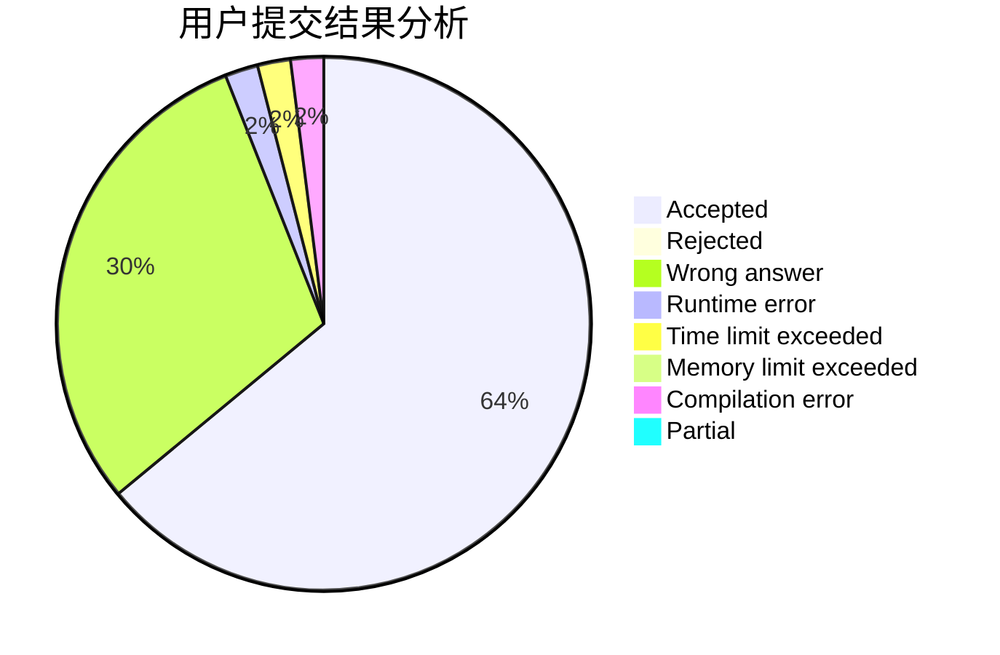
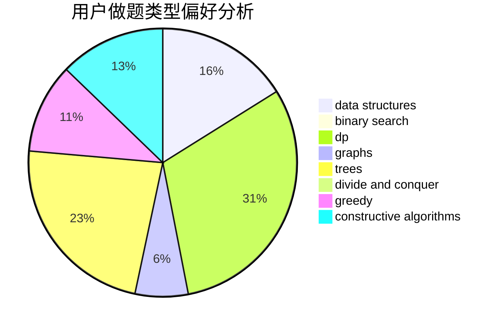
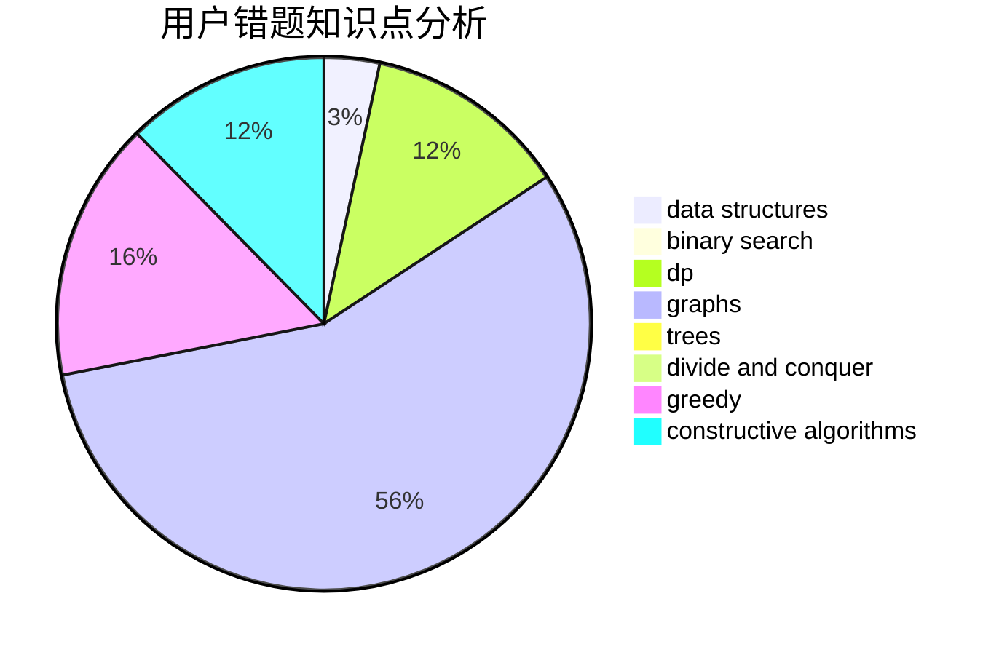

# Ryeblablabla

<!-- tabs:start -->

#### **用户提交结果分析**

#### **用户做题类型偏好分析**

#### **用户错题知识点分析**

<!-- tabs:end -->
# 推荐题目
[813D](https://codeforces.com/contest/813/problem/D)		dp,
                        flows		  
[669C](https://codeforces.com/contest/669/problem/C)		dsu,graphs,sortings,trees		  
[1065B](https://codeforces.com/contest/1065/problem/B)		constructive algorithms,
                        graphs		  
[2A](https://codeforces.com/contest/2/problem/A)		hashing,
                        implementation		  
[227A](https://codeforces.com/contest/227/problem/A)		geometry		  
[1353C](https://codeforces.com/contest/1353/problem/C)		math		  
[3D](https://codeforces.com/contest/3/problem/D)		greedy		  
[325A](https://codeforces.com/contest/325/problem/A)		implementation		  
[444C](https://codeforces.com/contest/444/problem/C)		data structures		  
[1063E](https://codeforces.com/contest/1063/problem/E)		constructive algorithms,
                        math		  
