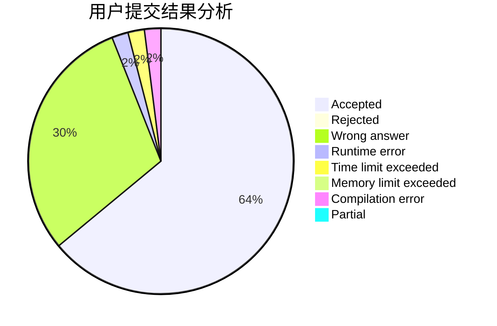
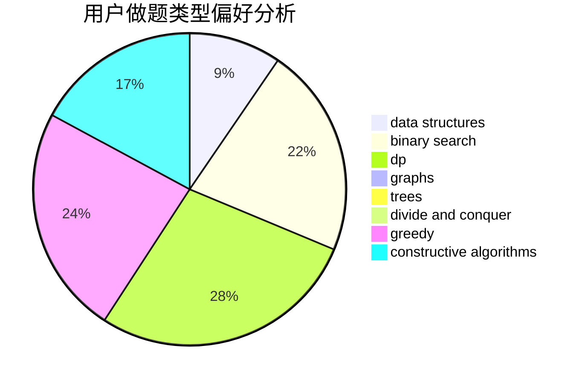
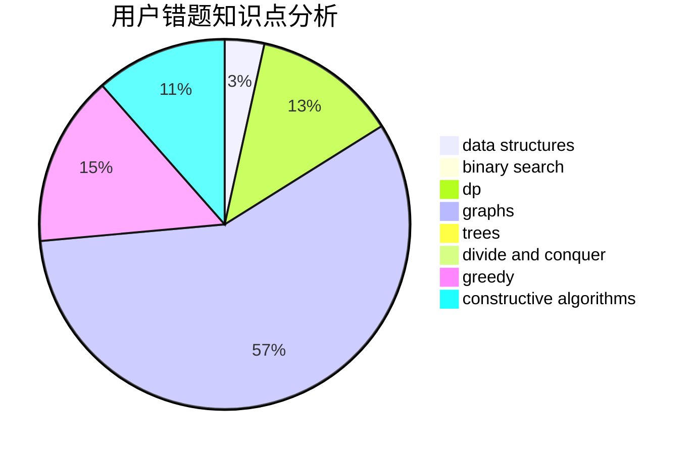

# Ryeblablabla

<!-- tabs:start -->

#### **用户提交结果分析**

#### **用户做题类型偏好分析**

#### **用户错题知识点分析**

<!-- tabs:end -->
# 推荐题目
[831F](https://codeforces.com/contest/831/problem/F)		dsu,graphs,sortings,trees		  
[691C](https://codeforces.com/contest/691/problem/C)		implementation,
                        strings		  
[1065F](https://codeforces.com/contest/1065/problem/F)		dfs and similar,
                        dp,
                        trees		  
[317E](https://codeforces.com/contest/317/problem/E)		constructive algorithms,
                        shortest paths		  
[246B](https://codeforces.com/contest/246/problem/B)		greedy,
                        math		  
[1360A](https://codeforces.com/contest/1360/problem/A)		greedy,
                        math		  
[429E](https://codeforces.com/contest/429/problem/E)		graphs		  
[354B](https://codeforces.com/contest/354/problem/B)		bitmasks,
                        dp,
                        games		  
[464B](https://codeforces.com/contest/464/problem/B)		brute force,
                        geometry		  
[1064B](https://codeforces.com/contest/1064/problem/B)		math		  
