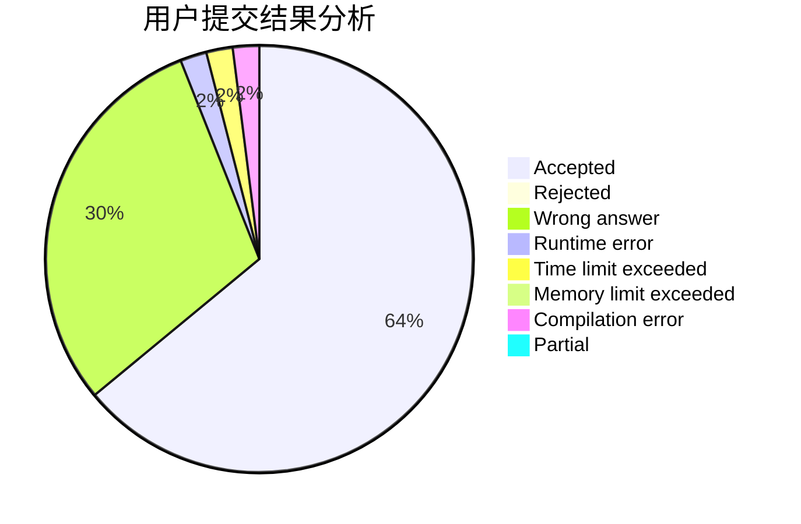
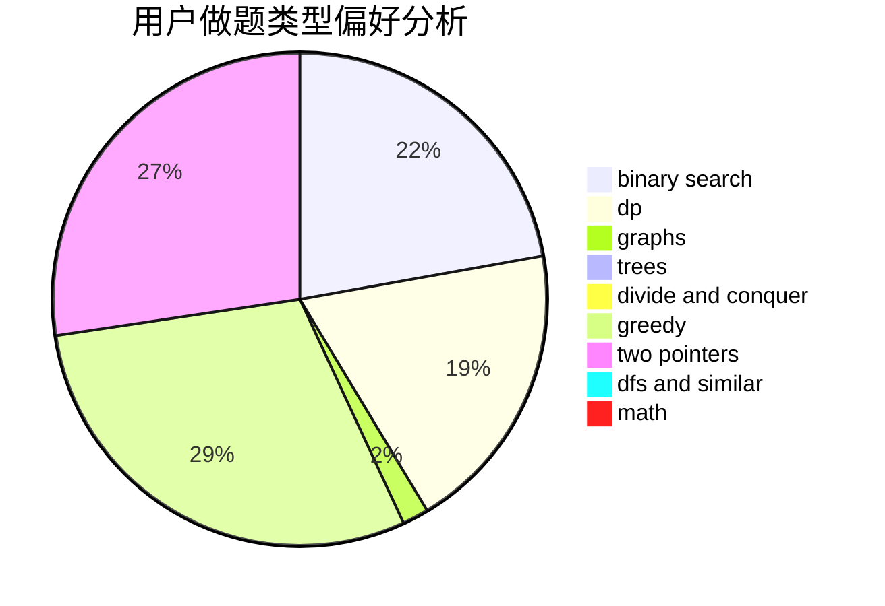

# Ryeblablabla

<!-- tabs:start -->

#### **用户提交结果分析**

#### **用户做题类型偏好分析**

<!-- tabs:end -->
# 推荐题目
[831F](https://codeforces.com/contest/831/problem/F)
[691C](https://codeforces.com/contest/691/problem/C)
[1065F](https://codeforces.com/contest/1065/problem/F)
[317E](https://codeforces.com/contest/317/problem/E)
[246B](https://codeforces.com/contest/246/problem/B)
[1360A](https://codeforces.com/contest/1360/problem/A)
[429E](https://codeforces.com/contest/429/problem/E)
[354B](https://codeforces.com/contest/354/problem/B)
[464B](https://codeforces.com/contest/464/problem/B)
[1064B](https://codeforces.com/contest/1064/problem/B)
