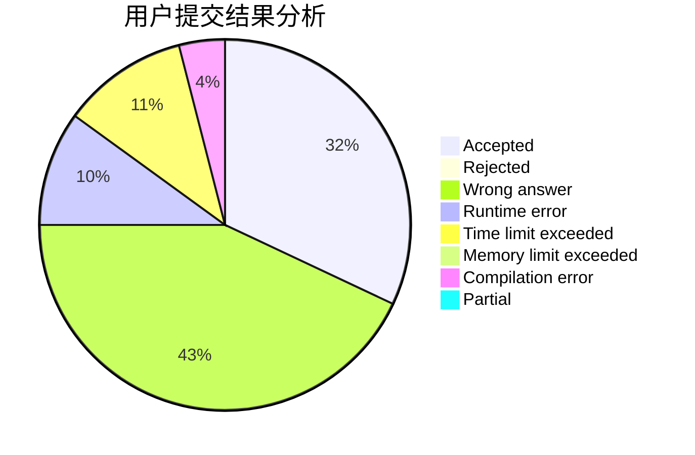
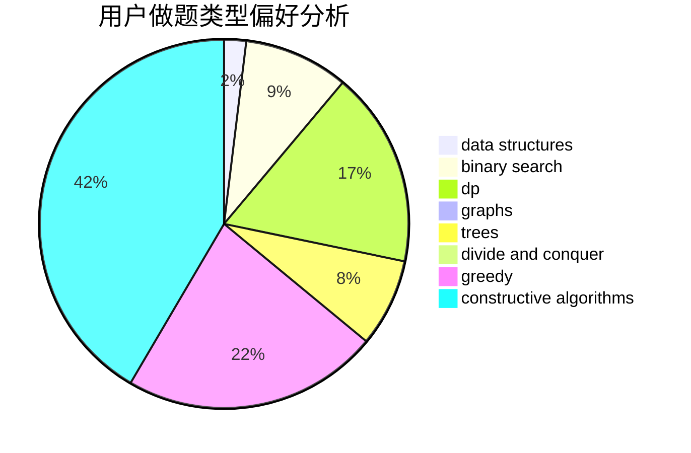

# Ryker0923

<!-- tabs:start -->

#### **用户提交结果分析**

#### **用户做题类型偏好分析**

#### **用户错题知识点分析**

<!-- tabs:end -->
# 推荐题目
[12621](https://codeforces.com/contest/1262/problem/1)		dsu,graphs,sortings,trees		  
[1096E](https://codeforces.com/contest/1096/problem/E)		combinatorics,
                        dp,
                        math,
                        probabilities		  
[1307C](https://codeforces.com/contest/1307/problem/C)		brute force,
                        dp,
                        math,
                        strings		  
[800C](https://codeforces.com/contest/800/problem/C)		dsu,graphs,sortings,trees		  
[1056C](https://codeforces.com/contest/1056/problem/C)		greedy,
                        implementation,
                        interactive,
                        sortings		  
[1074C](https://codeforces.com/contest/1074/problem/C)		dsu,graphs,sortings,trees		  
[1034D](https://codeforces.com/contest/1034/problem/D)		binary search,
                        data structures,
                        two pointers		  
[651C](https://codeforces.com/contest/651/problem/C)		dsu,graphs,sortings,trees		  
[1072C](https://codeforces.com/contest/1072/problem/C)		dsu,graphs,sortings,trees		  
[601D](https://codeforces.com/contest/601/problem/D)		data structures,
                        dfs and similar,
                        dsu,
                        hashing,
                        strings,
                        trees		  
