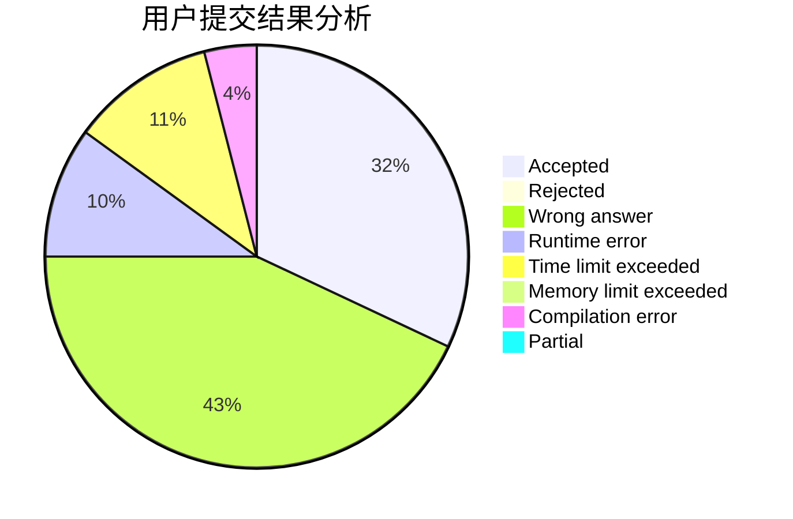
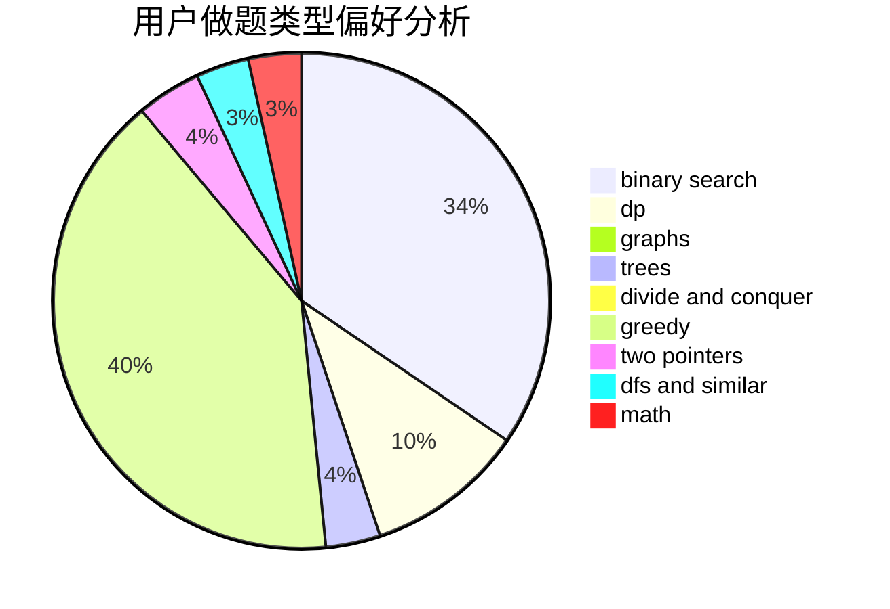

# Ryker0923

<!-- tabs:start -->

#### **用户提交结果分析**

#### **用户做题类型偏好分析**

<!-- tabs:end -->
# 推荐题目
[12621](https://codeforces.com/contest/1262/problem/1)
[1096E](https://codeforces.com/contest/1096/problem/E)
[1307C](https://codeforces.com/contest/1307/problem/C)
[800C](https://codeforces.com/contest/800/problem/C)
[1056C](https://codeforces.com/contest/1056/problem/C)
[1074C](https://codeforces.com/contest/1074/problem/C)
[1034D](https://codeforces.com/contest/1034/problem/D)
[651C](https://codeforces.com/contest/651/problem/C)
[1072C](https://codeforces.com/contest/1072/problem/C)
[601D](https://codeforces.com/contest/601/problem/D)
