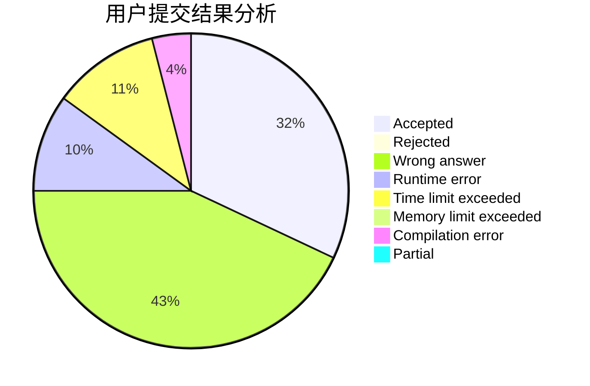
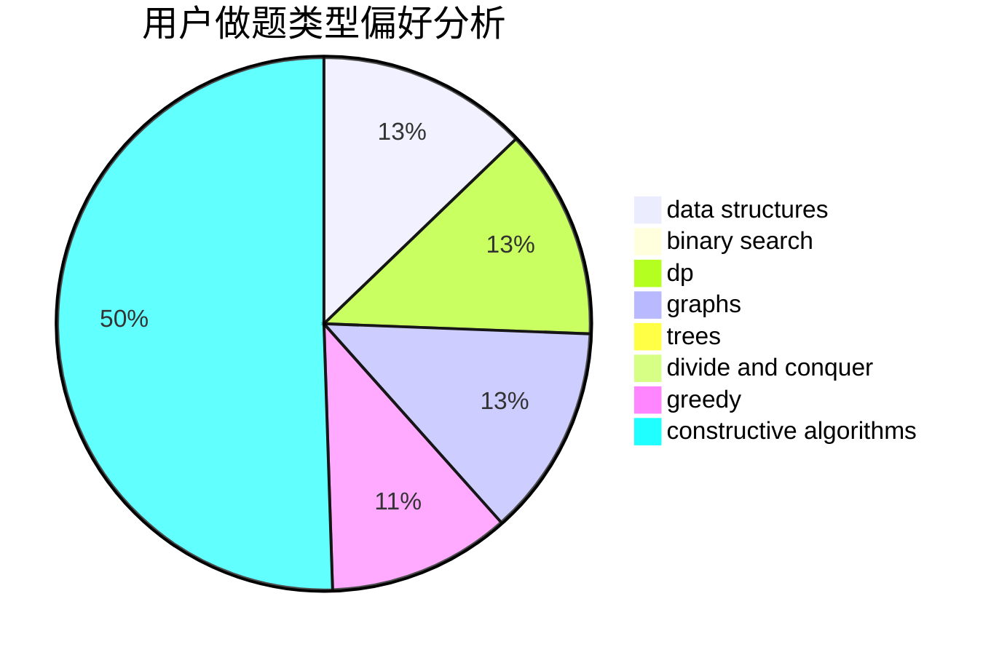

# Ryker0923

<!-- tabs:start -->

#### **用户提交结果分析**

#### **用户做题类型偏好分析**

#### **用户错题知识点分析**

<!-- tabs:end -->
# 推荐题目
[1254D](https://codeforces.com/contest/1254/problem/D)		data structures,
                        probabilities,
                        trees		  
[1096B](https://codeforces.com/contest/1096/problem/B)		combinatorics,
                        math,
                        strings		  
[12B](https://codeforces.com/contest/12/problem/B)		implementation,
                        sortings		  
[782D](https://codeforces.com/contest/782/problem/D)		dsu,graphs,sortings,trees		  
[1055F](https://codeforces.com/contest/1055/problem/F)		strings,
                        trees		  
[1073G](https://codeforces.com/contest/1073/problem/G)		data structures,
                        string suffix structures		  
[1034A](https://codeforces.com/contest/1034/problem/A)		number theory		  
[623C](https://codeforces.com/contest/623/problem/C)		binary search,
                        dp		  
[1071D](https://codeforces.com/contest/1071/problem/D)		dsu,graphs,sortings,trees		  
[581C](https://codeforces.com/contest/581/problem/C)		implementation,
                        math,
                        sortings		  
