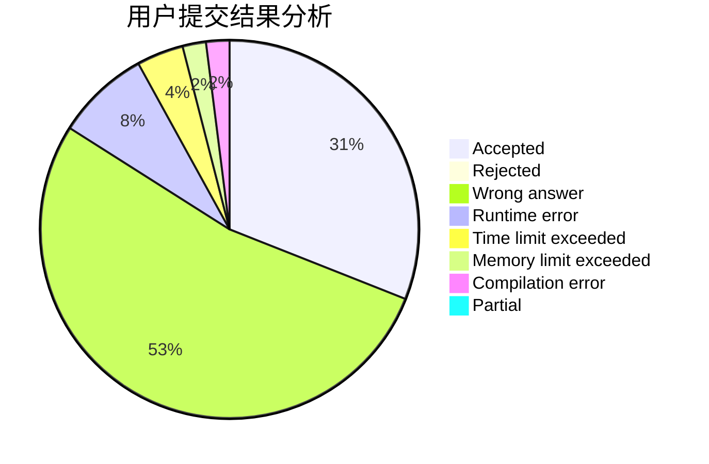
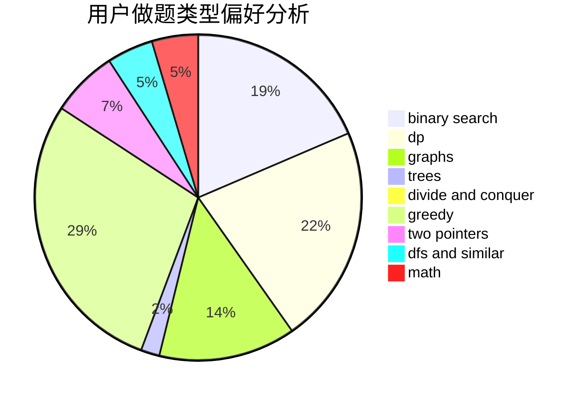

# Rynar

<!-- tabs:start -->

#### **用户提交结果分析**

#### **用户做题类型偏好分析**

<!-- tabs:end -->
# 推荐题目
[1276F](https://codeforces.com/contest/1276/problem/F)
[371C](https://codeforces.com/contest/371/problem/C)
[798C](https://codeforces.com/contest/798/problem/C)
[567A](https://codeforces.com/contest/567/problem/A)
[834B](https://codeforces.com/contest/834/problem/B)
[1059E](https://codeforces.com/contest/1059/problem/E)
[861A](https://codeforces.com/contest/861/problem/A)
[1077D](https://codeforces.com/contest/1077/problem/D)
[1510A](https://codeforces.com/contest/1510/problem/A)
[1408C](https://codeforces.com/contest/1408/problem/C)
