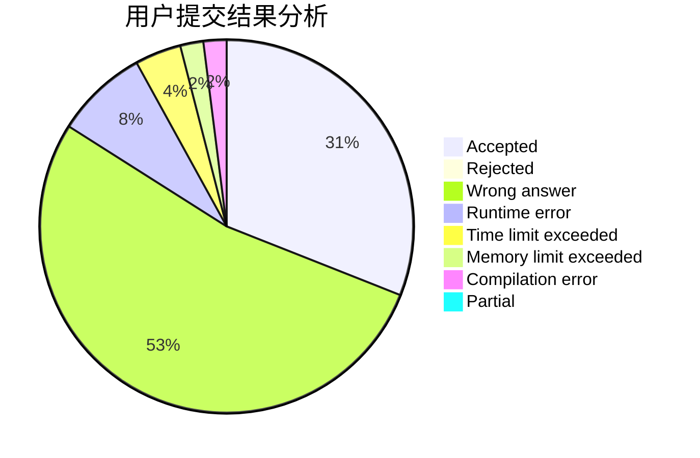
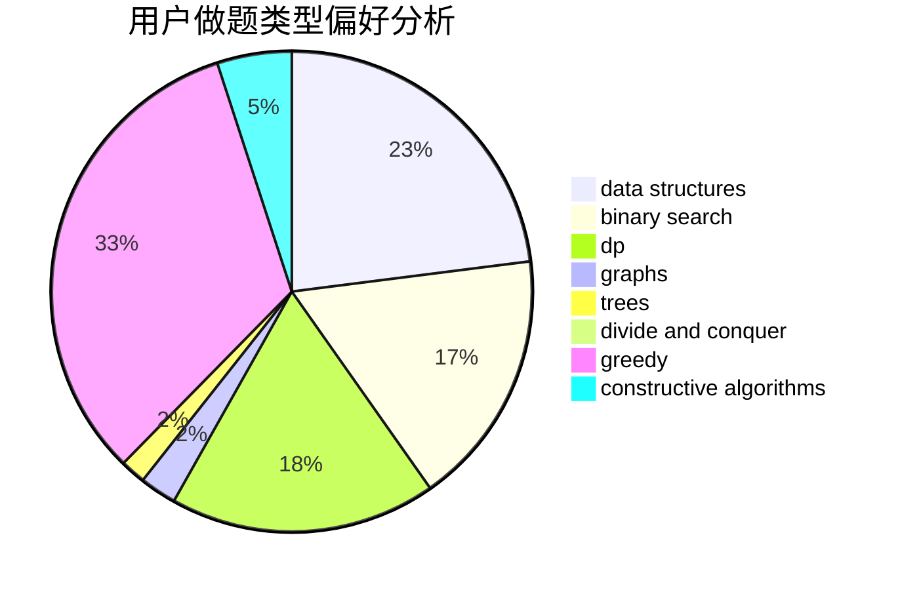
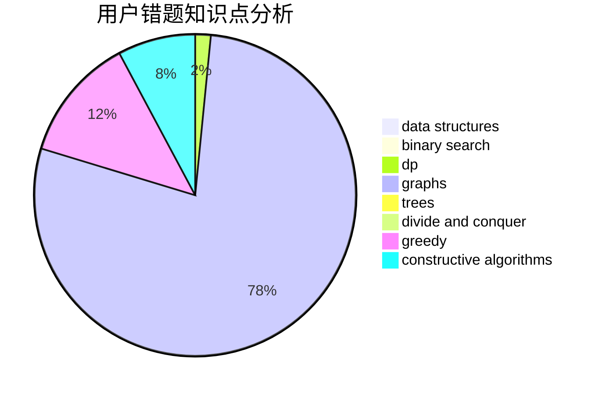

# Rynar

<!-- tabs:start -->

#### **用户提交结果分析**

#### **用户做题类型偏好分析**

#### **用户错题知识点分析**

<!-- tabs:end -->
# 推荐题目
[1276F](https://codeforces.com/contest/1276/problem/F)		string suffix structures		  
[371C](https://codeforces.com/contest/371/problem/C)		binary search,
                        brute force		  
[798C](https://codeforces.com/contest/798/problem/C)		dp,
                        greedy,
                        number theory		  
[567A](https://codeforces.com/contest/567/problem/A)		greedy,
                        implementation		  
[834B](https://codeforces.com/contest/834/problem/B)		data structures,
                        implementation		  
[1059E](https://codeforces.com/contest/1059/problem/E)		binary search,
                        data structures,
                        dp,
                        greedy,
                        trees		  
[861A](https://codeforces.com/contest/861/problem/A)		dsu,graphs,sortings,trees		  
[1077D](https://codeforces.com/contest/1077/problem/D)		binary search,
                        sortings		  
[1510A](https://codeforces.com/contest/1510/problem/A)		nan		  
[1408C](https://codeforces.com/contest/1408/problem/C)		binary search,
                        dp,
                        implementation,
                        math,
                        two pointers		  
