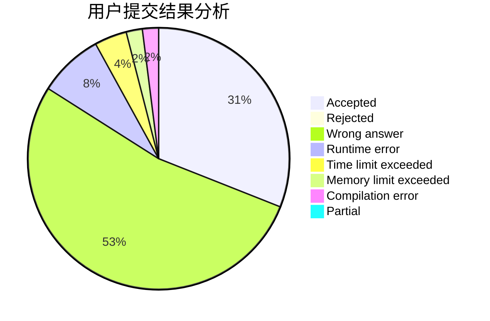
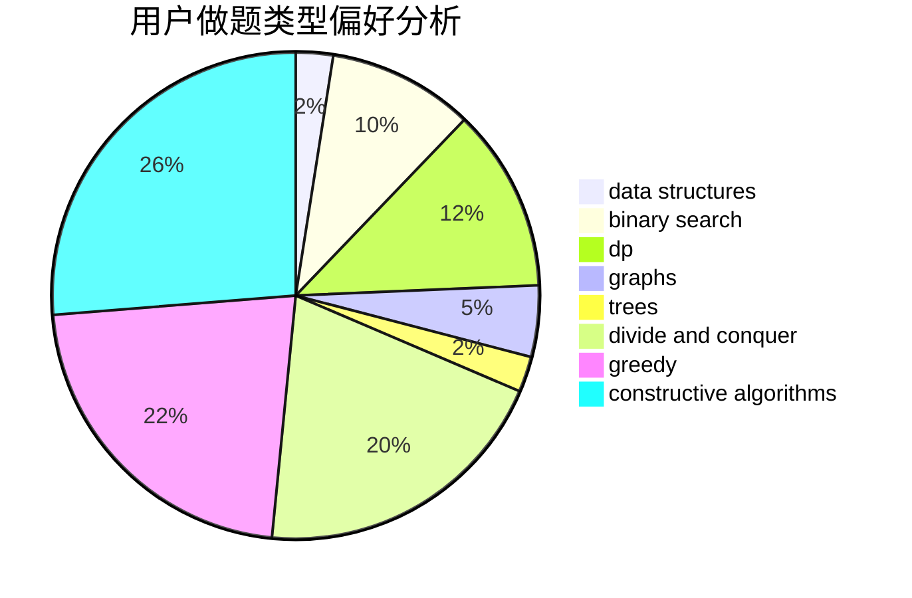
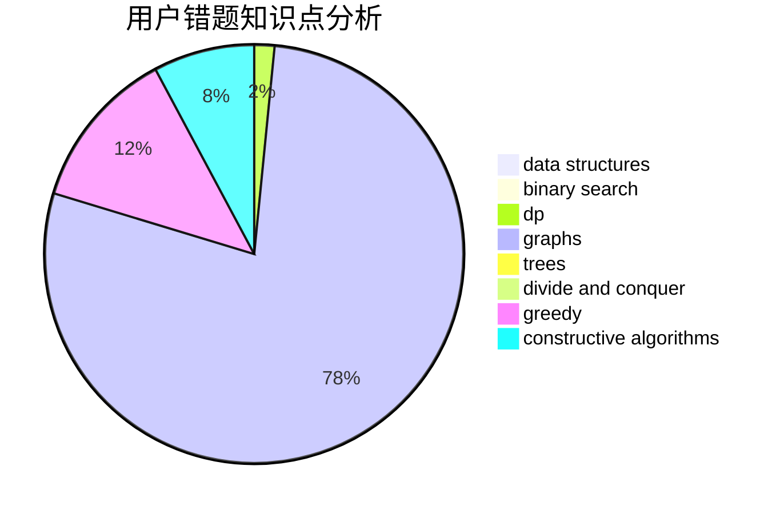

# Rynar

<!-- tabs:start -->

#### **用户提交结果分析**

#### **用户做题类型偏好分析**

#### **用户错题知识点分析**

<!-- tabs:end -->
# 推荐题目
[1267K](https://codeforces.com/contest/1267/problem/K)		combinatorics,
                        math		  
[345A](https://codeforces.com/contest/345/problem/A)		*special problem,
                        probabilities		  
[77E](https://codeforces.com/contest/77/problem/E)		geometry		  
[542E](https://codeforces.com/contest/542/problem/E)		graphs,
                        shortest paths		  
[815B](https://codeforces.com/contest/815/problem/B)		brute force,
                        combinatorics,
                        constructive algorithms,
                        math		  
[1059B](https://codeforces.com/contest/1059/problem/B)		implementation		  
[842B](https://codeforces.com/contest/842/problem/B)		geometry		  
[1077C](https://codeforces.com/contest/1077/problem/C)		nan		  
[149E](https://codeforces.com/contest/149/problem/E)		string suffix structures,
                        strings		  
[1399B](https://codeforces.com/contest/1399/problem/B)		greedy		  
