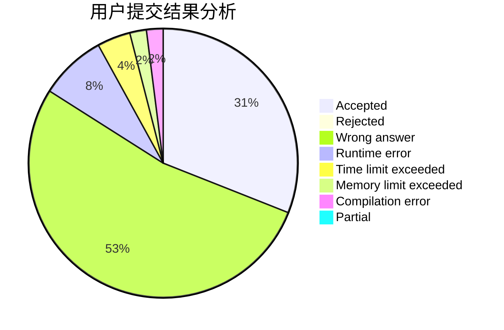
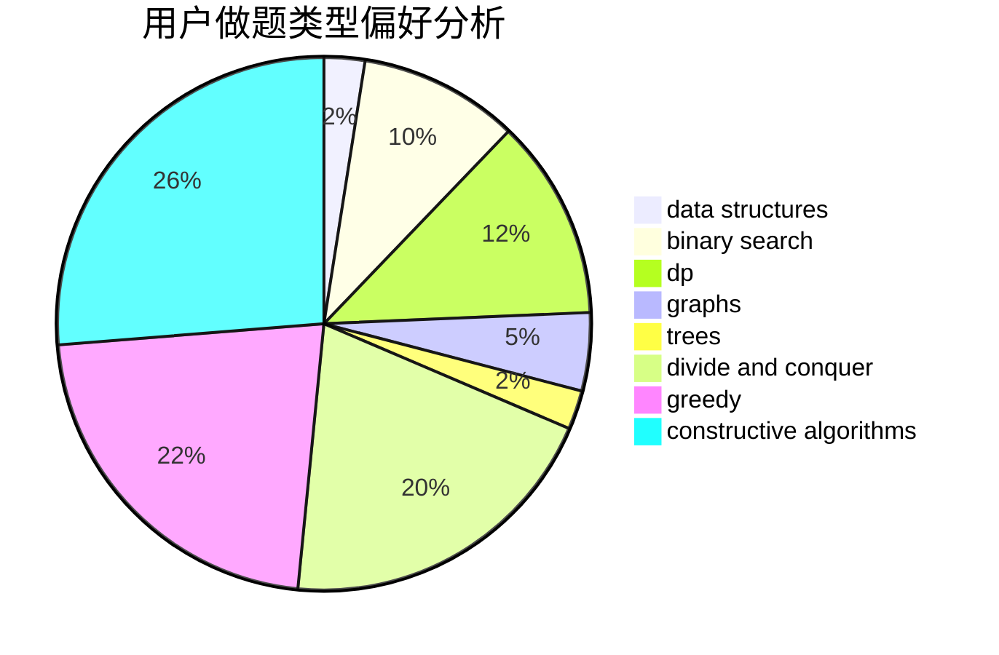
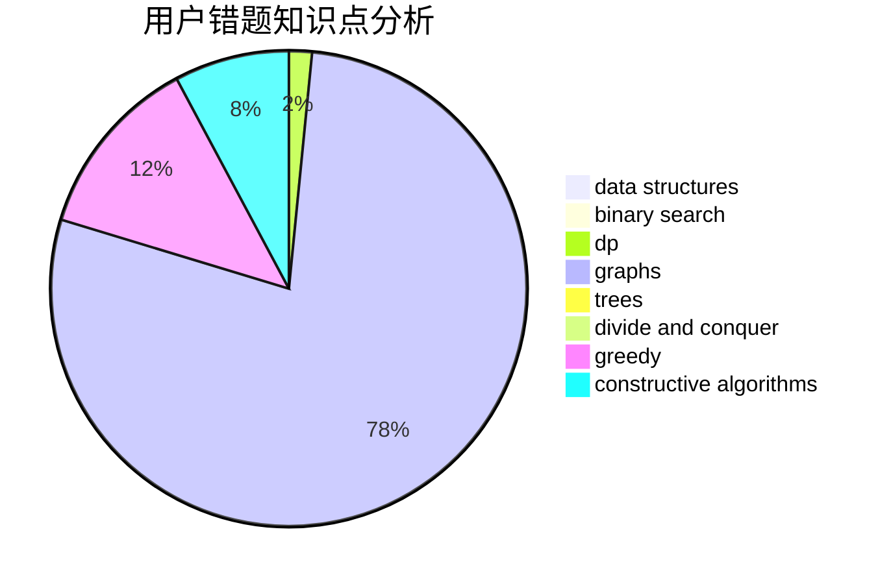

# Rynar
<!-- tabs:start -->
#### **用户提交结果分析**

#### **用户做题类型偏好分析**

#### **用户错题知识点分析**

<!-- tabs:end -->
# 推荐题目
[Key Storage](http://codeforces.com/problemset/problem/1267/K)		combinatorics,
                        math		  
[Expecting Trouble](http://codeforces.com/problemset/problem/345/A)		*special problem,
                        probabilities		  
[Playing on Graph](http://codeforces.com/problemset/problem/542/E)		graphs,
                        shortest paths		  
[Gifts Fixing](http://codeforces.com/problemset/problem/1399/B)		greedy		  
[Martian Food](http://codeforces.com/problemset/problem/77/E)		geometry		  
[Gleb And Pizza](http://codeforces.com/problemset/problem/842/B)		geometry		  
[Martian Strings](http://codeforces.com/problemset/problem/149/E)		string suffix structures,
                        strings		  
[Try and Catch](http://codeforces.com/problemset/problem/195/C)		expression parsing,
                        implementation		  
[Good Array](http://codeforces.com/problemset/problem/1077/C)		nan		  
[Karen and Test](http://codeforces.com/problemset/problem/815/B)		brute force,
                        combinatorics,
                        constructive algorithms,
                        math		  
<!-- tabs:start -->
#### **data structures**
[Key Storage](http://codeforces.com/problemset/problem/1004/F)		bitmasks,
                        data structures,
                        divide and conquer		  
[Expecting Trouble](http://codeforces.com/problemset/problem/837/G)		data structures		  
[Playing on Graph](http://codeforces.com/problemset/problem/1114/F)		bitmasks,
                        data structures,
                        divide and conquer,
                        math,
                        number theory		  
[Gifts Fixing](http://codeforces.com/problemset/problem/620/E)		bitmasks,
                        data structures,
                        trees		  
[Martian Food](http://codeforces.com/problemset/problem/241/B)		binary search,
                        bitmasks,
                        data structures,
                        math		  
[Gleb And Pizza](https://codeforces.com/contest/1447/problem/F1)		data structures,
                        greedy		  
[Martian Strings](http://codeforces.com/problemset/problem/38/G)		data structures		  
[Try and Catch](http://codeforces.com/problemset/problem/452/F)		data structures,
                        divide and conquer,
                        hashing		  
[Good Array](http://codeforces.com/problemset/problem/696/D)		data structures,
                        dp,
                        matrices,
                        strings		  
[Karen and Test](http://codeforces.com/problemset/problem/1322/B)		binary search,
                        bitmasks,
                        constructive algorithms,
                        data structures,
                        math,
                        sortings		  
#### **binary search**
[Key Storage](http://codeforces.com/problemset/problem/241/B)		binary search,
                        bitmasks,
                        data structures,
                        math		  
[Expecting Trouble](http://codeforces.com/problemset/problem/231/C)		binary search,
                        sortings,
                        two pointers		  
[Playing on Graph](http://codeforces.com/problemset/problem/1305/H)		binary search,
                        greedy		  
[Gifts Fixing](http://codeforces.com/problemset/problem/1322/B)		binary search,
                        bitmasks,
                        constructive algorithms,
                        data structures,
                        math,
                        sortings		  
[Martian Food](http://codeforces.com/problemset/problem/1301/C)		binary search,
                        combinatorics,
                        greedy,
                        math,
                        strings		  
[Gleb And Pizza](http://codeforces.com/problemset/problem/1500/E)		binary search,
                        data structures		  
[Martian Strings](http://codeforces.com/problemset/problem/1131/C)		binary search,
                        greedy,
                        sortings		  
[Try and Catch](http://codeforces.com/problemset/problem/1492/C)		binary search,
                        data structures,
                        dp,
                        greedy,
                        two pointers		  
[Good Array](http://codeforces.com/problemset/problem/1463/D)		binary search,
                        constructive algorithms,
                        greedy,
                        two pointers		  
[Karen and Test](http://codeforces.com/problemset/problem/1490/G)		binary search,
                        data structures,
                        math		  
#### **dp**
[Key Storage](http://codeforces.com/problemset/problem/279/E)		dp,
                        games,
                        greedy,
                        number theory		  
[Expecting Trouble](http://codeforces.com/problemset/problem/711/C)		dp		  
[Playing on Graph](http://codeforces.com/problemset/problem/696/D)		data structures,
                        dp,
                        matrices,
                        strings		  
[Gifts Fixing](http://codeforces.com/problemset/problem/659/G)		combinatorics,
                        dp,
                        number theory		  
[Martian Food](http://codeforces.com/problemset/problem/1492/C)		binary search,
                        data structures,
                        dp,
                        greedy,
                        two pointers		  
[Gleb And Pizza](https://codeforces.com/contest/1457/problem/C)		brute force,
                        dp,
                        implementation		  
[Martian Strings](http://codeforces.com/problemset/problem/1491/C)		brute force,
                        data structures,
                        dp,
                        greedy,
                        implementation		  
[Try and Catch](http://codeforces.com/problemset/problem/1437/C)		dp,
                        flows,
                        graph matchings,
                        greedy,
                        math,
                        sortings		  
[Good Array](http://codeforces.com/problemset/problem/1499/B)		brute force,
                        dp,
                        greedy,
                        implementation		  
[Karen and Test](http://codeforces.com/problemset/problem/1491/D)		bitmasks,
                        constructive algorithms,
                        dp,
                        greedy,
                        math		  
#### **graph**
[Key Storage](http://codeforces.com/problemset/problem/542/E)		graphs,
                        shortest paths		  
[Expecting Trouble](https://codeforces.com/contest/1341/problem/F)		constructive algorithms,
                        dfs and similar,
                        graphs,
                        trees		  
[Playing on Graph](http://codeforces.com/problemset/problem/1487/C)		brute force,
                        constructive algorithms,
                        dfs and similar,
                        graphs,
                        greedy,
                        implementation,
                        math		  
[Gifts Fixing](http://codeforces.com/problemset/problem/1019/C)		constructive algorithms,
                        graphs		  
[Martian Food](http://codeforces.com/problemset/problem/76/A)		dsu,
                        graphs,
                        sortings,
                        trees		  
[Gleb And Pizza](http://codeforces.com/problemset/problem/1487/C)		brute force,
                        constructive algorithms,
                        dfs and similar,
                        graphs,
                        greedy,
                        implementation,
                        math		  
[Martian Strings](http://codeforces.com/problemset/problem/1437/C)		dp,
                        flows,
                        graph matchings,
                        greedy,
                        math,
                        sortings		  
[Try and Catch](http://codeforces.com/problemset/problem/1470/D)		constructive algorithms,
                        dfs and similar,
                        graph matchings,
                        graphs,
                        greedy		  
[Good Array](http://codeforces.com/problemset/problem/1476/C)		dp,
                        graphs,
                        greedy		  
[Karen and Test](http://codeforces.com/problemset/problem/1304/D)		constructive algorithms,
                        graphs,
                        greedy,
                        two pointers		  
#### **trees**
[Key Storage](http://codeforces.com/problemset/problem/620/E)		bitmasks,
                        data structures,
                        trees		  
[Expecting Trouble](http://codeforces.com/problemset/problem/1210/C)		math,
                        number theory,
                        trees		  
[Playing on Graph](https://codeforces.com/contest/1341/problem/F)		constructive algorithms,
                        dfs and similar,
                        graphs,
                        trees		  
[Gifts Fixing](http://codeforces.com/problemset/problem/76/A)		dsu,
                        graphs,
                        sortings,
                        trees		  
[Martian Food](http://codeforces.com/problemset/problem/1479/D)		binary search,
                        bitmasks,
                        brute force,
                        data structures,
                        probabilities,
                        trees		  
[Gleb And Pizza](http://codeforces.com/problemset/problem/1511/C)		brute force,
                        data structures,
                        implementation,
                        trees		  
[Martian Strings](http://codeforces.com/problemset/problem/1499/F)		combinatorics,
                        dfs and similar,
                        dp,
                        trees		  
[Try and Catch](http://codeforces.com/problemset/problem/1491/E)		brute force,
                        dfs and similar,
                        divide and conquer,
                        number theory,
                        trees		  
[Good Array](http://codeforces.com/problemset/problem/1466/D)		data structures,
                        greedy,
                        sortings,
                        trees		  
[Karen and Test](http://codeforces.com/problemset/problem/1495/D)		combinatorics,
                        dfs and similar,
                        graphs,
                        math,
                        shortest paths,
                        trees		  
#### **divide and conquer**
[Key Storage](http://codeforces.com/problemset/problem/1004/F)		bitmasks,
                        data structures,
                        divide and conquer		  
[Expecting Trouble](http://codeforces.com/problemset/problem/1114/F)		bitmasks,
                        data structures,
                        divide and conquer,
                        math,
                        number theory		  
[Playing on Graph](http://codeforces.com/problemset/problem/452/F)		data structures,
                        divide and conquer,
                        hashing		  
[Gifts Fixing](http://codeforces.com/problemset/problem/1461/D)		binary search,
                        brute force,
                        data structures,
                        divide and conquer,
                        implementation,
                        sortings		  
[Martian Food](http://codeforces.com/problemset/problem/1466/G)		combinatorics,
                        divide and conquer,
                        hashing,
                        math,
                        string suffix structures,
                        strings		  
[Gleb And Pizza](http://codeforces.com/problemset/problem/1490/D)		dfs and similar,
                        divide and conquer,
                        implementation		  
[Martian Strings](https://codeforces.com/contest/1483/problem/C)		data structures,
                        divide and conquer,
                        dp		  
[Try and Catch](http://codeforces.com/problemset/problem/1491/E)		brute force,
                        dfs and similar,
                        divide and conquer,
                        number theory,
                        trees		  
[Good Array](http://codeforces.com/problemset/problem/1303/G)		data structures,
                        divide and conquer,
                        geometry,
                        trees		  
[Karen and Test](http://codeforces.com/problemset/problem/1494/D)		constructive algorithms,
                        data structures,
                        dfs and similar,
                        divide and conquer,
                        dsu,
                        greedy,
                        sortings,
                        trees		  
#### **greedy**
[Key Storage](http://codeforces.com/problemset/problem/1399/B)		greedy		  
[Expecting Trouble](http://codeforces.com/problemset/problem/1452/F)		constructive algorithms,
                        greedy		  
[Playing on Graph](http://codeforces.com/problemset/problem/709/B)		greedy,
                        implementation,
                        sortings		  
[Gifts Fixing](http://codeforces.com/problemset/problem/279/E)		dp,
                        games,
                        greedy,
                        number theory		  
[Martian Food](https://codeforces.com/contest/1447/problem/F1)		data structures,
                        greedy		  
[Gleb And Pizza](http://codeforces.com/problemset/problem/1305/H)		binary search,
                        greedy		  
[Martian Strings](http://codeforces.com/problemset/problem/578/E)		constructive algorithms,
                        greedy		  
[Try and Catch](http://codeforces.com/problemset/problem/1487/C)		brute force,
                        constructive algorithms,
                        dfs and similar,
                        graphs,
                        greedy,
                        implementation,
                        math		  
[Good Array](http://codeforces.com/problemset/problem/1430/C)		constructive algorithms,
                        data structures,
                        greedy,
                        implementation,
                        math		  
[Karen and Test](http://codeforces.com/problemset/problem/1325/D)		bitmasks,
                        constructive algorithms,
                        greedy,
                        number theory		  
#### **constructive algorithms**
[Key Storage](http://codeforces.com/problemset/problem/815/B)		brute force,
                        combinatorics,
                        constructive algorithms,
                        math		  
[Expecting Trouble](http://codeforces.com/problemset/problem/1452/F)		constructive algorithms,
                        greedy		  
[Playing on Graph](https://codeforces.com/contest/1071/problem/C)		constructive algorithms		  
[Gifts Fixing](http://codeforces.com/problemset/problem/443/A)		constructive algorithms,
                        implementation		  
[Martian Food](http://codeforces.com/problemset/problem/906/B)		brute force,
                        constructive algorithms,
                        math		  
[Gleb And Pizza](http://codeforces.com/problemset/problem/1400/A)		constructive algorithms,
                        strings		  
[Martian Strings](https://codeforces.com/contest/1341/problem/F)		constructive algorithms,
                        dfs and similar,
                        graphs,
                        trees		  
[Try and Catch](http://codeforces.com/problemset/problem/1322/B)		binary search,
                        bitmasks,
                        constructive algorithms,
                        data structures,
                        math,
                        sortings		  
[Good Array](http://codeforces.com/problemset/problem/578/E)		constructive algorithms,
                        greedy		  
[Karen and Test](http://codeforces.com/problemset/problem/679/A)		constructive algorithms,
                        interactive,
                        math		  
#### **sortings**
[Key Storage](http://codeforces.com/problemset/problem/709/B)		greedy,
                        implementation,
                        sortings		  
[Expecting Trouble](http://codeforces.com/problemset/problem/231/C)		binary search,
                        sortings,
                        two pointers		  
[Playing on Graph](http://codeforces.com/problemset/problem/1322/B)		binary search,
                        bitmasks,
                        constructive algorithms,
                        data structures,
                        math,
                        sortings		  
[Gifts Fixing](http://codeforces.com/problemset/problem/76/A)		dsu,
                        graphs,
                        sortings,
                        trees		  
[Martian Food](http://codeforces.com/problemset/problem/1131/C)		binary search,
                        greedy,
                        sortings		  
[Gleb And Pizza](https://codeforces.com/contest/1496/problem/C)		geometry,
                        greedy,
                        math,
                        sortings		  
[Martian Strings](http://codeforces.com/problemset/problem/1495/A)		geometry,
                        greedy,
                        math,
                        sortings		  
[Try and Catch](http://codeforces.com/problemset/problem/1497/A)		brute force,
                        data structures,
                        greedy,
                        sortings		  
[Good Array](http://codeforces.com/problemset/problem/1427/A)		math,
                        sortings		  
[Karen and Test](http://codeforces.com/problemset/problem/1461/D)		binary search,
                        brute force,
                        data structures,
                        divide and conquer,
                        implementation,
                        sortings		  
<!-- tabs:end -->
