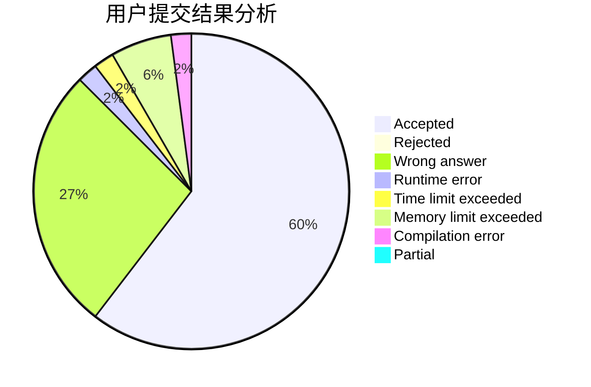
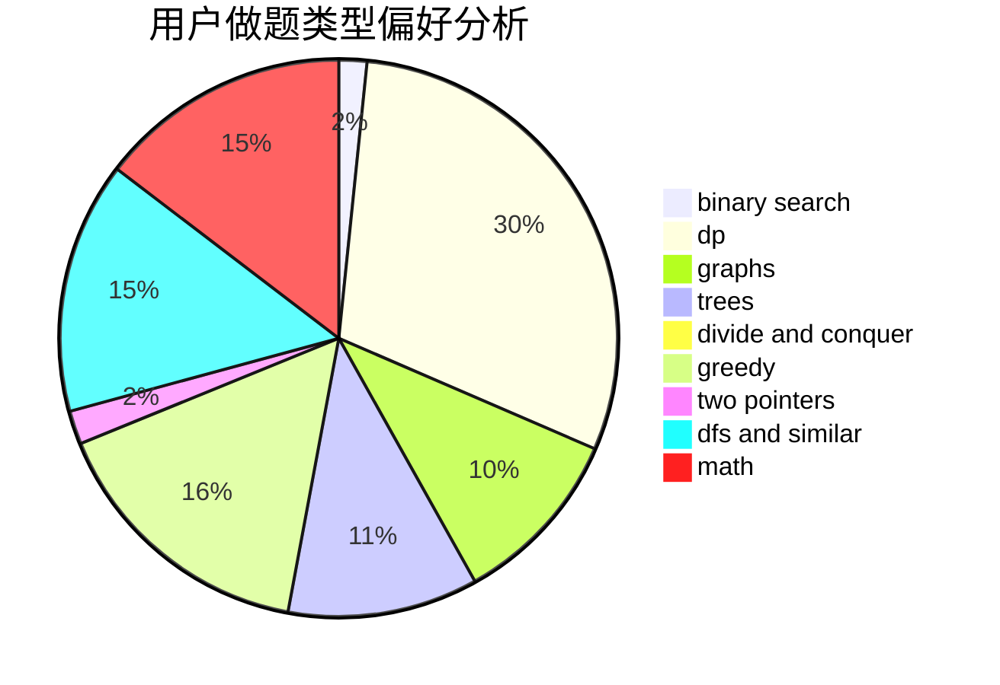

# Ryochii

<!-- tabs:start -->

#### **用户提交结果分析**

#### **用户做题类型偏好分析**

<!-- tabs:end -->
# 推荐题目
[1106E](https://codeforces.com/contest/1106/problem/E)
[1082F](https://codeforces.com/contest/1082/problem/F)
[747F](https://codeforces.com/contest/747/problem/F)
[1053B](https://codeforces.com/contest/1053/problem/B)
[515C](https://codeforces.com/contest/515/problem/C)
[853A](https://codeforces.com/contest/853/problem/A)
[78C](https://codeforces.com/contest/78/problem/C)
[413B](https://codeforces.com/contest/413/problem/B)
[635E](https://codeforces.com/contest/635/problem/E)
[1286F](https://codeforces.com/contest/1286/problem/F)
