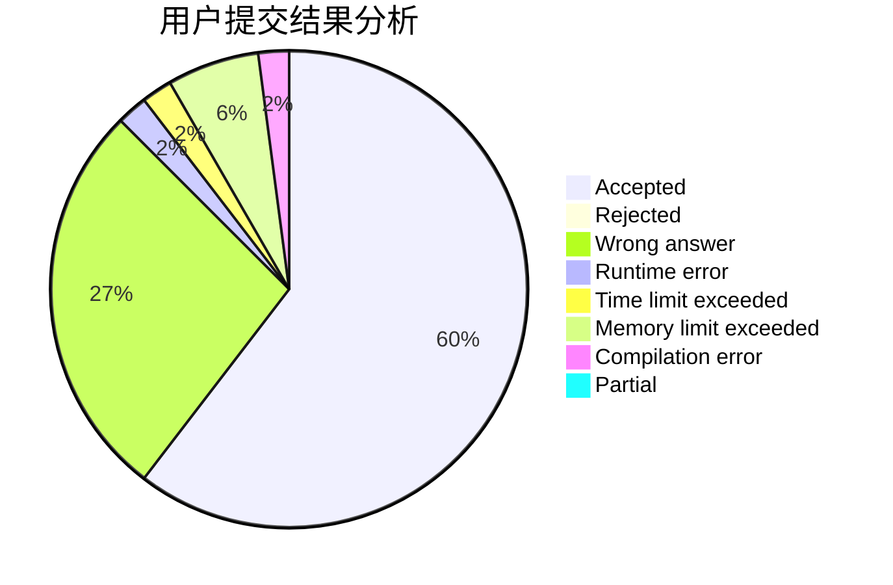
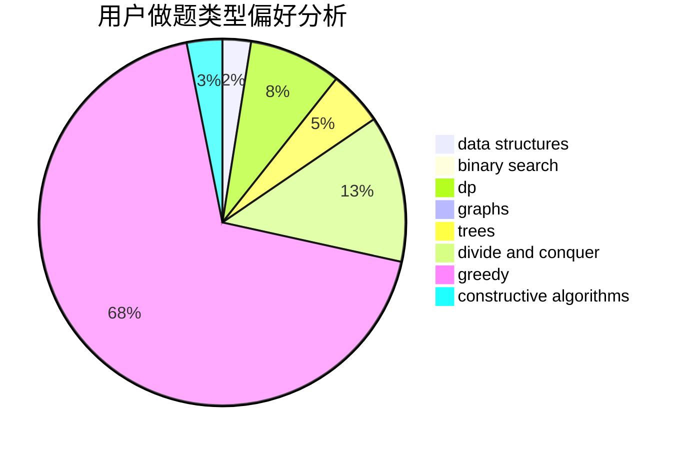

# Ryochii

<!-- tabs:start -->

#### **用户提交结果分析**

#### **用户做题类型偏好分析**

#### **用户错题知识点分析**

<!-- tabs:end -->
# 推荐题目
[1106B](https://codeforces.com/contest/1106/problem/B)		data structures,
                        implementation		  
[1082C](https://codeforces.com/contest/1082/problem/C)		greedy,
                        sortings		  
[730G](https://codeforces.com/contest/730/problem/G)		implementation		  
[1051F](https://codeforces.com/contest/1051/problem/F)		graphs,
                        shortest paths,
                        trees		  
[495B](https://codeforces.com/contest/495/problem/B)		math,
                        number theory		  
[835C](https://codeforces.com/contest/835/problem/C)		dp,
                        implementation		  
[76D](https://codeforces.com/contest/76/problem/D)		dp,
                        greedy,
                        math		  
[381B](https://codeforces.com/contest/381/problem/B)		greedy,
                        implementation,
                        sortings		  
[617E](https://codeforces.com/contest/617/problem/E)		data structures		  
[1280E](https://codeforces.com/contest/1280/problem/E)		math		  
