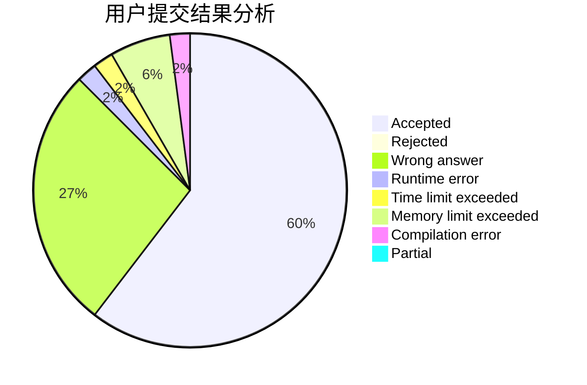
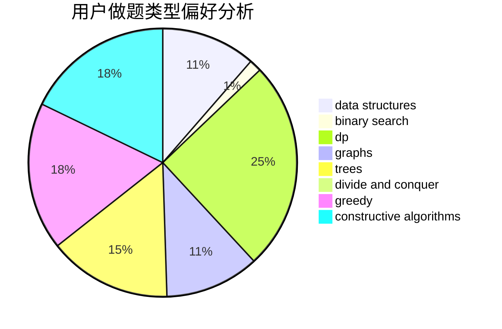

# Ryochii

<!-- tabs:start -->

#### **用户提交结果分析**

#### **用户做题类型偏好分析**

#### **用户错题知识点分析**

<!-- tabs:end -->
# 推荐题目
[1106E](https://codeforces.com/contest/1106/problem/E)		data structures,
                        dp		  
[1082F](https://codeforces.com/contest/1082/problem/F)		dp,
                        strings,
                        trees		  
[747F](https://codeforces.com/contest/747/problem/F)		brute force,
                        combinatorics,
                        dp,
                        math		  
[1053B](https://codeforces.com/contest/1053/problem/B)		dsu,graphs,sortings,trees		  
[515C](https://codeforces.com/contest/515/problem/C)		greedy,
                        math,
                        sortings		  
[853A](https://codeforces.com/contest/853/problem/A)		greedy		  
[78C](https://codeforces.com/contest/78/problem/C)		dp,
                        games,
                        number theory		  
[413B](https://codeforces.com/contest/413/problem/B)		implementation		  
[635E](https://codeforces.com/contest/635/problem/E)		dsu,graphs,sortings,trees		  
[1286F](https://codeforces.com/contest/1286/problem/F)		brute force,
                        constructive algorithms,
                        dp,
                        fft,
                        implementation,
                        math		  
