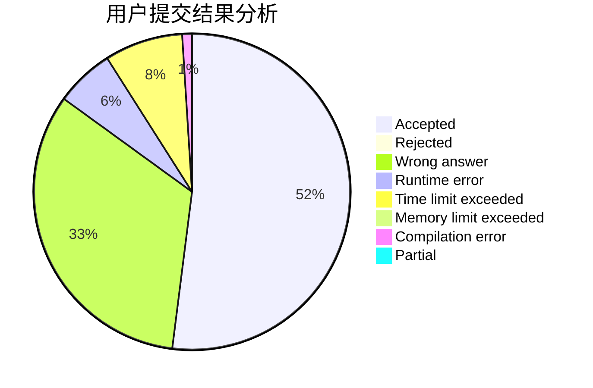
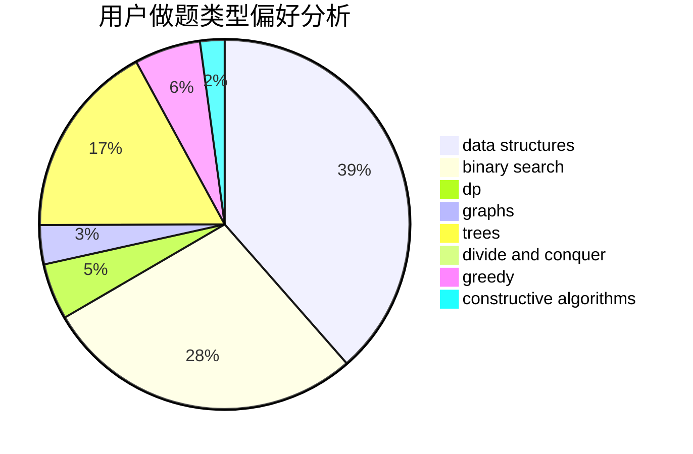
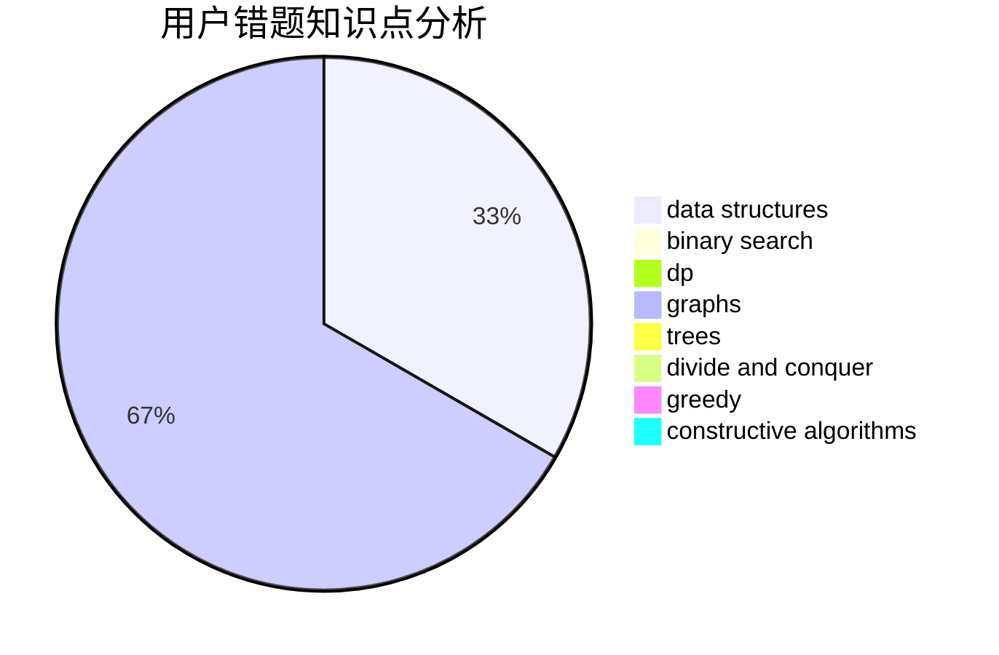

# SANJIN

<!-- tabs:start -->

#### **用户提交结果分析**

#### **用户做题类型偏好分析**

#### **用户错题知识点分析**

<!-- tabs:end -->
# 推荐题目
[1349F1](https://codeforces.com/contest/1349F/problem/1)		dp,
                        fft,
                        math		  
[543A](https://codeforces.com/contest/543/problem/A)		dp		  
[1107E](https://codeforces.com/contest/1107/problem/E)		dp		  
[1101B](https://codeforces.com/contest/1101/problem/B)		greedy,
                        implementation		  
[1162D](https://codeforces.com/contest/1162/problem/D)		dsu,graphs,sortings,trees		  
[171H](https://codeforces.com/contest/171/problem/H)		*special problem,
                        implementation		  
[907D](https://codeforces.com/contest/907/problem/D)		dsu,graphs,sortings,trees		  
[1251C](https://codeforces.com/contest/1251/problem/C)		greedy,
                        two pointers		  
[1163B2](https://codeforces.com/contest/1163B/problem/2)		data structures,
                        implementation		  
[954H](https://codeforces.com/contest/954/problem/H)		combinatorics,
                        dp		  
