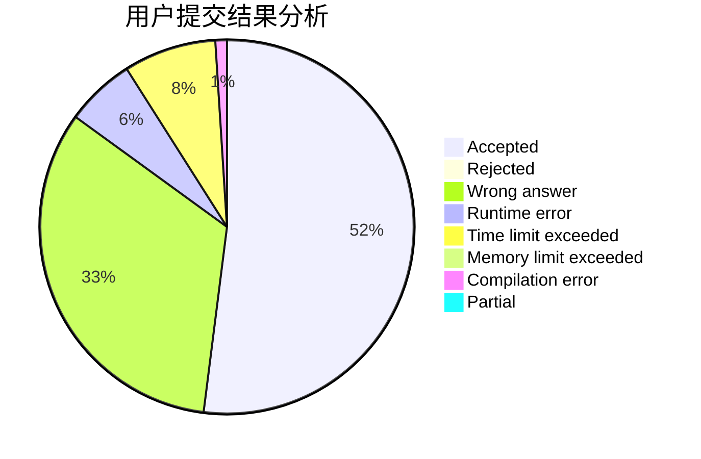
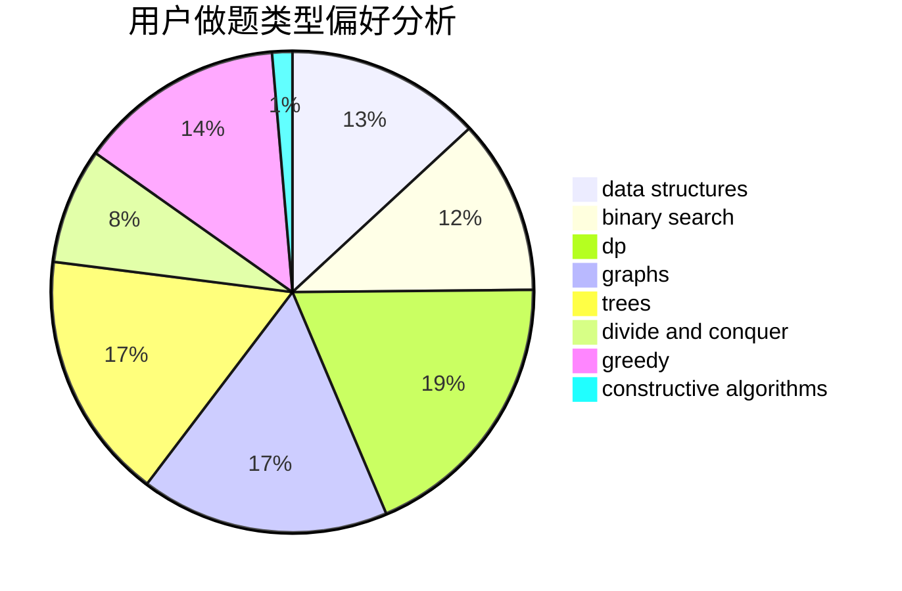
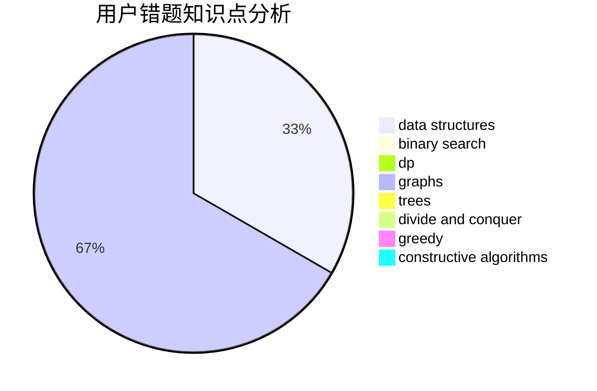

# SANJIN

<!-- tabs:start -->

#### **用户提交结果分析**

#### **用户做题类型偏好分析**

#### **用户错题知识点分析**

<!-- tabs:end -->
# 推荐题目
[13571](https://codeforces.com/contest/1357/problem/1)		dsu,graphs,sortings,trees		  
[567C](https://codeforces.com/contest/567/problem/C)		binary search,
                        data structures,
                        dp		  
[11082](https://codeforces.com/contest/1108/problem/2)		dsu,graphs,sortings,trees		  
[1101E](https://codeforces.com/contest/1101/problem/E)		implementation		  
[1164K](https://codeforces.com/contest/1164/problem/K)		dsu,graphs,sortings,trees		  
[19A](https://codeforces.com/contest/19/problem/A)		implementation		  
[922A](https://codeforces.com/contest/922/problem/A)		implementation		  
[1256D](https://codeforces.com/contest/1256/problem/D)		greedy		  
[1164Q](https://codeforces.com/contest/1164/problem/Q)		dsu,graphs,sortings,trees		  
[976E](https://codeforces.com/contest/976/problem/E)		greedy,
                        sortings		  
