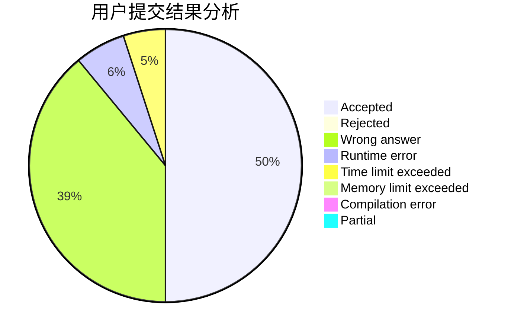
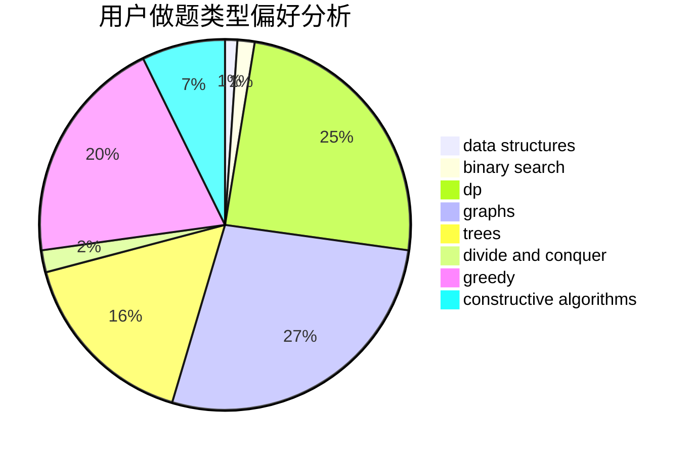
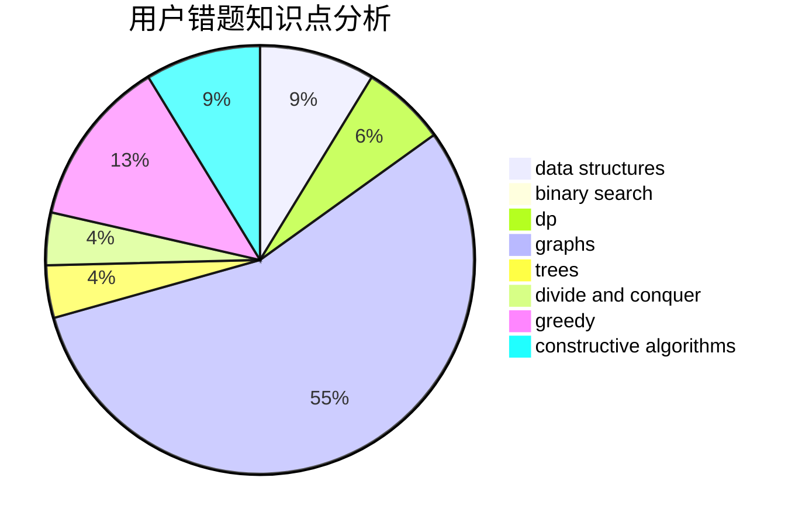

# SCUEC_Lyh

<!-- tabs:start -->

#### **用户提交结果分析**

#### **用户做题类型偏好分析**

#### **用户错题知识点分析**

<!-- tabs:end -->
# 推荐题目
[1466G](https://codeforces.com/contest/1466/problem/G)		combinatorics,
                        divide and conquer,
                        hashing,
                        math,
                        string suffix structures,
                        strings		  
[1100A](https://codeforces.com/contest/1100/problem/A)		implementation		  
[152E](https://codeforces.com/contest/152/problem/E)		bitmasks,
                        dp,
                        graphs,
                        trees		  
[551B](https://codeforces.com/contest/551/problem/B)		brute force,
                        constructive algorithms,
                        implementation,
                        strings		  
[62E](https://codeforces.com/contest/62/problem/E)		dp,
                        flows		  
[238C](https://codeforces.com/contest/238/problem/C)		dfs and similar,
                        dp,
                        greedy,
                        trees		  
[830D](https://codeforces.com/contest/830/problem/D)		combinatorics,
                        dp,
                        graphs,
                        trees		  
[763E](https://codeforces.com/contest/763/problem/E)		data structures,
                        divide and conquer,
                        dsu		  
[204E](https://codeforces.com/contest/204/problem/E)		data structures,
                        implementation,
                        string suffix structures,
                        two pointers		  
[21C](https://codeforces.com/contest/21/problem/C)		binary search,
                        dp,
                        sortings		  
