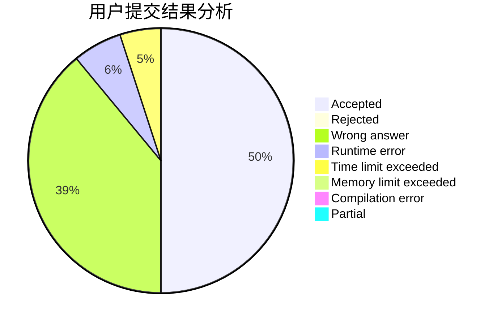
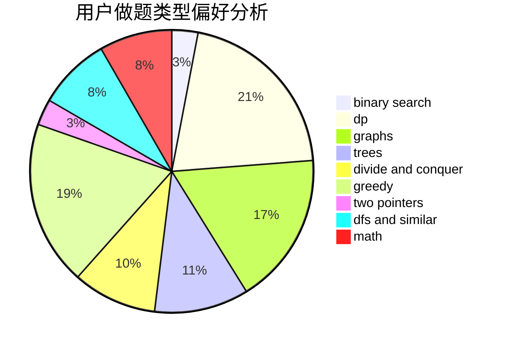

# SCUEC_Lyh

<!-- tabs:start -->

#### **用户提交结果分析**

#### **用户做题类型偏好分析**

<!-- tabs:end -->
# 推荐题目
[1466G](https://codeforces.com/contest/1466/problem/G)
[1100A](https://codeforces.com/contest/1100/problem/A)
[152E](https://codeforces.com/contest/152/problem/E)
[551B](https://codeforces.com/contest/551/problem/B)
[62E](https://codeforces.com/contest/62/problem/E)
[238C](https://codeforces.com/contest/238/problem/C)
[830D](https://codeforces.com/contest/830/problem/D)
[763E](https://codeforces.com/contest/763/problem/E)
[204E](https://codeforces.com/contest/204/problem/E)
[21C](https://codeforces.com/contest/21/problem/C)
