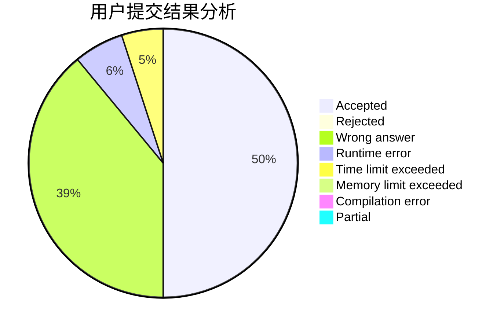
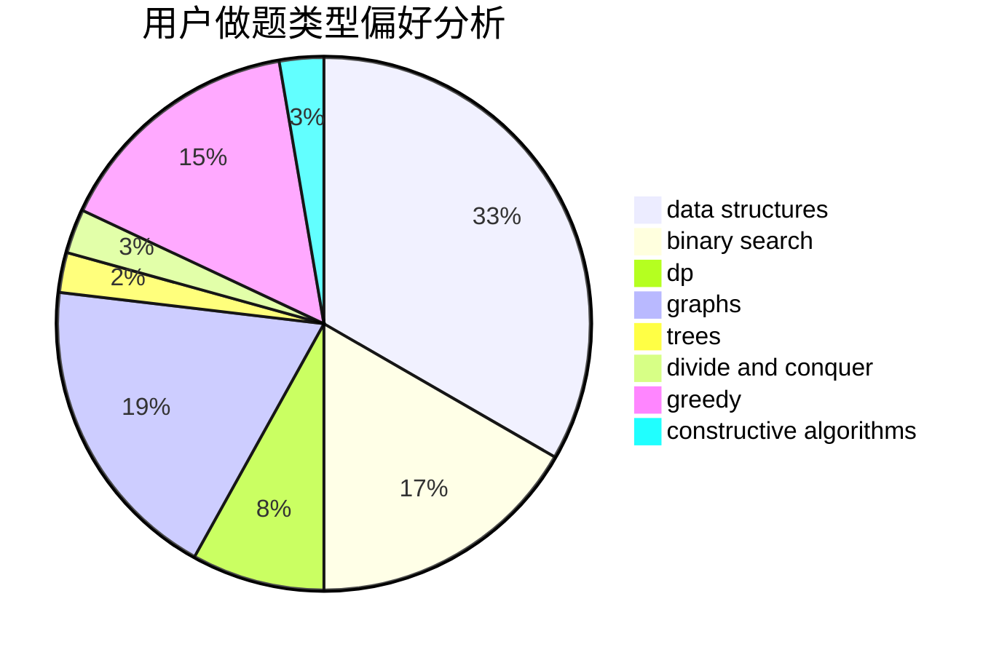
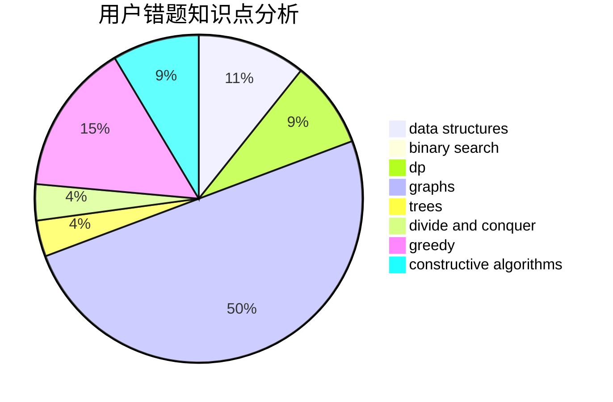

# SCUEC_Lyh

<!-- tabs:start -->

#### **用户提交结果分析**

#### **用户做题类型偏好分析**

#### **用户错题知识点分析**

<!-- tabs:end -->
# 推荐题目
[1457D](https://codeforces.com/contest/1457/problem/D)		dsu,graphs,sortings,trees		  
[10C](https://codeforces.com/contest/10/problem/C)		number theory		  
[1505D](https://codeforces.com/contest/1505/problem/D)		number theory		  
[527B](https://codeforces.com/contest/527/problem/B)		greedy		  
[610E](https://codeforces.com/contest/610/problem/E)		data structures,
                        strings		  
[219A](https://codeforces.com/contest/219/problem/A)		implementation,
                        strings		  
[812A](https://codeforces.com/contest/812/problem/A)		implementation		  
[743D](https://codeforces.com/contest/743/problem/D)		dfs and similar,
                        dp,
                        graphs,
                        trees		  
[178F2](https://codeforces.com/contest/178F/problem/2)		dp,
                        sortings,
                        strings		  
[198C](https://codeforces.com/contest/198/problem/C)		binary search,
                        geometry		  
