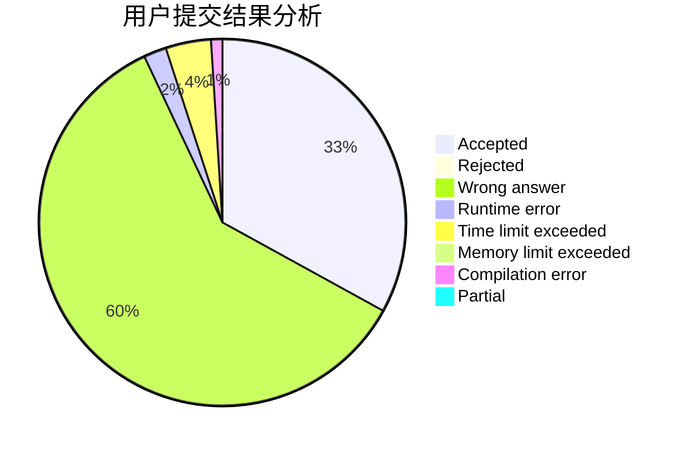
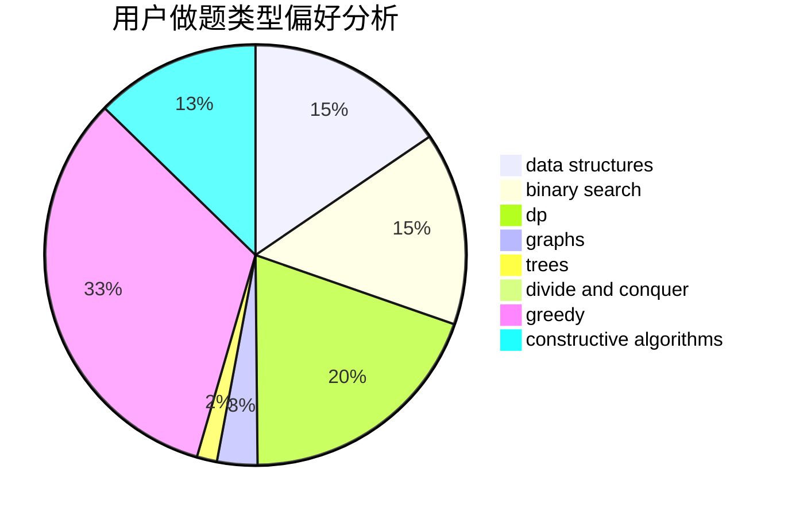
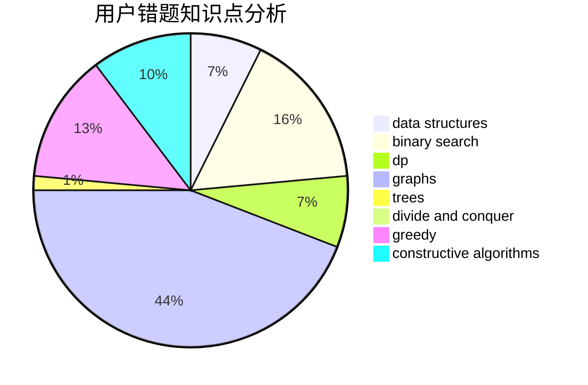

# SDUT-spirit

<!-- tabs:start -->

#### **用户提交结果分析**

#### **用户做题类型偏好分析**

#### **用户错题知识点分析**

<!-- tabs:end -->
# 推荐题目
[1183G](https://codeforces.com/contest/1183/problem/G)		greedy,
                        implementation,
                        sortings		  
[839E](https://codeforces.com/contest/839/problem/E)		brute force,
                        graphs,
                        math,
                        meet-in-the-middle		  
[441D](https://codeforces.com/contest/441/problem/D)		constructive algorithms,
                        dsu,
                        graphs,
                        implementation,
                        math,
                        string suffix structures		  
[851B](https://codeforces.com/contest/851/problem/B)		geometry,
                        math		  
[360E](https://codeforces.com/contest/360/problem/E)		graphs,
                        greedy,
                        shortest paths		  
[1058E](https://codeforces.com/contest/1058/problem/E)		dsu,graphs,sortings,trees		  
[608D](https://codeforces.com/contest/608/problem/D)		dsu,graphs,sortings,trees		  
[290B](https://codeforces.com/contest/290/problem/B)		*special problem,
                        implementation		  
[1142A](https://codeforces.com/contest/1142/problem/A)		brute force,
                        math		  
[1004E](https://codeforces.com/contest/1004/problem/E)		binary search,
                        data structures,
                        dp,
                        greedy,
                        shortest paths,
                        trees		  
