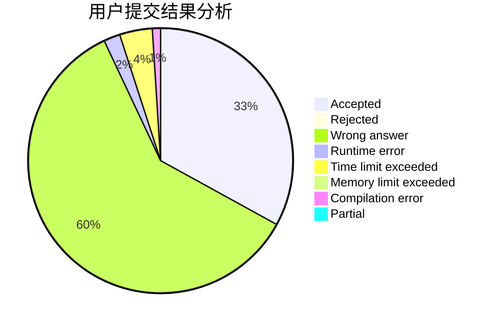
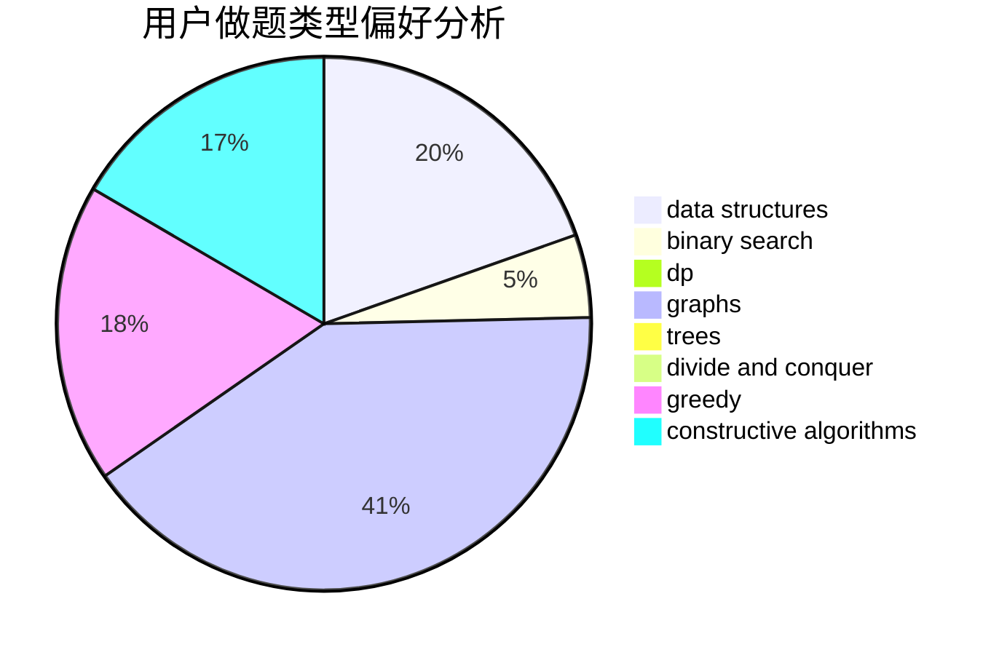
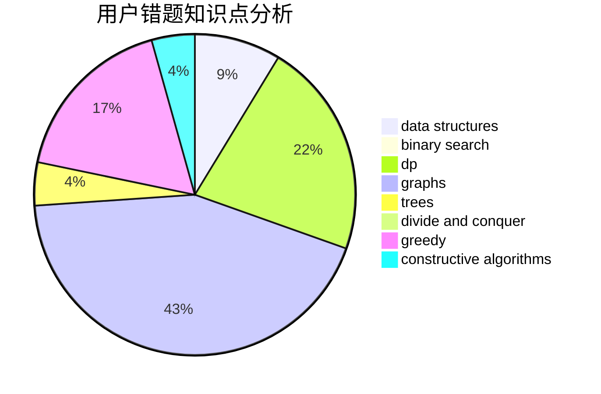

# SDUT-spirit

<!-- tabs:start -->

#### **用户提交结果分析**

#### **用户做题类型偏好分析**

#### **用户错题知识点分析**

<!-- tabs:end -->
# 推荐题目
[1186F](https://codeforces.com/contest/1186/problem/F)		dfs and similar,
                        graphs,
                        greedy,
                        implementation		  
[859B](https://codeforces.com/contest/859/problem/B)		brute force,
                        geometry,
                        math		  
[462B](https://codeforces.com/contest/462/problem/B)		greedy		  
[86C](https://codeforces.com/contest/86/problem/C)		dp,
                        string suffix structures,
                        trees		  
[389A](https://codeforces.com/contest/389/problem/A)		greedy,
                        math		  
[1059C](https://codeforces.com/contest/1059/problem/C)		constructive algorithms,
                        math		  
[627E](https://codeforces.com/contest/627/problem/E)		two pointers		  
[305B](https://codeforces.com/contest/305/problem/B)		brute force,
                        implementation,
                        math		  
[1144C](https://codeforces.com/contest/1144/problem/C)		constructive algorithms,
                        sortings		  
[10052](https://codeforces.com/contest/1005/problem/2)		dsu,graphs,sortings,trees		  
