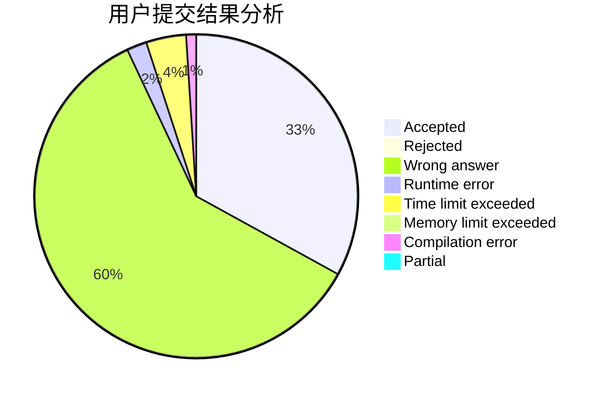
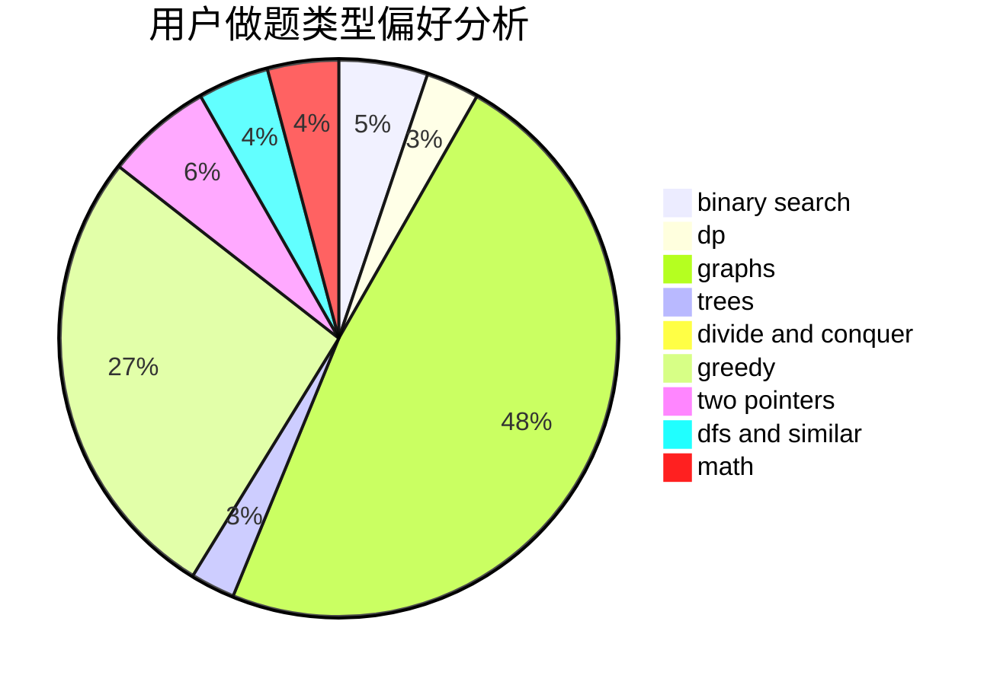

# SDUT-spirit

<!-- tabs:start -->

#### **用户提交结果分析**

#### **用户做题类型偏好分析**

<!-- tabs:end -->
# 推荐题目
[1186F](https://codeforces.com/contest/1186/problem/F)
[859B](https://codeforces.com/contest/859/problem/B)
[462B](https://codeforces.com/contest/462/problem/B)
[86C](https://codeforces.com/contest/86/problem/C)
[389A](https://codeforces.com/contest/389/problem/A)
[1059C](https://codeforces.com/contest/1059/problem/C)
[627E](https://codeforces.com/contest/627/problem/E)
[305B](https://codeforces.com/contest/305/problem/B)
[1144C](https://codeforces.com/contest/1144/problem/C)
[10052](https://codeforces.com/contest/1005/problem/2)
