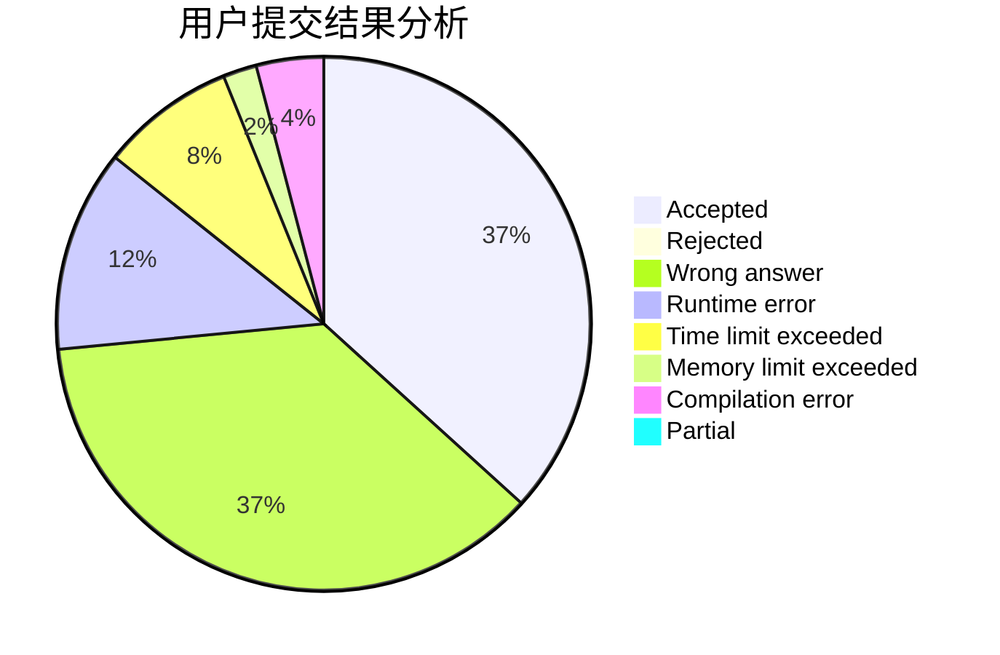
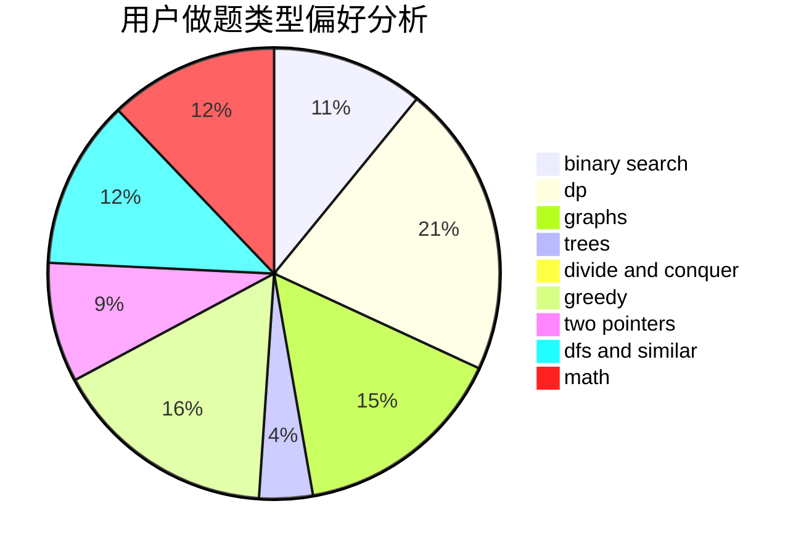

# SFWR

<!-- tabs:start -->

#### **用户提交结果分析**

#### **用户做题类型偏好分析**

<!-- tabs:end -->
# 推荐题目
[1408D](https://codeforces.com/contest/1408/problem/D)
[1510C](https://codeforces.com/contest/1510/problem/C)
[228B](https://codeforces.com/contest/228/problem/B)
[769A](https://codeforces.com/contest/769/problem/A)
[165A](https://codeforces.com/contest/165/problem/A)
[785B](https://codeforces.com/contest/785/problem/B)
[13B](https://codeforces.com/contest/13/problem/B)
[888D](https://codeforces.com/contest/888/problem/D)
[282E](https://codeforces.com/contest/282/problem/E)
[1056G](https://codeforces.com/contest/1056/problem/G)
