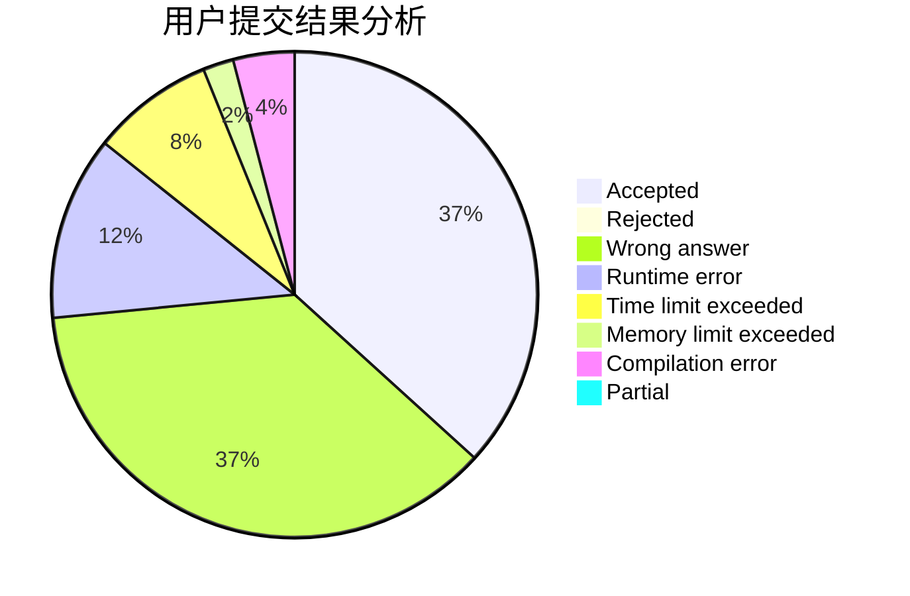
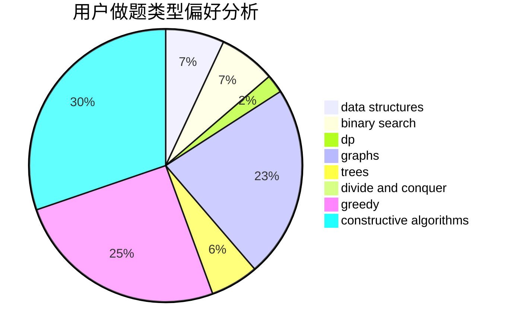

# SFWR

<!-- tabs:start -->

#### **用户提交结果分析**

#### **用户做题类型偏好分析**

#### **用户错题知识点分析**

<!-- tabs:end -->
# 推荐题目
[1399C](https://codeforces.com/contest/1399/problem/C)		brute force,
                        greedy,
                        two pointers		  
[14B](https://codeforces.com/contest/14/problem/B)		implementation		  
[204C](https://codeforces.com/contest/204/problem/C)		math,
                        probabilities		  
[74B](https://codeforces.com/contest/74/problem/B)		dp,
                        games,
                        greedy		  
[1510E](https://codeforces.com/contest/1510/problem/E)		nan		  
[765F](https://codeforces.com/contest/765/problem/F)		data structures		  
[1391E](https://codeforces.com/contest/1391/problem/E)		constructive algorithms,
                        dfs and similar,
                        graphs,
                        greedy,
                        trees		  
[869A](https://codeforces.com/contest/869/problem/A)		brute force,
                        implementation		  
[266E](https://codeforces.com/contest/266/problem/E)		data structures,
                        math		  
[1056D](https://codeforces.com/contest/1056/problem/D)		constructive algorithms,
                        dfs and similar,
                        dp,
                        graphs,
                        greedy,
                        sortings,
                        trees		  
