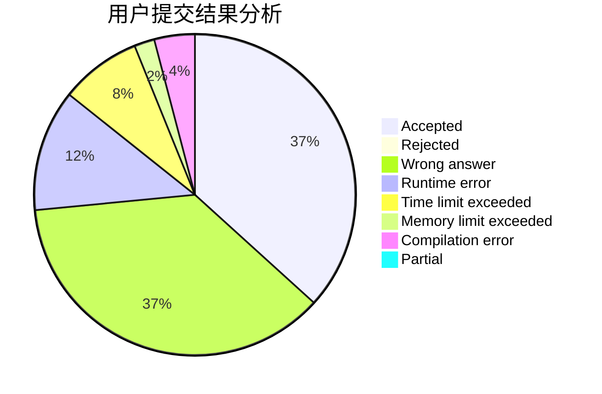
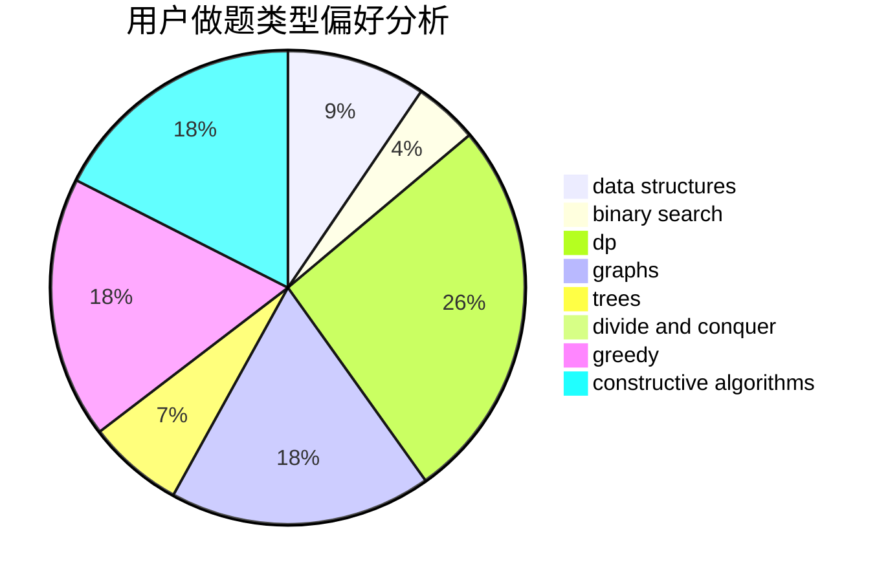

# SFWR

<!-- tabs:start -->

#### **用户提交结果分析**

#### **用户做题类型偏好分析**

#### **用户错题知识点分析**

<!-- tabs:end -->
# 推荐题目
[1408D](https://codeforces.com/contest/1408/problem/D)		binary search,
                        brute force,
                        data structures,
                        dp,
                        implementation,
                        sortings,
                        two pointers		  
[1510C](https://codeforces.com/contest/1510/problem/C)		dfs and similar,
                        graph matchings,
                        graphs		  
[228B](https://codeforces.com/contest/228/problem/B)		brute force,
                        implementation		  
[769A](https://codeforces.com/contest/769/problem/A)		*special problem,
                        implementation,
                        sortings		  
[165A](https://codeforces.com/contest/165/problem/A)		implementation		  
[785B](https://codeforces.com/contest/785/problem/B)		greedy,
                        sortings		  
[13B](https://codeforces.com/contest/13/problem/B)		geometry,
                        implementation		  
[888D](https://codeforces.com/contest/888/problem/D)		combinatorics,
                        dp,
                        math		  
[282E](https://codeforces.com/contest/282/problem/E)		bitmasks,
                        data structures,
                        trees		  
[1056G](https://codeforces.com/contest/1056/problem/G)		brute force,
                        data structures,
                        graphs		  
