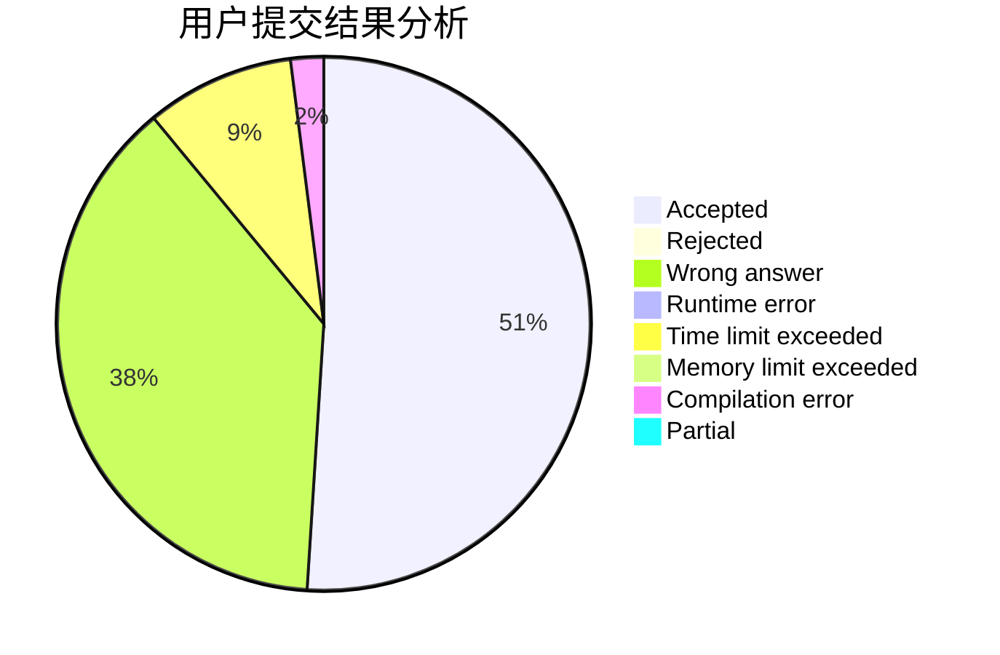
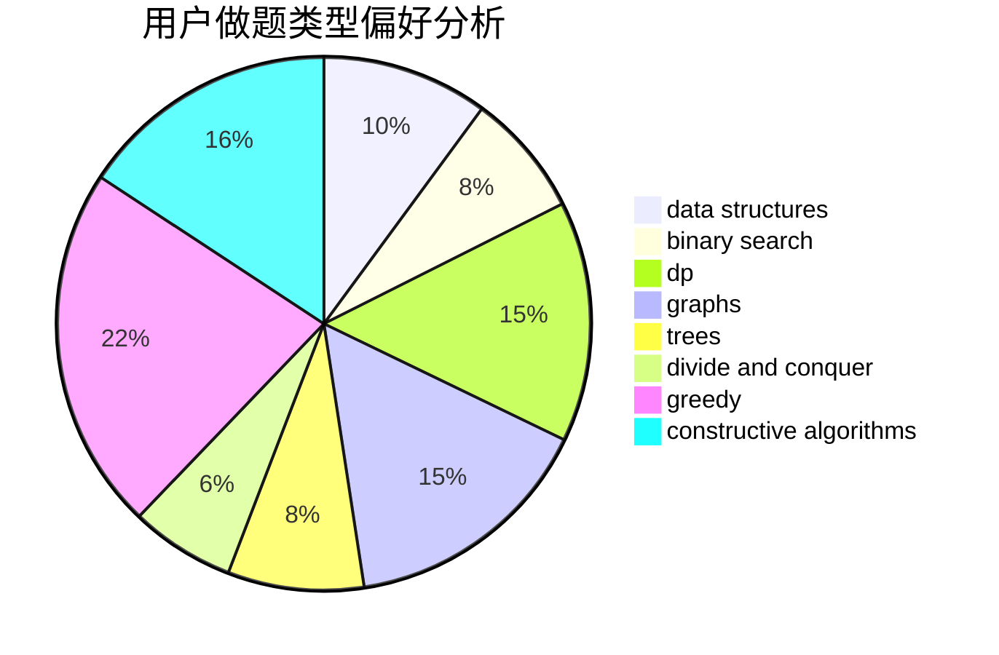
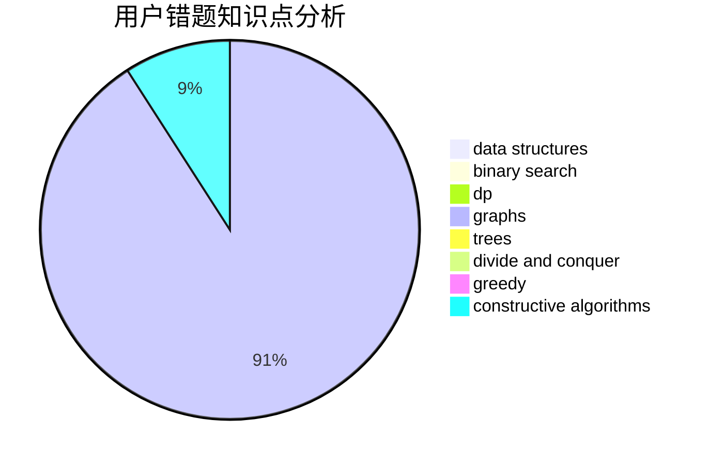

# SGColin

<!-- tabs:start -->

#### **用户提交结果分析**

#### **用户做题类型偏好分析**

#### **用户错题知识点分析**

<!-- tabs:end -->
# 推荐题目
[1361A](https://codeforces.com/contest/1361/problem/A)		constructive algorithms,
                        graphs,
                        greedy,
                        sortings		  
[1451F](https://codeforces.com/contest/1451/problem/F)		constructive algorithms,
                        games		  
[1131A](https://codeforces.com/contest/1131/problem/A)		math		  
[254A](https://codeforces.com/contest/254/problem/A)		constructive algorithms,
                        sortings		  
[359C](https://codeforces.com/contest/359/problem/C)		math,
                        number theory		  
[650B](https://codeforces.com/contest/650/problem/B)		binary search,
                        brute force,
                        dp,
                        two pointers		  
[276C](https://codeforces.com/contest/276/problem/C)		data structures,
                        greedy,
                        implementation,
                        sortings		  
[650C](https://codeforces.com/contest/650/problem/C)		dfs and similar,
                        dp,
                        dsu,
                        graphs,
                        greedy		  
[1297A](https://codeforces.com/contest/1297/problem/A)		*special problem,
                        implementation		  
[1070E](https://codeforces.com/contest/1070/problem/E)		binary search,
                        data structures		  
