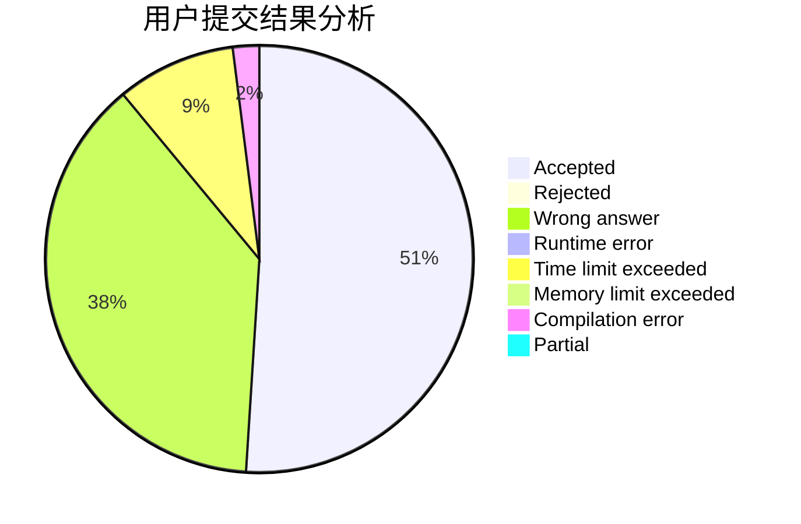
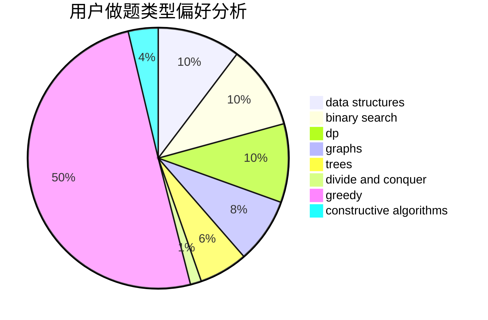
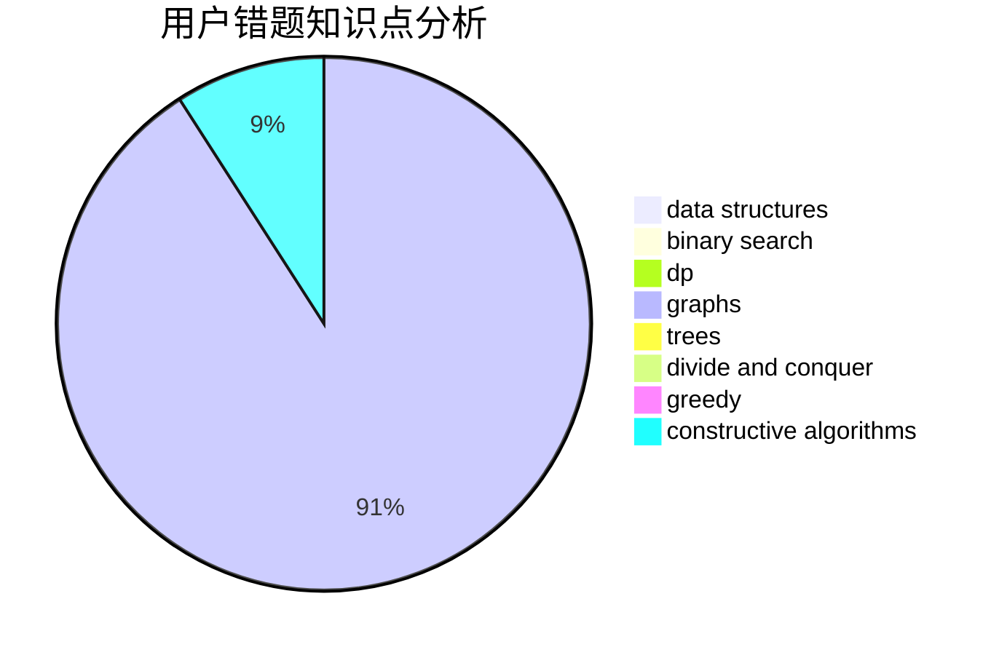

# SGColin
<!-- tabs:start -->
#### **用户提交结果分析**

#### **用户做题类型偏好分析**

#### **用户错题知识点分析**

<!-- tabs:end -->
# 推荐题目
[Toy Train](http://codeforces.com/problemset/problem/1129/A2)		brute force,
                        greedy		  
[The Time](http://codeforces.com/problemset/problem/622/B)		implementation		  
[The Great Julya Calendar](http://codeforces.com/problemset/problem/331/C3)		dp		  
[Table](http://codeforces.com/problemset/problem/232/B)		bitmasks,
                        combinatorics,
                        dp,
                        math		  
[PawnChess](http://codeforces.com/problemset/problem/592/A)		implementation		  
[Maximum Value](https://codeforces.com/contest/485/problem/D)		binary search,
                        math,
                        sortings,
                        two pointers		  
[Almost Permutation](http://codeforces.com/problemset/problem/863/F)		flows		  
[Air Conditioner](http://codeforces.com/problemset/problem/1304/C)		dp,
                        greedy,
                        implementation,
                        sortings,
                        two pointers		  
[Berkomnadzor](http://codeforces.com/problemset/problem/1070/B)		data structures,
                        greedy		  
[Not Equal on a Segment](http://codeforces.com/problemset/problem/622/C)		data structures,
                        implementation		  
<!-- tabs:start -->
#### **data structures**
[Toy Train](http://codeforces.com/problemset/problem/1070/B)		data structures,
                        greedy		  
[The Time](http://codeforces.com/problemset/problem/622/C)		data structures,
                        implementation		  
[The Great Julya Calendar](http://codeforces.com/problemset/problem/1034/D)		binary search,
                        data structures,
                        two pointers		  
[Table](http://codeforces.com/problemset/problem/901/C)		binary search,
                        data structures,
                        dfs and similar,
                        dsu,
                        graphs,
                        two pointers		  
[PawnChess](http://codeforces.com/problemset/problem/1175/E)		data structures,
                        dfs and similar,
                        divide and conquer,
                        dp,
                        greedy,
                        implementation,
                        trees		  
[Maximum Value](http://codeforces.com/problemset/problem/1364/A)		brute force,
                        data structures,
                        number theory,
                        two pointers		  
[Almost Permutation](http://codeforces.com/problemset/problem/1354/D)		binary search,
                        data structures		  
[Air Conditioner](http://codeforces.com/problemset/problem/1444/C)		data structures,
                        dfs and similar,
                        dsu,
                        graphs		  
[Berkomnadzor](http://codeforces.com/problemset/problem/678/F)		data structures,
                        divide and conquer,
                        geometry		  
[Not Equal on a Segment](http://codeforces.com/problemset/problem/86/D)		data structures,
                        implementation,
                        math,
                        two pointers		  
#### **binary search**
[Toy Train](https://codeforces.com/contest/485/problem/D)		binary search,
                        math,
                        sortings,
                        two pointers		  
[The Time](http://codeforces.com/problemset/problem/1034/D)		binary search,
                        data structures,
                        two pointers		  
[The Great Julya Calendar](http://codeforces.com/problemset/problem/785/C)		binary search,
                        math		  
[Table](http://codeforces.com/problemset/problem/613/A)		binary search,
                        geometry,
                        ternary search		  
[PawnChess](http://codeforces.com/problemset/problem/778/A)		binary search,
                        greedy,
                        strings		  
[Maximum Value](http://codeforces.com/problemset/problem/901/C)		binary search,
                        data structures,
                        dfs and similar,
                        dsu,
                        graphs,
                        two pointers		  
[Almost Permutation](http://codeforces.com/problemset/problem/1354/D)		binary search,
                        data structures		  
[Air Conditioner](http://codeforces.com/problemset/problem/1492/C)		binary search,
                        data structures,
                        dp,
                        greedy,
                        two pointers		  
[Berkomnadzor](http://codeforces.com/problemset/problem/1463/D)		binary search,
                        constructive algorithms,
                        greedy,
                        two pointers		  
[Not Equal on a Segment](http://codeforces.com/problemset/problem/1490/G)		binary search,
                        data structures,
                        math		  
#### **dp**
[Toy Train](http://codeforces.com/problemset/problem/331/C3)		dp		  
[The Time](http://codeforces.com/problemset/problem/232/B)		bitmasks,
                        combinatorics,
                        dp,
                        math		  
[The Great Julya Calendar](http://codeforces.com/problemset/problem/1304/C)		dp,
                        greedy,
                        implementation,
                        sortings,
                        two pointers		  
[Table](https://codeforces.com/contest/1424/problem/I)		bitmasks,
                        constructive algorithms,
                        dp,
                        math		  
[PawnChess](https://codeforces.com/contest/816/problem/E)		brute force,
                        dp,
                        trees		  
[Maximum Value](http://codeforces.com/problemset/problem/383/D)		dp		  
[Almost Permutation](http://codeforces.com/problemset/problem/258/D)		dp,
                        math,
                        probabilities		  
[Air Conditioner](http://codeforces.com/problemset/problem/115/D)		dp,
                        expression parsing		  
[Berkomnadzor](http://codeforces.com/problemset/problem/494/B)		dp,
                        strings		  
[Not Equal on a Segment](http://codeforces.com/problemset/problem/1420/C1)		constructive algorithms,
                        dp,
                        greedy		  
#### **graph**
[Toy Train](http://codeforces.com/problemset/problem/1176/E)		dfs and similar,
                        dsu,
                        graphs,
                        shortest paths,
                        trees		  
[The Time](http://codeforces.com/problemset/problem/901/C)		binary search,
                        data structures,
                        dfs and similar,
                        dsu,
                        graphs,
                        two pointers		  
[The Great Julya Calendar](http://codeforces.com/problemset/problem/1290/D)		constructive algorithms,
                        graphs,
                        interactive		  
[Table](http://codeforces.com/problemset/problem/387/D)		graph matchings		  
[PawnChess](http://codeforces.com/problemset/problem/906/C)		bitmasks,
                        brute force,
                        dp,
                        graphs		  
[Maximum Value](http://codeforces.com/problemset/problem/160/D)		dfs and similar,
                        dsu,
                        graphs,
                        sortings		  
[Almost Permutation](http://codeforces.com/problemset/problem/1444/C)		data structures,
                        dfs and similar,
                        dsu,
                        graphs		  
[Air Conditioner](http://codeforces.com/problemset/problem/1495/D)		combinatorics,
                        dfs and similar,
                        graphs,
                        math,
                        shortest paths,
                        trees		  
[Berkomnadzor](http://codeforces.com/problemset/problem/1487/C)		brute force,
                        constructive algorithms,
                        dfs and similar,
                        graphs,
                        greedy,
                        implementation,
                        math		  
[Not Equal on a Segment](http://codeforces.com/problemset/problem/1437/C)		dp,
                        flows,
                        graph matchings,
                        greedy,
                        math,
                        sortings		  
#### **trees**
[Toy Train](http://codeforces.com/problemset/problem/1176/E)		dfs and similar,
                        dsu,
                        graphs,
                        shortest paths,
                        trees		  
[The Time](https://codeforces.com/contest/816/problem/E)		brute force,
                        dp,
                        trees		  
[The Great Julya Calendar](http://codeforces.com/problemset/problem/960/D)		brute force,
                        implementation,
                        trees		  
[Table](http://codeforces.com/problemset/problem/960/E)		combinatorics,
                        dfs and similar,
                        divide and conquer,
                        dp,
                        probabilities,
                        trees		  
[PawnChess](http://codeforces.com/problemset/problem/1280/D)		dp,
                        greedy,
                        trees		  
[Maximum Value](http://codeforces.com/problemset/problem/1175/E)		data structures,
                        dfs and similar,
                        divide and conquer,
                        dp,
                        greedy,
                        implementation,
                        trees		  
[Almost Permutation](http://codeforces.com/problemset/problem/735/E)		dp,
                        trees		  
[Air Conditioner](http://codeforces.com/problemset/problem/1495/D)		combinatorics,
                        dfs and similar,
                        graphs,
                        math,
                        shortest paths,
                        trees		  
[Berkomnadzor](http://codeforces.com/problemset/problem/1479/D)		binary search,
                        bitmasks,
                        brute force,
                        data structures,
                        probabilities,
                        trees		  
[Not Equal on a Segment](http://codeforces.com/problemset/problem/1511/C)		brute force,
                        data structures,
                        implementation,
                        trees		  
#### **divide and conquer**
[Toy Train](http://codeforces.com/problemset/problem/960/E)		combinatorics,
                        dfs and similar,
                        divide and conquer,
                        dp,
                        probabilities,
                        trees		  
[The Time](http://codeforces.com/problemset/problem/1175/E)		data structures,
                        dfs and similar,
                        divide and conquer,
                        dp,
                        greedy,
                        implementation,
                        trees		  
[The Great Julya Calendar](http://codeforces.com/problemset/problem/678/F)		data structures,
                        divide and conquer,
                        geometry		  
[Table](http://codeforces.com/problemset/problem/1461/D)		binary search,
                        brute force,
                        data structures,
                        divide and conquer,
                        implementation,
                        sortings		  
[PawnChess](http://codeforces.com/problemset/problem/1466/G)		combinatorics,
                        divide and conquer,
                        hashing,
                        math,
                        string suffix structures,
                        strings		  
[Maximum Value](http://codeforces.com/problemset/problem/1490/D)		dfs and similar,
                        divide and conquer,
                        implementation		  
[Almost Permutation](https://codeforces.com/contest/1483/problem/C)		data structures,
                        divide and conquer,
                        dp		  
[Air Conditioner](http://codeforces.com/problemset/problem/1491/E)		brute force,
                        dfs and similar,
                        divide and conquer,
                        number theory,
                        trees		  
[Berkomnadzor](http://codeforces.com/problemset/problem/1303/G)		data structures,
                        divide and conquer,
                        geometry,
                        trees		  
[Not Equal on a Segment](http://codeforces.com/problemset/problem/1494/D)		constructive algorithms,
                        data structures,
                        dfs and similar,
                        divide and conquer,
                        dsu,
                        greedy,
                        sortings,
                        trees		  
#### **greedy**
[Toy Train](http://codeforces.com/problemset/problem/1129/A2)		brute force,
                        greedy		  
[The Time](http://codeforces.com/problemset/problem/1304/C)		dp,
                        greedy,
                        implementation,
                        sortings,
                        two pointers		  
[The Great Julya Calendar](http://codeforces.com/problemset/problem/1070/B)		data structures,
                        greedy		  
[Table](http://codeforces.com/problemset/problem/1130/B)		greedy		  
[PawnChess](http://codeforces.com/problemset/problem/778/A)		binary search,
                        greedy,
                        strings		  
[Maximum Value](http://codeforces.com/problemset/problem/1420/C1)		constructive algorithms,
                        dp,
                        greedy		  
[Almost Permutation](http://codeforces.com/problemset/problem/1280/D)		dp,
                        greedy,
                        trees		  
[Air Conditioner](http://codeforces.com/problemset/problem/1175/E)		data structures,
                        dfs and similar,
                        divide and conquer,
                        dp,
                        greedy,
                        implementation,
                        trees		  
[Berkomnadzor](http://codeforces.com/problemset/problem/1442/A)		constructive algorithms,
                        dp,
                        greedy		  
[Not Equal on a Segment](http://codeforces.com/problemset/problem/1203/F2)		dp,
                        greedy		  
#### **constructive algorithms**
[Toy Train](https://codeforces.com/contest/1424/problem/I)		bitmasks,
                        constructive algorithms,
                        dp,
                        math		  
[The Time](http://codeforces.com/problemset/problem/1290/D)		constructive algorithms,
                        graphs,
                        interactive		  
[The Great Julya Calendar](http://codeforces.com/problemset/problem/652/F)		constructive algorithms,
                        math		  
[Table](http://codeforces.com/problemset/problem/1420/C1)		constructive algorithms,
                        dp,
                        greedy		  
[PawnChess](http://codeforces.com/problemset/problem/1442/A)		constructive algorithms,
                        dp,
                        greedy		  
[Maximum Value](http://codeforces.com/problemset/problem/1144/C)		constructive algorithms,
                        sortings		  
[Almost Permutation](http://codeforces.com/problemset/problem/1493/A)		constructive algorithms,
                        greedy		  
[Air Conditioner](http://codeforces.com/problemset/problem/1463/D)		binary search,
                        constructive algorithms,
                        greedy,
                        two pointers		  
[Berkomnadzor](https://codeforces.com/contest/1456/problem/B)		bitmasks,
                        brute force,
                        constructive algorithms		  
[Not Equal on a Segment](http://codeforces.com/problemset/problem/1492/D)		bitmasks,
                        constructive algorithms,
                        greedy,
                        math		  
#### **sortings**
[Toy Train](https://codeforces.com/contest/485/problem/D)		binary search,
                        math,
                        sortings,
                        two pointers		  
[The Time](http://codeforces.com/problemset/problem/1304/C)		dp,
                        greedy,
                        implementation,
                        sortings,
                        two pointers		  
[The Great Julya Calendar](http://codeforces.com/problemset/problem/160/D)		dfs and similar,
                        dsu,
                        graphs,
                        sortings		  
[Table](http://codeforces.com/problemset/problem/1144/C)		constructive algorithms,
                        sortings		  
[PawnChess](https://codeforces.com/contest/841/problem/C)		combinatorics,
                        greedy,
                        math,
                        number theory,
                        sortings		  
[Maximum Value](http://codeforces.com/problemset/problem/1311/B)		dfs and similar,
                        sortings		  
[Almost Permutation](https://codeforces.com/contest/1496/problem/C)		geometry,
                        greedy,
                        math,
                        sortings		  
[Air Conditioner](http://codeforces.com/problemset/problem/1495/A)		geometry,
                        greedy,
                        math,
                        sortings		  
[Berkomnadzor](http://codeforces.com/problemset/problem/1497/A)		brute force,
                        data structures,
                        greedy,
                        sortings		  
[Not Equal on a Segment](http://codeforces.com/problemset/problem/1427/A)		math,
                        sortings		  
<!-- tabs:end -->
