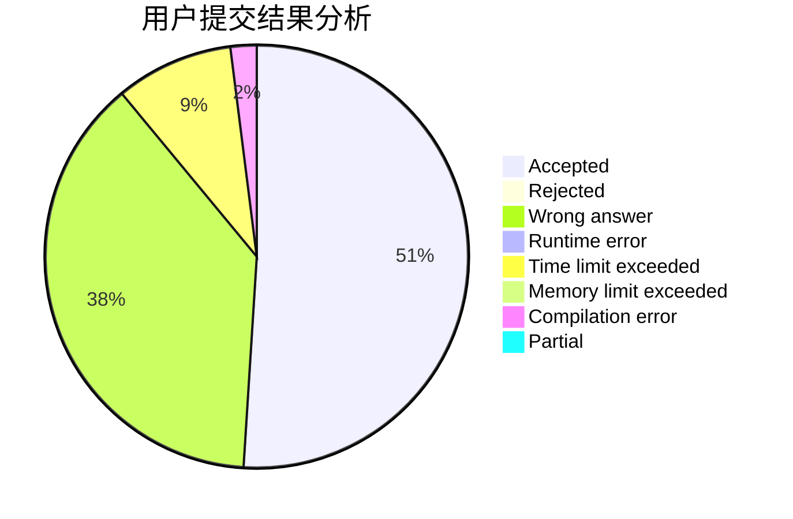
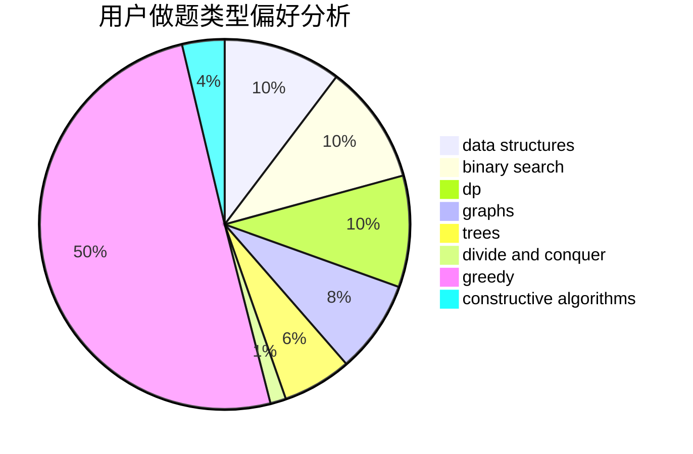
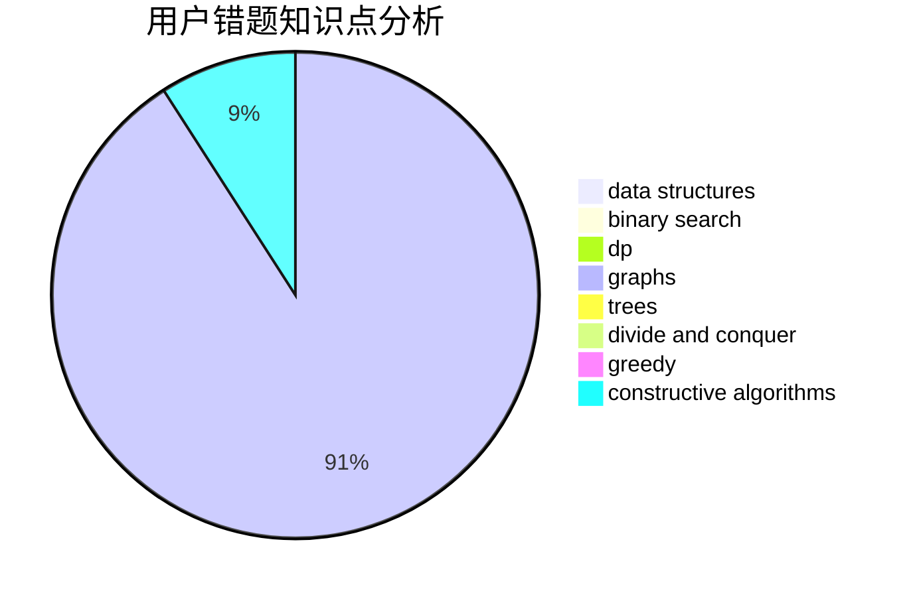

# SGColin

<!-- tabs:start -->

#### **用户提交结果分析**

#### **用户做题类型偏好分析**

#### **用户错题知识点分析**

<!-- tabs:end -->
# 推荐题目
[1354D](https://codeforces.com/contest/1354/problem/D)		binary search,
                        data structures		  
[1442A](https://codeforces.com/contest/1442/problem/A)		constructive algorithms,
                        dp,
                        greedy		  
[1129A2](https://codeforces.com/contest/1129A/problem/2)		brute force,
                        greedy		  
[232B](https://codeforces.com/contest/232/problem/B)		bitmasks,
                        combinatorics,
                        dp,
                        math		  
[331C3](https://codeforces.com/contest/331C/problem/3)		dp		  
[622B](https://codeforces.com/contest/622/problem/B)		implementation		  
[258D](https://codeforces.com/contest/258/problem/D)		dp,
                        math,
                        probabilities		  
[622C](https://codeforces.com/contest/622/problem/C)		data structures,
                        implementation		  
[1290D](https://codeforces.com/contest/1290/problem/D)		constructive algorithms,
                        graphs,
                        interactive		  
[1070B](https://codeforces.com/contest/1070/problem/B)		data structures,
                        greedy		  
