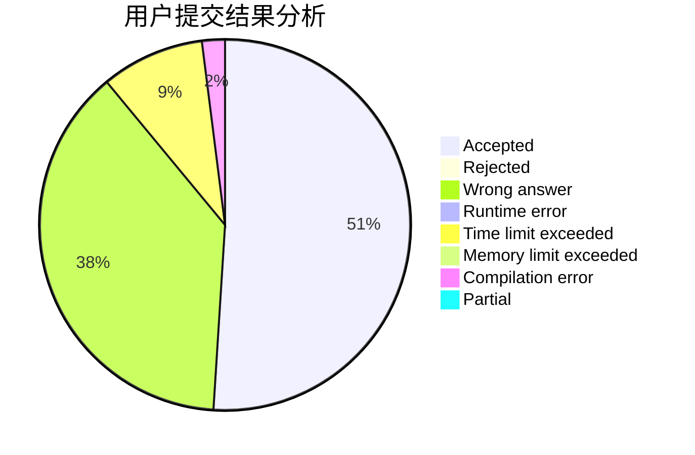
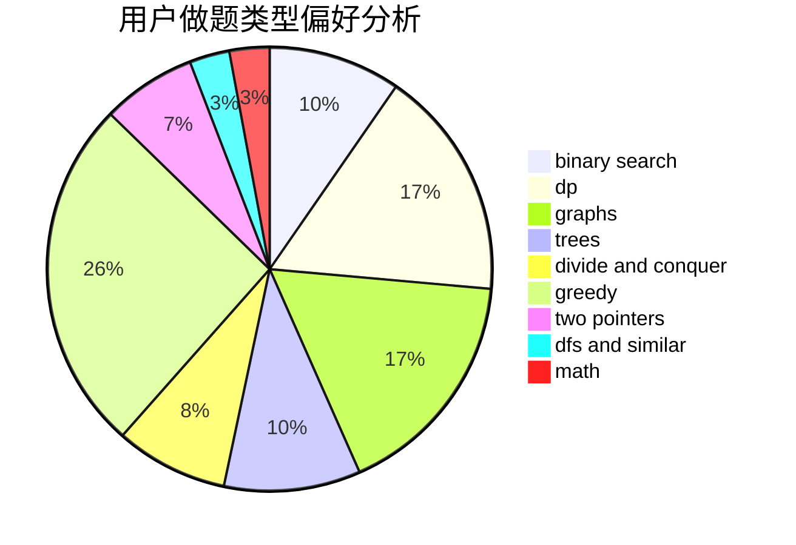

# SGColin

<!-- tabs:start -->

#### **用户提交结果分析**

#### **用户做题类型偏好分析**

<!-- tabs:end -->
# 推荐题目
[1361A](https://codeforces.com/contest/1361/problem/A)
[1451F](https://codeforces.com/contest/1451/problem/F)
[1131A](https://codeforces.com/contest/1131/problem/A)
[254A](https://codeforces.com/contest/254/problem/A)
[359C](https://codeforces.com/contest/359/problem/C)
[650B](https://codeforces.com/contest/650/problem/B)
[276C](https://codeforces.com/contest/276/problem/C)
[650C](https://codeforces.com/contest/650/problem/C)
[1297A](https://codeforces.com/contest/1297/problem/A)
[1070E](https://codeforces.com/contest/1070/problem/E)
