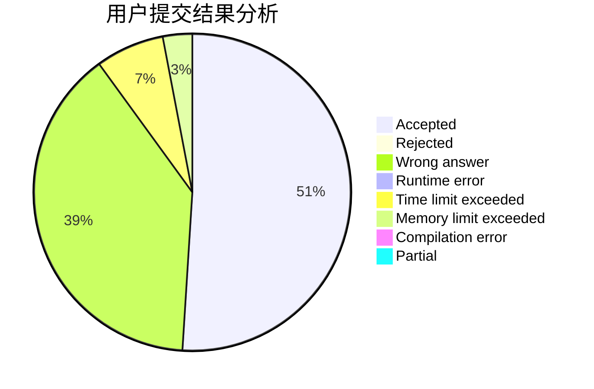
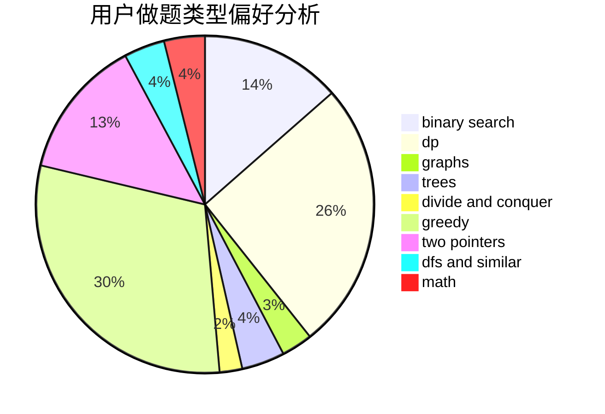

# SHU_DD

<!-- tabs:start -->

#### **用户提交结果分析**

#### **用户做题类型偏好分析**

<!-- tabs:end -->
# 推荐题目
[67A](https://codeforces.com/contest/67/problem/A)
[1349E](https://codeforces.com/contest/1349/problem/E)
[127A](https://codeforces.com/contest/127/problem/A)
[510D](https://codeforces.com/contest/510/problem/D)
[864F](https://codeforces.com/contest/864/problem/F)
[778D](https://codeforces.com/contest/778/problem/D)
[729E](https://codeforces.com/contest/729/problem/E)
[319D](https://codeforces.com/contest/319/problem/D)
[733B](https://codeforces.com/contest/733/problem/B)
[830A](https://codeforces.com/contest/830/problem/A)
