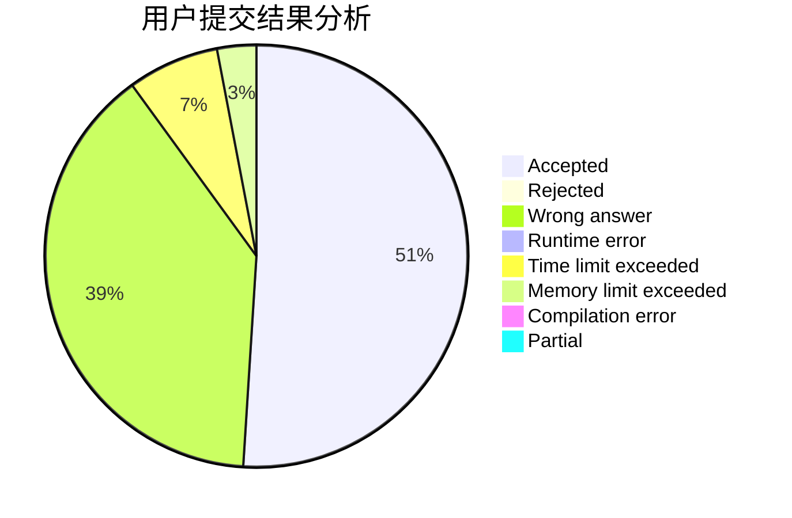
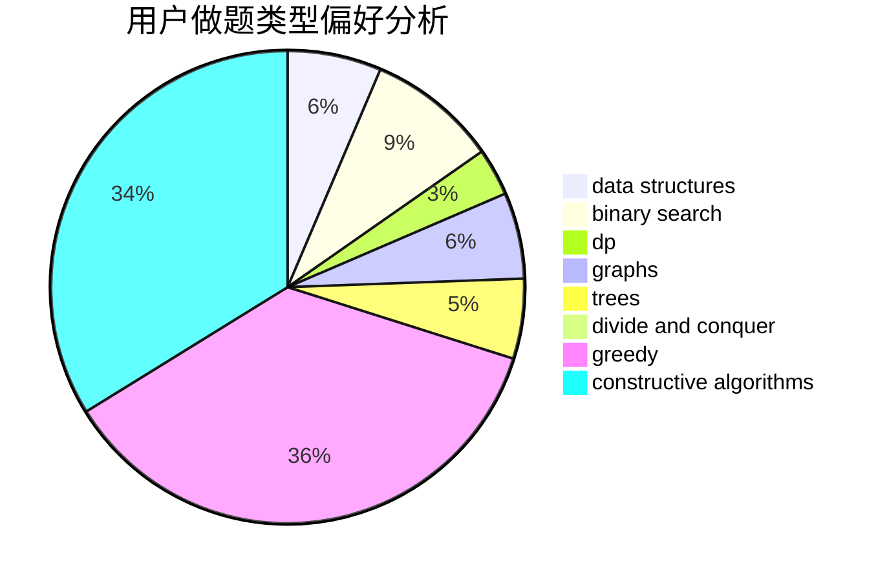
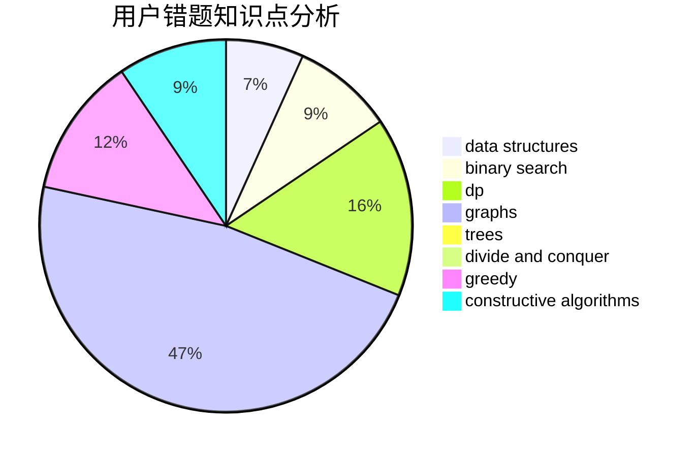

# SHU_DD

<!-- tabs:start -->

#### **用户提交结果分析**

#### **用户做题类型偏好分析**

#### **用户错题知识点分析**

<!-- tabs:end -->
# 推荐题目
[659F](https://codeforces.com/contest/659/problem/F)		dfs and similar,
                        dsu,
                        graphs,
                        greedy,
                        sortings		  
[1343A](https://codeforces.com/contest/1343/problem/A)		brute force,
                        math		  
[1270G](https://codeforces.com/contest/1270/problem/G)		constructive algorithms,
                        dfs and similar,
                        graphs,
                        math		  
[490E](https://codeforces.com/contest/490/problem/E)		binary search,
                        brute force,
                        greedy,
                        implementation		  
[846E](https://codeforces.com/contest/846/problem/E)		dfs and similar,
                        greedy,
                        trees		  
[759B](https://codeforces.com/contest/759/problem/B)		dsu,graphs,sortings,trees		  
[709D](https://codeforces.com/contest/709/problem/D)		dsu,graphs,sortings,trees		  
[301A](https://codeforces.com/contest/301/problem/A)		constructive algorithms		  
[714E](https://codeforces.com/contest/714/problem/E)		dsu,graphs,sortings,trees		  
[811C](https://codeforces.com/contest/811/problem/C)		dp,
                        implementation		  
