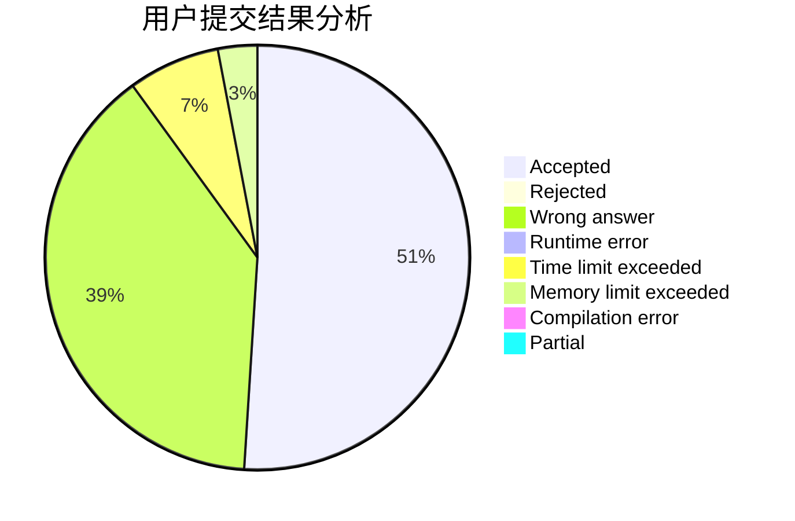
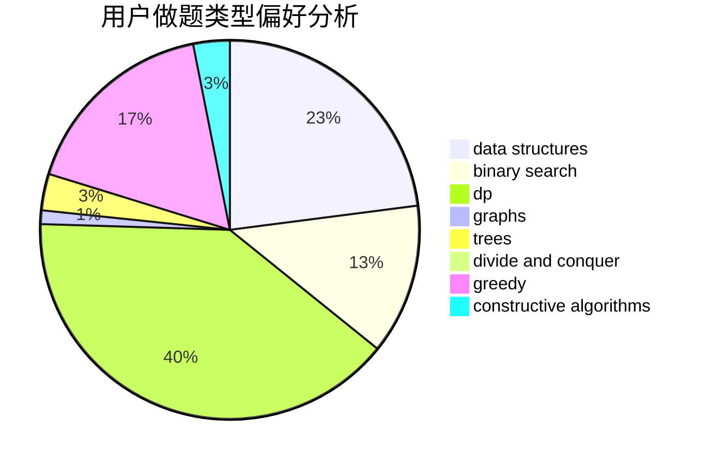
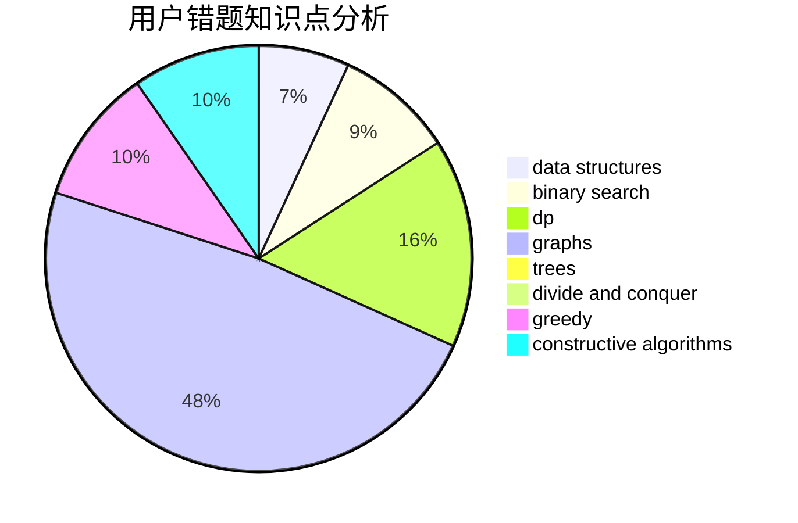

# SHU_DD

<!-- tabs:start -->

#### **用户提交结果分析**

#### **用户做题类型偏好分析**

#### **用户错题知识点分析**

<!-- tabs:end -->
# 推荐题目
[67A](https://codeforces.com/contest/67/problem/A)		dp,
                        graphs,
                        greedy,
                        implementation		  
[1349E](https://codeforces.com/contest/1349/problem/E)		constructive algorithms,
                        dp,
                        greedy		  
[127A](https://codeforces.com/contest/127/problem/A)		geometry		  
[510D](https://codeforces.com/contest/510/problem/D)		bitmasks,
                        brute force,
                        dp,
                        math		  
[864F](https://codeforces.com/contest/864/problem/F)		dfs and similar,
                        graphs,
                        trees		  
[778D](https://codeforces.com/contest/778/problem/D)		constructive algorithms		  
[729E](https://codeforces.com/contest/729/problem/E)		constructive algorithms,
                        data structures,
                        graphs,
                        greedy,
                        sortings		  
[319D](https://codeforces.com/contest/319/problem/D)		greedy,
                        hashing,
                        string suffix structures,
                        strings		  
[733B](https://codeforces.com/contest/733/problem/B)		math		  
[830A](https://codeforces.com/contest/830/problem/A)		binary search,
                        brute force,
                        dp,
                        greedy,
                        sortings		  
