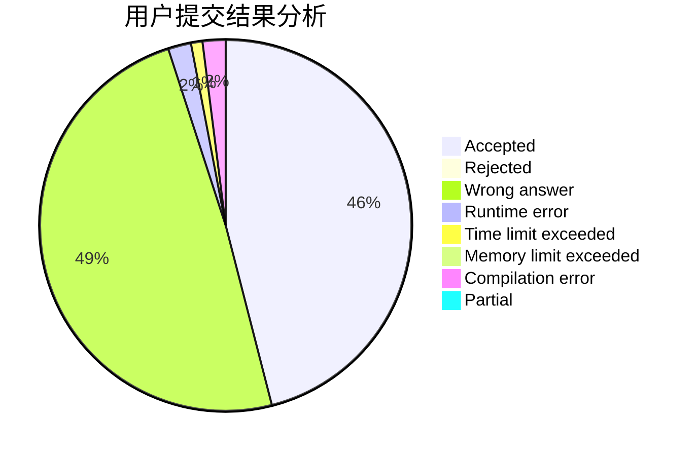
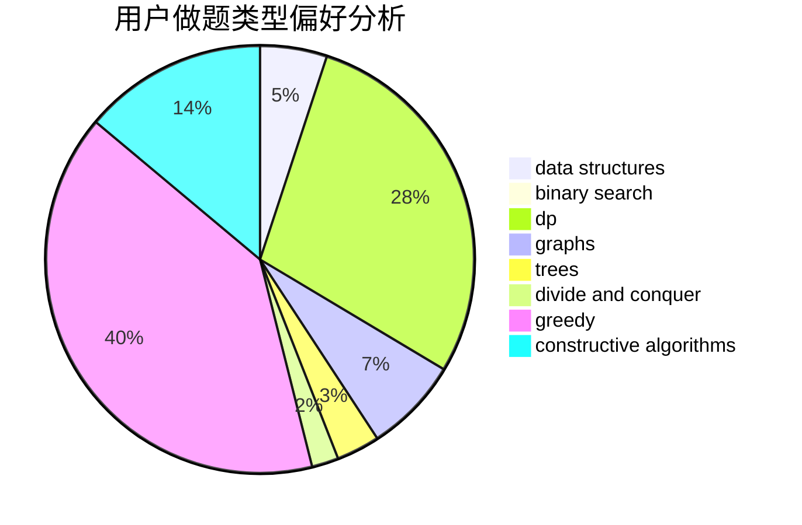
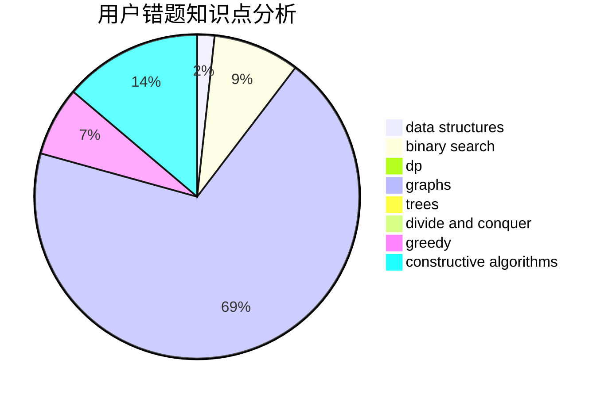

# ANDX

<!-- tabs:start -->

#### **用户提交结果分析**

#### **用户做题类型偏好分析**

#### **用户错题知识点分析**

<!-- tabs:end -->
# 推荐题目
[1505I](https://codeforces.com/contest/1505/problem/I)		nan		  
[1505G](https://codeforces.com/contest/1505/problem/G)		implementation		  
[1065G](https://codeforces.com/contest/1065/problem/G)		strings		  
[1401E](https://codeforces.com/contest/1401/problem/E)		data structures,
                        geometry,
                        implementation,
                        sortings		  
[11C](https://codeforces.com/contest/11/problem/C)		implementation		  
[1053A](https://codeforces.com/contest/1053/problem/A)		dsu,graphs,sortings,trees		  
[1077D](https://codeforces.com/contest/1077/problem/D)		binary search,
                        sortings		  
[1044F](https://codeforces.com/contest/1044/problem/F)		data structures		  
[1131B](https://codeforces.com/contest/1131/problem/B)		greedy,
                        implementation		  
[1293A](https://codeforces.com/contest/1293/problem/A)		binary search,
                        brute force,
                        implementation		  
