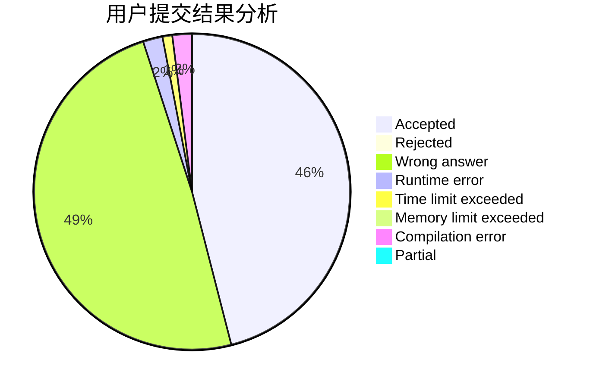
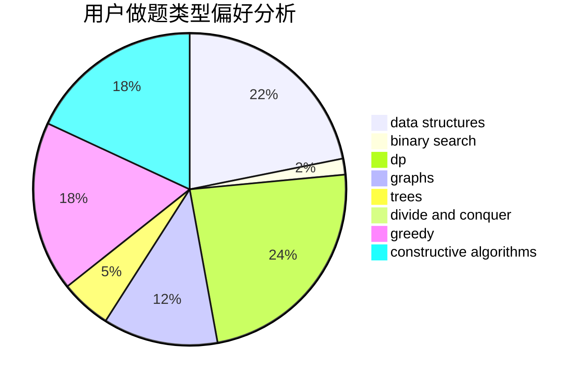
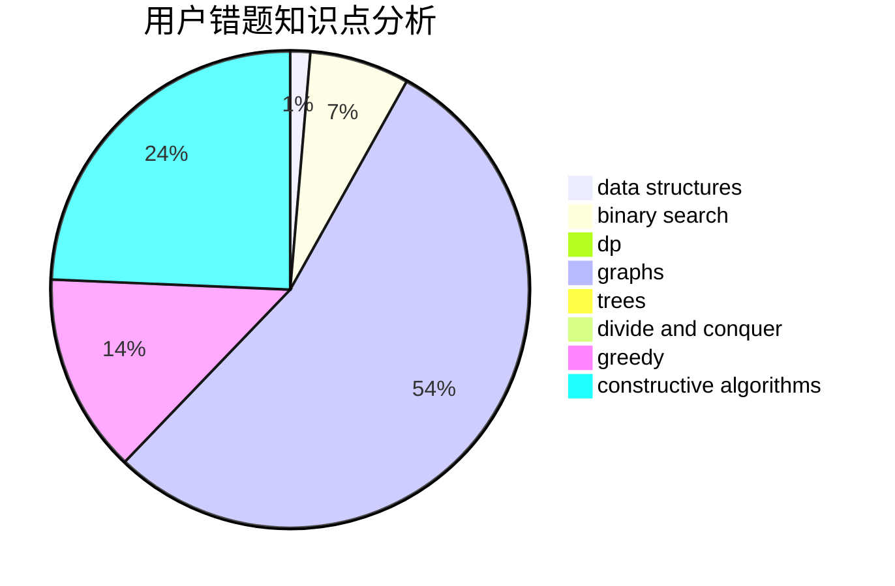

# ANDX

<!-- tabs:start -->

#### **用户提交结果分析**

#### **用户做题类型偏好分析**

#### **用户错题知识点分析**

<!-- tabs:end -->
# 推荐题目
[1497C1](https://codeforces.com/contest/1497C/problem/1)		constructive algorithms,
                        math		  
[1497A](https://codeforces.com/contest/1497/problem/A)		brute force,
                        data structures,
                        greedy,
                        sortings		  
[1065C](https://codeforces.com/contest/1065/problem/C)		greedy		  
[1393E2](https://codeforces.com/contest/1393E/problem/2)		dp,
                        hashing,
                        implementation,
                        string suffix structures,
                        strings,
                        two pointers		  
[1196B](https://codeforces.com/contest/1196/problem/B)		constructive algorithms,
                        math		  
[1051E](https://codeforces.com/contest/1051/problem/E)		binary search,
                        data structures,
                        dp,
                        hashing,
                        strings		  
[1077C](https://codeforces.com/contest/1077/problem/C)		nan		  
[1044A](https://codeforces.com/contest/1044/problem/A)		binary search,
                        two pointers		  
[1129B](https://codeforces.com/contest/1129/problem/B)		constructive algorithms		  
[1285F](https://codeforces.com/contest/1285/problem/F)		binary search,
                        combinatorics,
                        number theory		  
