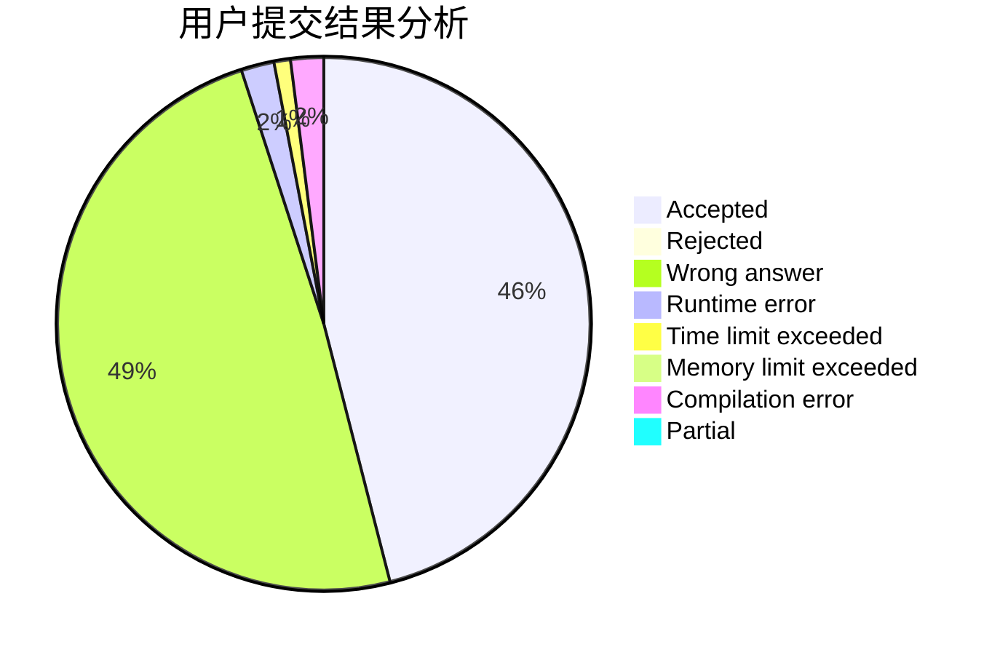
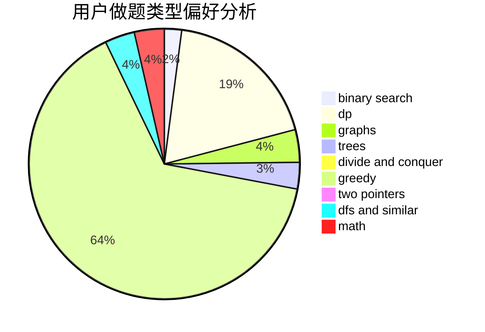

# ANDX

<!-- tabs:start -->

#### **用户提交结果分析**

#### **用户做题类型偏好分析**

<!-- tabs:end -->
# 推荐题目
[1505I](https://codeforces.com/contest/1505/problem/I)
[1505G](https://codeforces.com/contest/1505/problem/G)
[1065G](https://codeforces.com/contest/1065/problem/G)
[1401E](https://codeforces.com/contest/1401/problem/E)
[11C](https://codeforces.com/contest/11/problem/C)
[1053A](https://codeforces.com/contest/1053/problem/A)
[1077D](https://codeforces.com/contest/1077/problem/D)
[1044F](https://codeforces.com/contest/1044/problem/F)
[1131B](https://codeforces.com/contest/1131/problem/B)
[1293A](https://codeforces.com/contest/1293/problem/A)
