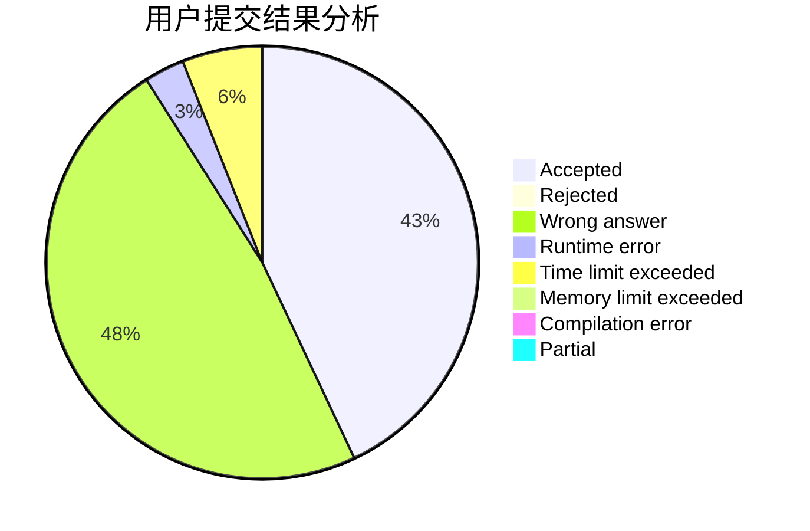
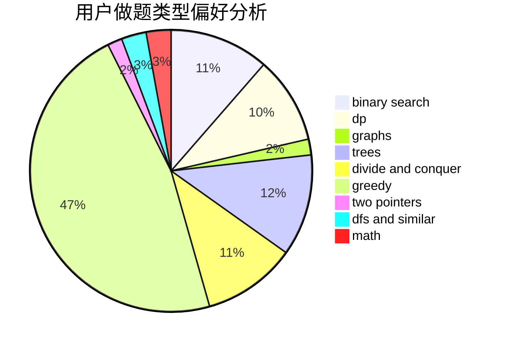

# SHUlpt

<!-- tabs:start -->

#### **用户提交结果分析**

#### **用户做题类型偏好分析**

<!-- tabs:end -->
# 推荐题目
[398E](https://codeforces.com/contest/398/problem/E)
[616C](https://codeforces.com/contest/616/problem/C)
[755G](https://codeforces.com/contest/755/problem/G)
[1138E](https://codeforces.com/contest/1138/problem/E)
[1109D](https://codeforces.com/contest/1109/problem/D)
[956F](https://codeforces.com/contest/956/problem/F)
[235E](https://codeforces.com/contest/235/problem/E)
[375C](https://codeforces.com/contest/375/problem/C)
[3313](https://codeforces.com/contest/331/problem/3)
[232C](https://codeforces.com/contest/232/problem/C)
