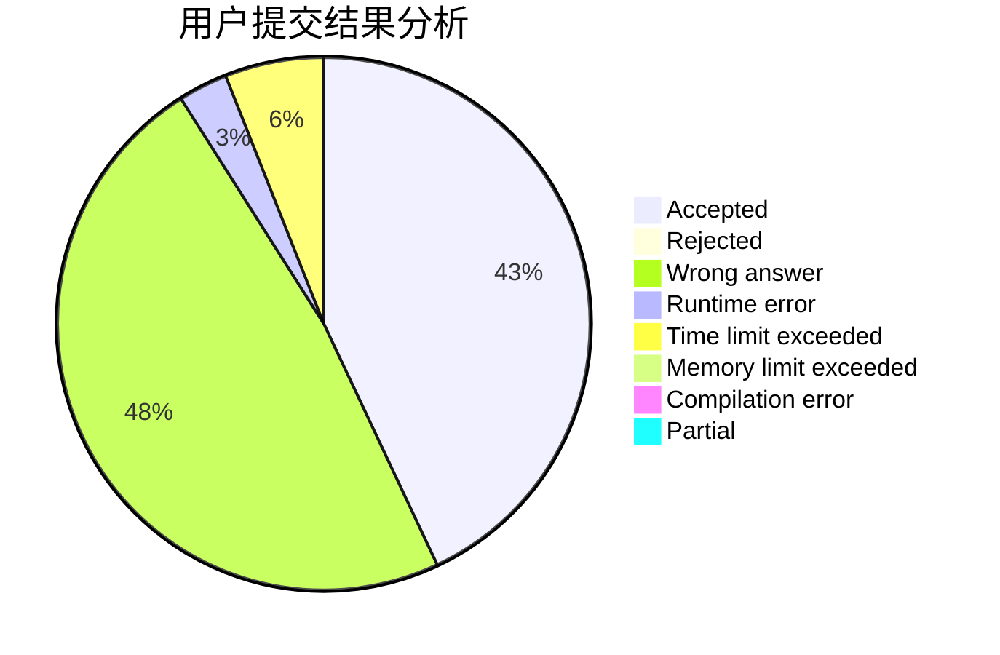
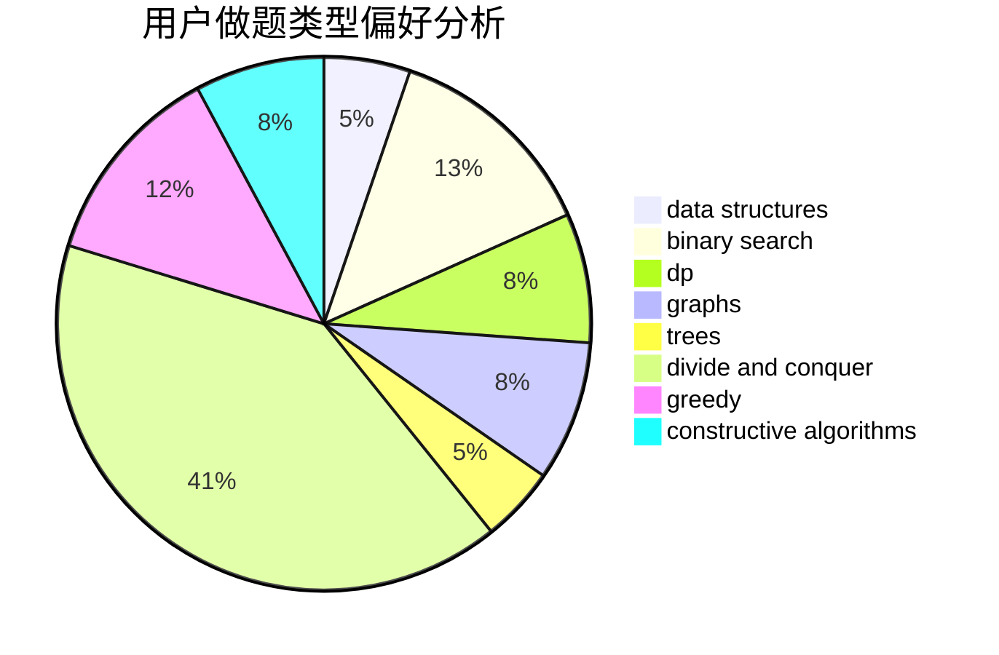
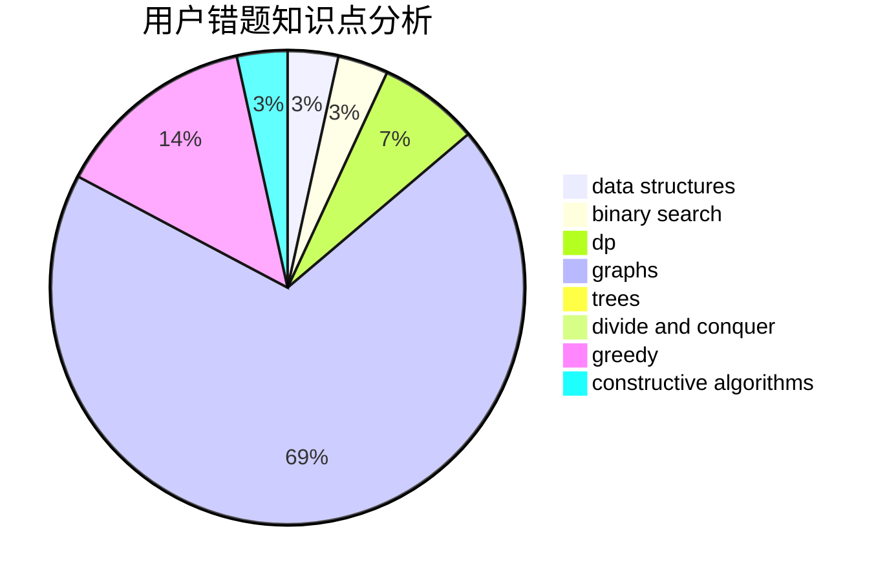

# SHUlpt

<!-- tabs:start -->

#### **用户提交结果分析**

#### **用户做题类型偏好分析**

#### **用户错题知识点分析**

<!-- tabs:end -->
# 推荐题目
[398E](https://codeforces.com/contest/398/problem/E)		nan		  
[616C](https://codeforces.com/contest/616/problem/C)		dfs and similar		  
[755G](https://codeforces.com/contest/755/problem/G)		combinatorics,
                        divide and conquer,
                        dp,
                        fft,
                        math,
                        number theory		  
[1138E](https://codeforces.com/contest/1138/problem/E)		dsu,graphs,sortings,trees		  
[1109D](https://codeforces.com/contest/1109/problem/D)		brute force,
                        combinatorics,
                        dp,
                        math,
                        trees		  
[956F](https://codeforces.com/contest/956/problem/F)		dsu,graphs,sortings,trees		  
[235E](https://codeforces.com/contest/235/problem/E)		combinatorics,
                        dp,
                        implementation,
                        math,
                        number theory		  
[375C](https://codeforces.com/contest/375/problem/C)		bitmasks,
                        shortest paths		  
[3313](https://codeforces.com/contest/331/problem/3)		dsu,graphs,sortings,trees		  
[232C](https://codeforces.com/contest/232/problem/C)		constructive algorithms,
                        divide and conquer,
                        dp,
                        graphs,
                        shortest paths		  
