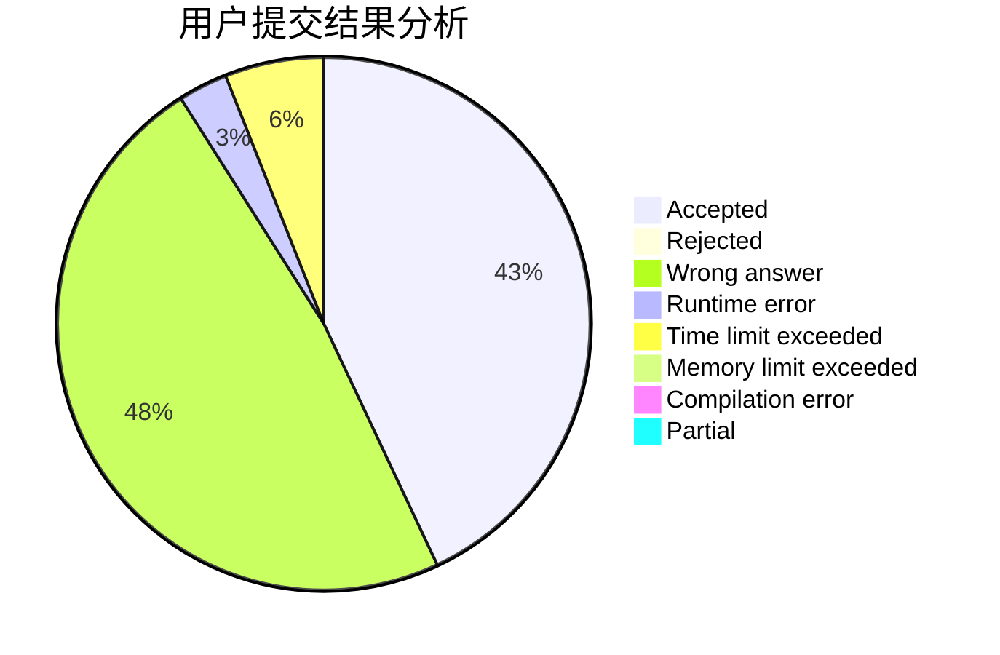
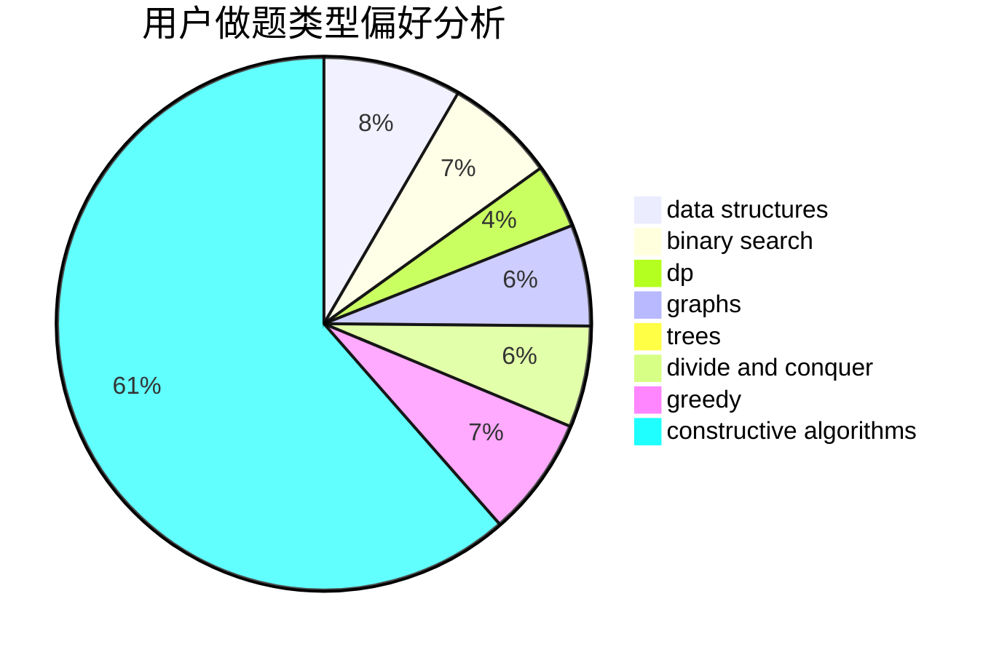
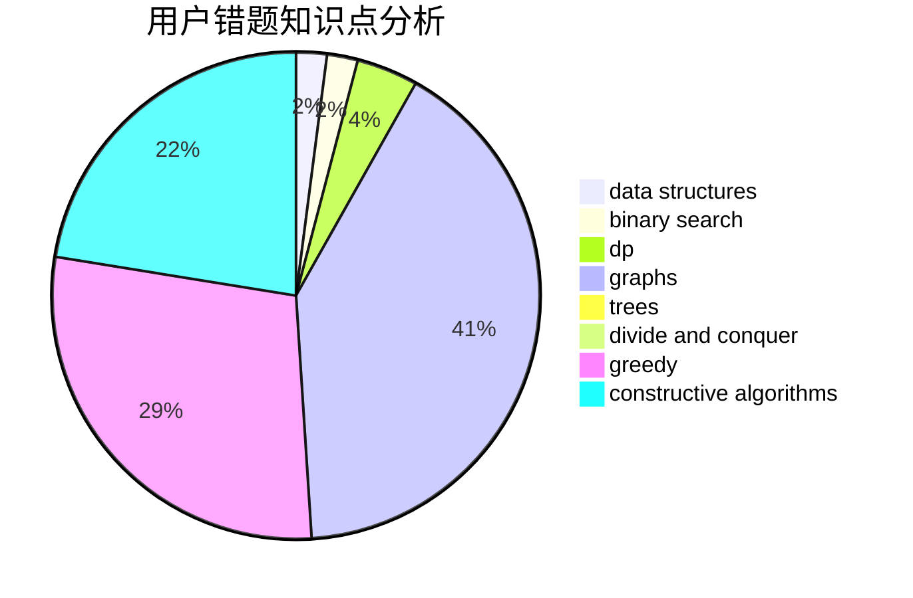

# SHUlpt

<!-- tabs:start -->

#### **用户提交结果分析**

#### **用户做题类型偏好分析**

#### **用户错题知识点分析**

<!-- tabs:end -->
# 推荐题目
[367E](https://codeforces.com/contest/367/problem/E)		combinatorics,
                        dp		  
[598D](https://codeforces.com/contest/598/problem/D)		dfs and similar,
                        graphs,
                        shortest paths		  
[735A](https://codeforces.com/contest/735/problem/A)		implementation,
                        strings		  
[1136C](https://codeforces.com/contest/1136/problem/C)		constructive algorithms,
                        sortings		  
[1108F](https://codeforces.com/contest/1108/problem/F)		binary search,
                        dsu,
                        graphs,
                        greedy		  
[935A](https://codeforces.com/contest/935/problem/A)		brute force,
                        implementation		  
[216C](https://codeforces.com/contest/216/problem/C)		greedy		  
[348C](https://codeforces.com/contest/348/problem/C)		brute force,
                        data structures		  
[30B](https://codeforces.com/contest/30/problem/B)		implementation		  
[212D](https://codeforces.com/contest/212/problem/D)		binary search,
                        data structures,
                        dsu		  
