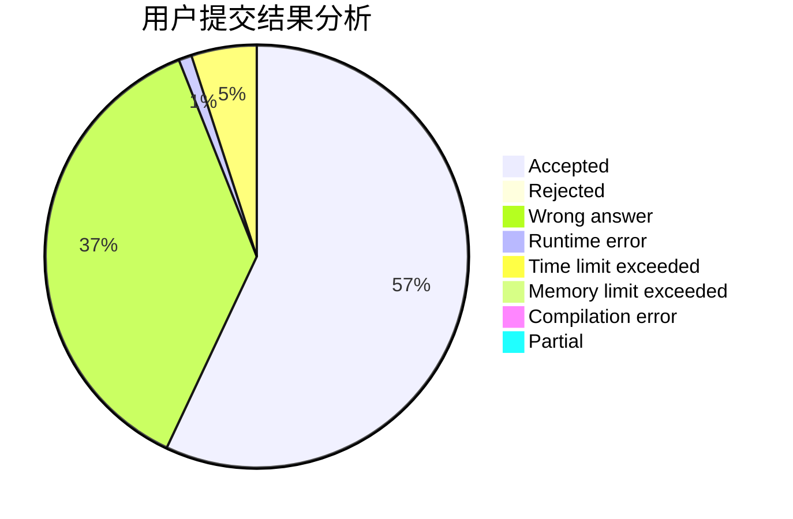
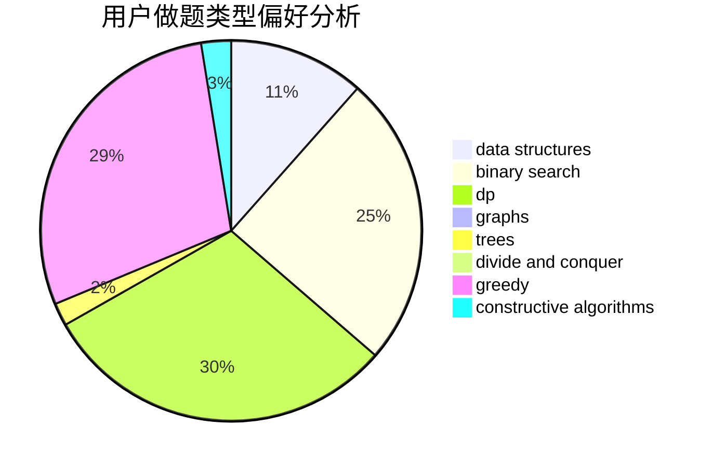
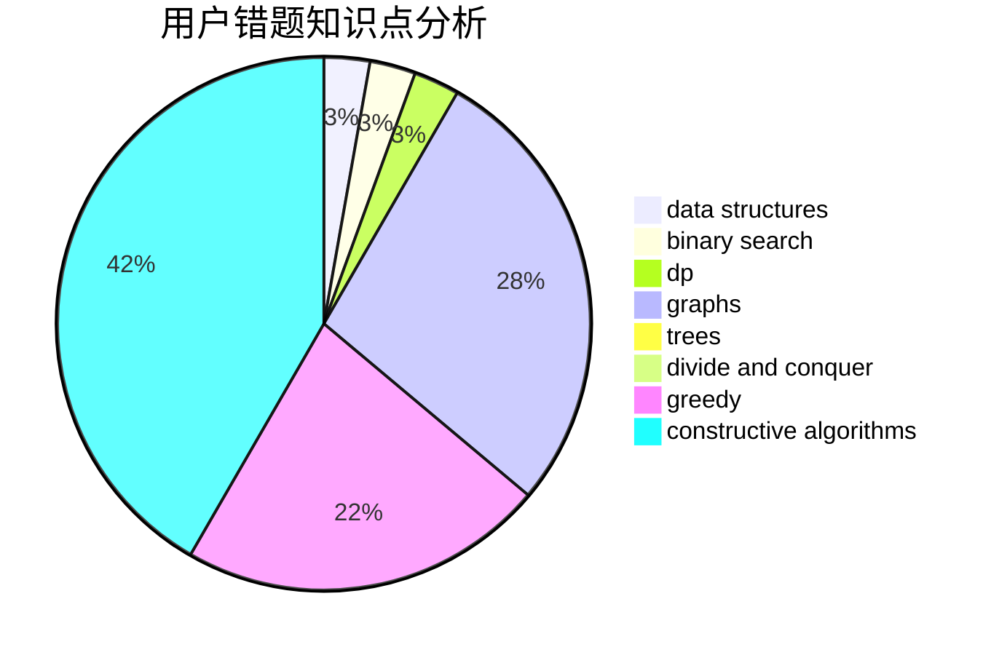

# SJoshua

<!-- tabs:start -->

#### **用户提交结果分析**

#### **用户做题类型偏好分析**

#### **用户错题知识点分析**

<!-- tabs:end -->
# 推荐题目
[430C](https://codeforces.com/contest/430/problem/C)		dsu,graphs,sortings,trees		  
[900B](https://codeforces.com/contest/900/problem/B)		math,
                        number theory		  
[617E](https://codeforces.com/contest/617/problem/E)		data structures		  
[689A](https://codeforces.com/contest/689/problem/A)		brute force,
                        constructive algorithms,
                        implementation		  
[819D](https://codeforces.com/contest/819/problem/D)		number theory		  
[1109E](https://codeforces.com/contest/1109/problem/E)		data structures,
                        number theory		  
[702A](https://codeforces.com/contest/702/problem/A)		dp,
                        greedy,
                        implementation		  
[1293E](https://codeforces.com/contest/1293/problem/E)		dsu,graphs,sortings,trees		  
[11951](https://codeforces.com/contest/1195/problem/1)		dsu,graphs,sortings,trees		  
[732A](https://codeforces.com/contest/732/problem/A)		brute force,
                        constructive algorithms,
                        implementation,
                        math		  
