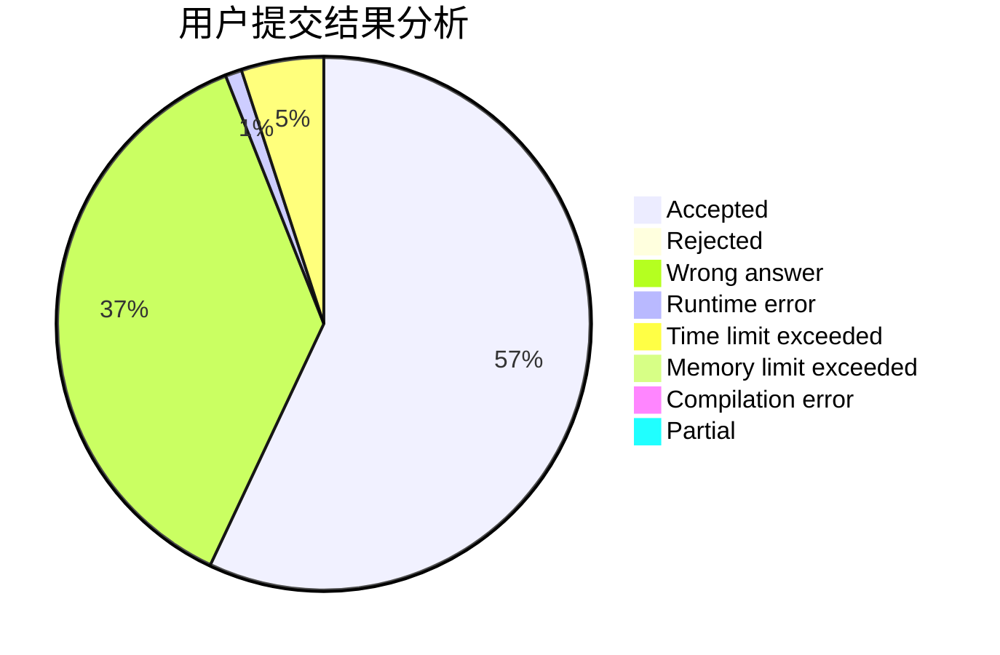
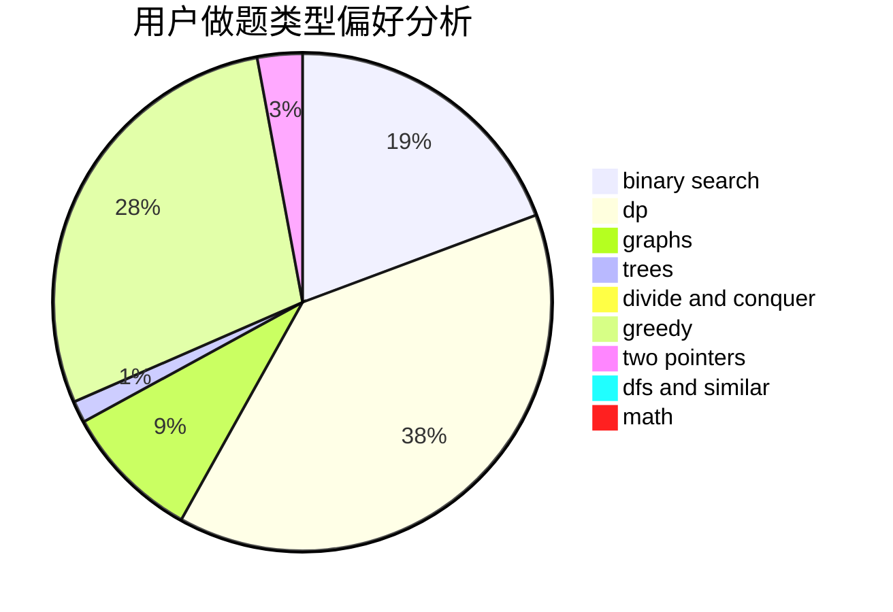

# SJoshua

<!-- tabs:start -->

#### **用户提交结果分析**

#### **用户做题类型偏好分析**

<!-- tabs:end -->
# 推荐题目
[430C](https://codeforces.com/contest/430/problem/C)
[900B](https://codeforces.com/contest/900/problem/B)
[617E](https://codeforces.com/contest/617/problem/E)
[689A](https://codeforces.com/contest/689/problem/A)
[819D](https://codeforces.com/contest/819/problem/D)
[1109E](https://codeforces.com/contest/1109/problem/E)
[702A](https://codeforces.com/contest/702/problem/A)
[1293E](https://codeforces.com/contest/1293/problem/E)
[11951](https://codeforces.com/contest/1195/problem/1)
[732A](https://codeforces.com/contest/732/problem/A)
