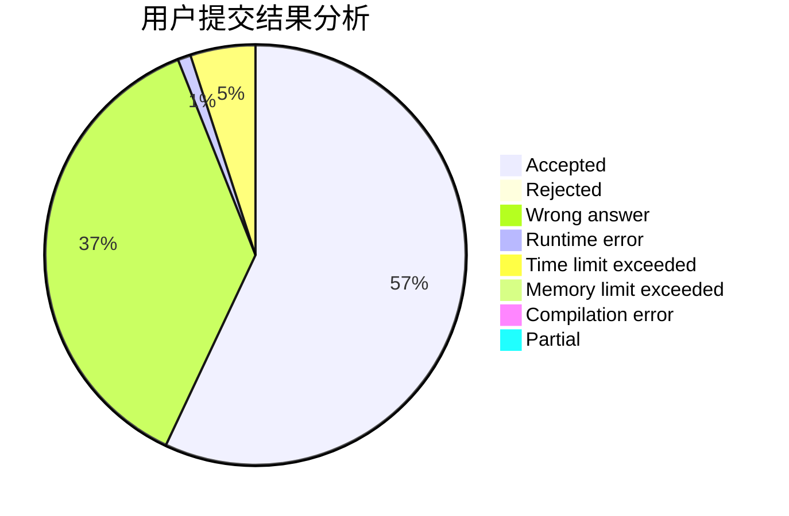
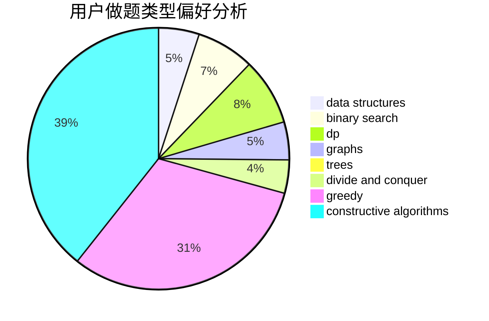
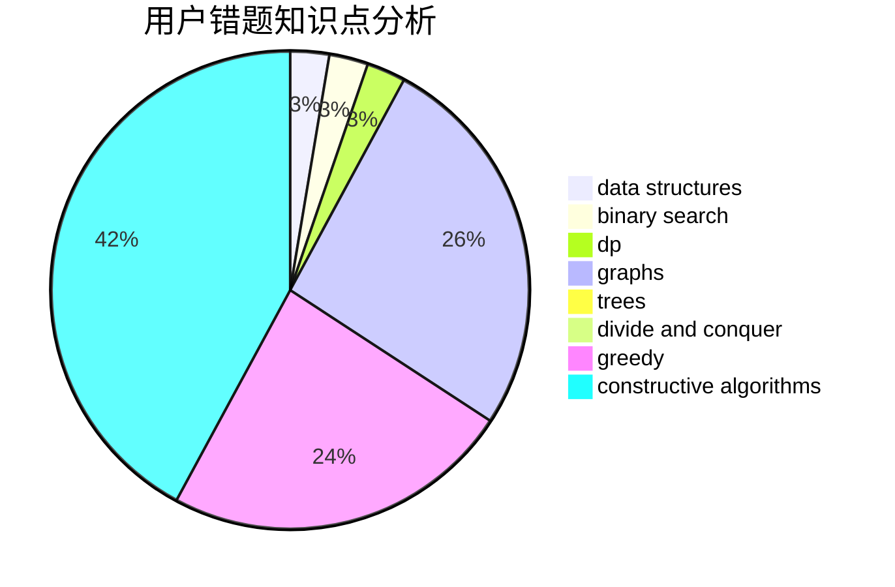

# SJoshua
<!-- tabs:start -->
#### **用户提交结果分析**

#### **用户做题类型偏好分析**

#### **用户错题知识点分析**

<!-- tabs:end -->
# 推荐题目
[Pouring Rain](http://codeforces.com/problemset/problem/667/A)		geometry,
                        math		  
[Little Pony and Crystal Mine](http://codeforces.com/problemset/problem/454/A)		implementation		  
[Searching for Graph](http://codeforces.com/problemset/problem/402/C)		brute force,
                        constructive algorithms,
                        graphs		  
[Spongebob and Squares](http://codeforces.com/problemset/problem/599/D)		brute force,
                        math		  
[Roma and Poker](http://codeforces.com/problemset/problem/803/E)		dp,
                        graphs		  
[Downloading B++](http://codeforces.com/problemset/problem/883/C)		binary search,
                        implementation		  
[RC Kaboom Show](http://codeforces.com/problemset/problem/1359/F)		binary search,
                        brute force,
                        data structures,
                        geometry,
                        math		  
[Identify the Operations](https://codeforces.com/contest/1443/problem/F)		combinatorics,
                        data structures,
                        dsu,
                        greedy,
                        implementation		  
[Joty and Chocolate](http://codeforces.com/problemset/problem/678/C)		implementation,
                        math,
                        number theory		  
[Increase and Decrease](http://codeforces.com/problemset/problem/246/B)		greedy,
                        math		  
<!-- tabs:start -->
#### **data structures**
[Pouring Rain](http://codeforces.com/problemset/problem/1359/F)		binary search,
                        brute force,
                        data structures,
                        geometry,
                        math		  
[Little Pony and Crystal Mine](https://codeforces.com/contest/1443/problem/F)		combinatorics,
                        data structures,
                        dsu,
                        greedy,
                        implementation		  
[Searching for Graph](http://codeforces.com/problemset/problem/712/E)		data structures,
                        math,
                        probabilities		  
[Spongebob and Squares](http://codeforces.com/problemset/problem/727/E)		data structures,
                        hashing,
                        string suffix structures,
                        strings		  
[Roma and Poker](http://codeforces.com/problemset/problem/1059/E)		binary search,
                        data structures,
                        dp,
                        greedy,
                        trees		  
[Downloading B++](http://codeforces.com/problemset/problem/696/D)		data structures,
                        dp,
                        matrices,
                        strings		  
[RC Kaboom Show](http://codeforces.com/problemset/problem/187/D)		data structures		  
[Identify the Operations](http://codeforces.com/problemset/problem/482/B)		constructive algorithms,
                        data structures,
                        trees		  
[Joty and Chocolate](http://codeforces.com/problemset/problem/1200/A)		brute force,
                        data structures,
                        implementation		  
[Increase and Decrease](http://codeforces.com/problemset/problem/1428/E)		binary search,
                        data structures,
                        greedy,
                        math,
                        sortings		  
#### **binary search**
[Pouring Rain](http://codeforces.com/problemset/problem/883/C)		binary search,
                        implementation		  
[Little Pony and Crystal Mine](http://codeforces.com/problemset/problem/1359/F)		binary search,
                        brute force,
                        data structures,
                        geometry,
                        math		  
[Searching for Graph](https://codeforces.com/contest/897/problem/C)		binary search,
                        dfs and similar		  
[Spongebob and Squares](http://codeforces.com/problemset/problem/750/A)		binary search,
                        brute force,
                        implementation,
                        math		  
[Roma and Poker](http://codeforces.com/problemset/problem/1305/H)		binary search,
                        greedy		  
[Downloading B++](https://codeforces.com/contest/866/problem/C)		binary search,
                        dp		  
[RC Kaboom Show](http://codeforces.com/problemset/problem/1059/E)		binary search,
                        data structures,
                        dp,
                        greedy,
                        trees		  
[Identify the Operations](http://codeforces.com/problemset/problem/1428/E)		binary search,
                        data structures,
                        greedy,
                        math,
                        sortings		  
[Joty and Chocolate](http://codeforces.com/problemset/problem/1476/F)		binary search,
                        data structures,
                        dp		  
[Increase and Decrease](http://codeforces.com/problemset/problem/1490/E)		binary search,
                        data structures,
                        greedy		  
#### **dp**
[Pouring Rain](http://codeforces.com/problemset/problem/803/E)		dp,
                        graphs		  
[Little Pony and Crystal Mine](http://codeforces.com/problemset/problem/1109/A)		dp,
                        implementation		  
[Searching for Graph](https://codeforces.com/contest/866/problem/C)		binary search,
                        dp		  
[Spongebob and Squares](http://codeforces.com/problemset/problem/1059/E)		binary search,
                        data structures,
                        dp,
                        greedy,
                        trees		  
[Roma and Poker](http://codeforces.com/problemset/problem/696/D)		data structures,
                        dp,
                        matrices,
                        strings		  
[Downloading B++](http://codeforces.com/problemset/problem/732/B)		dp,
                        greedy		  
[RC Kaboom Show](http://codeforces.com/problemset/problem/1476/F)		binary search,
                        data structures,
                        dp		  
[Identify the Operations](http://codeforces.com/problemset/problem/142/C)		brute force,
                        dp		  
[Joty and Chocolate](http://codeforces.com/problemset/problem/1442/E)		binary search,
                        constructive algorithms,
                        dfs and similar,
                        dp,
                        greedy,
                        trees		  
[Increase and Decrease](http://codeforces.com/problemset/problem/1492/C)		binary search,
                        data structures,
                        dp,
                        greedy,
                        two pointers		  
#### **graph**
[Pouring Rain](http://codeforces.com/problemset/problem/402/C)		brute force,
                        constructive algorithms,
                        graphs		  
[Little Pony and Crystal Mine](http://codeforces.com/problemset/problem/803/E)		dp,
                        graphs		  
[Searching for Graph](http://codeforces.com/problemset/problem/574/B)		brute force,
                        dfs and similar,
                        graphs,
                        hashing		  
[Spongebob and Squares](http://codeforces.com/problemset/problem/1487/C)		brute force,
                        constructive algorithms,
                        dfs and similar,
                        graphs,
                        greedy,
                        implementation,
                        math		  
[Roma and Poker](http://codeforces.com/problemset/problem/1437/C)		dp,
                        flows,
                        graph matchings,
                        greedy,
                        math,
                        sortings		  
[Downloading B++](http://codeforces.com/problemset/problem/1470/D)		constructive algorithms,
                        dfs and similar,
                        graph matchings,
                        graphs,
                        greedy		  
[RC Kaboom Show](http://codeforces.com/problemset/problem/1476/C)		dp,
                        graphs,
                        greedy		  
[Identify the Operations](http://codeforces.com/problemset/problem/1304/D)		constructive algorithms,
                        graphs,
                        greedy,
                        two pointers		  
[Joty and Chocolate](http://codeforces.com/problemset/problem/1475/C)		combinatorics,
                        graphs,
                        math		  
[Increase and Decrease](http://codeforces.com/problemset/problem/553/E)		dp,
                        fft,
                        graphs,
                        math,
                        probabilities		  
#### **trees**
[Pouring Rain](https://codeforces.com/contest/1189/problem/D2)		constructive algorithms,
                        dfs and similar,
                        implementation,
                        trees		  
[Little Pony and Crystal Mine](http://codeforces.com/problemset/problem/1059/E)		binary search,
                        data structures,
                        dp,
                        greedy,
                        trees		  
[Searching for Graph](http://codeforces.com/problemset/problem/482/B)		constructive algorithms,
                        data structures,
                        trees		  
[Spongebob and Squares](http://codeforces.com/problemset/problem/1466/D)		data structures,
                        greedy,
                        sortings,
                        trees		  
[Roma and Poker](http://codeforces.com/problemset/problem/1442/E)		binary search,
                        constructive algorithms,
                        dfs and similar,
                        dp,
                        greedy,
                        trees		  
[Downloading B++](http://codeforces.com/problemset/problem/1479/D)		binary search,
                        bitmasks,
                        brute force,
                        data structures,
                        probabilities,
                        trees		  
[RC Kaboom Show](http://codeforces.com/problemset/problem/1511/C)		brute force,
                        data structures,
                        implementation,
                        trees		  
[Identify the Operations](http://codeforces.com/problemset/problem/1499/F)		combinatorics,
                        dfs and similar,
                        dp,
                        trees		  
[Joty and Chocolate](http://codeforces.com/problemset/problem/1491/E)		brute force,
                        dfs and similar,
                        divide and conquer,
                        number theory,
                        trees		  
[Increase and Decrease](http://codeforces.com/problemset/problem/1466/D)		data structures,
                        greedy,
                        sortings,
                        trees		  
#### **divide and conquer**
[Pouring Rain](http://codeforces.com/problemset/problem/1461/D)		binary search,
                        brute force,
                        data structures,
                        divide and conquer,
                        implementation,
                        sortings		  
[Little Pony and Crystal Mine](http://codeforces.com/problemset/problem/1466/G)		combinatorics,
                        divide and conquer,
                        hashing,
                        math,
                        string suffix structures,
                        strings		  
[Searching for Graph](http://codeforces.com/problemset/problem/1490/D)		dfs and similar,
                        divide and conquer,
                        implementation		  
[Spongebob and Squares](https://codeforces.com/contest/1483/problem/C)		data structures,
                        divide and conquer,
                        dp		  
[Roma and Poker](http://codeforces.com/problemset/problem/1491/E)		brute force,
                        dfs and similar,
                        divide and conquer,
                        number theory,
                        trees		  
[Downloading B++](http://codeforces.com/problemset/problem/1303/G)		data structures,
                        divide and conquer,
                        geometry,
                        trees		  
[RC Kaboom Show](http://codeforces.com/problemset/problem/1494/D)		constructive algorithms,
                        data structures,
                        dfs and similar,
                        divide and conquer,
                        dsu,
                        greedy,
                        sortings,
                        trees		  
[Identify the Operations](http://codeforces.com/problemset/problem/1482/E)		data structures,
                        divide and conquer,
                        dp		  
[Joty and Chocolate](http://codeforces.com/problemset/problem/566/C)		dfs and similar,
                        divide and conquer,
                        trees		  
[Increase and Decrease](http://codeforces.com/problemset/problem/1428/F)		binary search,
                        data structures,
                        divide and conquer,
                        dp,
                        two pointers		  
#### **greedy**
[Pouring Rain](https://codeforces.com/contest/1443/problem/F)		combinatorics,
                        data structures,
                        dsu,
                        greedy,
                        implementation		  
[Little Pony and Crystal Mine](http://codeforces.com/problemset/problem/246/B)		greedy,
                        math		  
[Searching for Graph](http://codeforces.com/problemset/problem/3/B)		greedy,
                        sortings		  
[Spongebob and Squares](http://codeforces.com/problemset/problem/45/D)		greedy,
                        meet-in-the-middle,
                        sortings		  
[Roma and Poker](http://codeforces.com/problemset/problem/1305/H)		binary search,
                        greedy		  
[Downloading B++](http://codeforces.com/problemset/problem/1059/E)		binary search,
                        data structures,
                        dp,
                        greedy,
                        trees		  
[RC Kaboom Show](http://codeforces.com/problemset/problem/464/A)		greedy,
                        strings		  
[Identify the Operations](http://codeforces.com/problemset/problem/525/C)		greedy,
                        math,
                        sortings		  
[Joty and Chocolate](http://codeforces.com/problemset/problem/732/B)		dp,
                        greedy		  
[Increase and Decrease](http://codeforces.com/problemset/problem/1296/D)		greedy,
                        sortings		  
#### **constructive algorithms**
[Pouring Rain](http://codeforces.com/problemset/problem/402/C)		brute force,
                        constructive algorithms,
                        graphs		  
[Little Pony and Crystal Mine](https://codeforces.com/contest/1189/problem/D2)		constructive algorithms,
                        dfs and similar,
                        implementation,
                        trees		  
[Searching for Graph](http://codeforces.com/problemset/problem/1286/C2)		brute force,
                        constructive algorithms,
                        hashing,
                        interactive,
                        math		  
[Spongebob and Squares](http://codeforces.com/problemset/problem/482/B)		constructive algorithms,
                        data structures,
                        trees		  
[Roma and Poker](http://codeforces.com/problemset/problem/1499/A)		combinatorics,
                        constructive algorithms,
                        math		  
[Downloading B++](http://codeforces.com/problemset/problem/1442/E)		binary search,
                        constructive algorithms,
                        dfs and similar,
                        dp,
                        greedy,
                        trees		  
[RC Kaboom Show](http://codeforces.com/problemset/problem/1493/A)		constructive algorithms,
                        greedy		  
[Identify the Operations](http://codeforces.com/problemset/problem/1463/D)		binary search,
                        constructive algorithms,
                        greedy,
                        two pointers		  
[Joty and Chocolate](https://codeforces.com/contest/1456/problem/B)		bitmasks,
                        brute force,
                        constructive algorithms		  
[Increase and Decrease](http://codeforces.com/problemset/problem/1492/D)		bitmasks,
                        constructive algorithms,
                        greedy,
                        math		  
#### **sortings**
[Pouring Rain](http://codeforces.com/problemset/problem/3/B)		greedy,
                        sortings		  
[Little Pony and Crystal Mine](http://codeforces.com/problemset/problem/45/D)		greedy,
                        meet-in-the-middle,
                        sortings		  
[Searching for Graph](http://codeforces.com/problemset/problem/977/D)		dfs and similar,
                        math,
                        sortings		  
[Spongebob and Squares](http://codeforces.com/problemset/problem/525/C)		greedy,
                        math,
                        sortings		  
[Roma and Poker](http://codeforces.com/problemset/problem/1311/B)		dfs and similar,
                        sortings		  
[Downloading B++](http://codeforces.com/problemset/problem/1296/D)		greedy,
                        sortings		  
[RC Kaboom Show](http://codeforces.com/problemset/problem/670/C)		implementation,
                        sortings		  
[Identify the Operations](http://codeforces.com/problemset/problem/1428/E)		binary search,
                        data structures,
                        greedy,
                        math,
                        sortings		  
[Joty and Chocolate](http://codeforces.com/problemset/problem/1399/A)		greedy,
                        sortings		  
[Increase and Decrease](http://codeforces.com/problemset/problem/1466/D)		data structures,
                        greedy,
                        sortings,
                        trees		  
<!-- tabs:end -->
