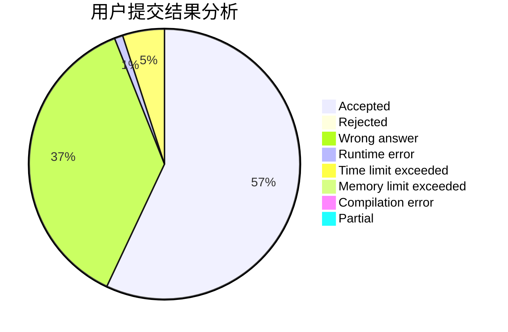
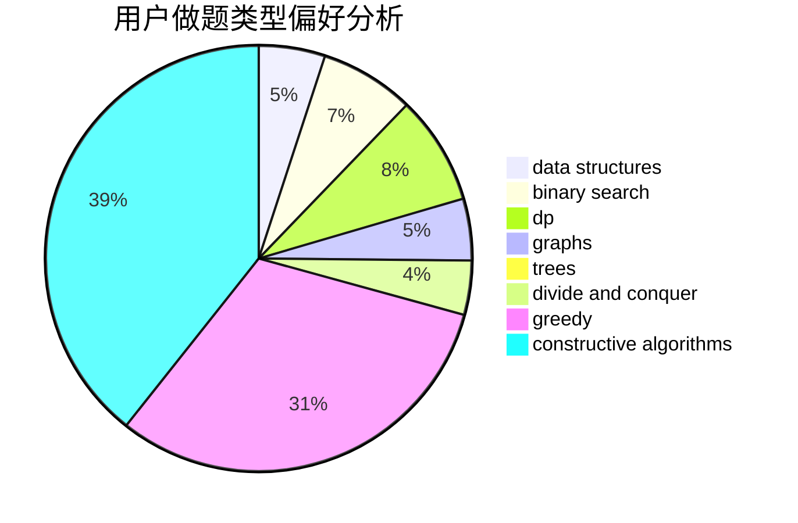
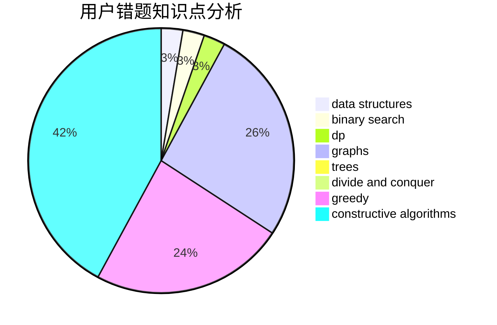

# SJoshua

<!-- tabs:start -->

#### **用户提交结果分析**

#### **用户做题类型偏好分析**

#### **用户错题知识点分析**

<!-- tabs:end -->
# 推荐题目
[402C](https://codeforces.com/contest/402/problem/C)		brute force,
                        constructive algorithms,
                        graphs		  
[883C](https://codeforces.com/contest/883/problem/C)		binary search,
                        implementation		  
[599D](https://codeforces.com/contest/599/problem/D)		brute force,
                        math		  
[667A](https://codeforces.com/contest/667/problem/A)		geometry,
                        math		  
[803E](https://codeforces.com/contest/803/problem/E)		dp,
                        graphs		  
[1109A](https://codeforces.com/contest/1109/problem/A)		dp,
                        implementation		  
[678C](https://codeforces.com/contest/678/problem/C)		implementation,
                        math,
                        number theory		  
[1286C2](https://codeforces.com/contest/1286C/problem/2)		brute force,
                        constructive algorithms,
                        hashing,
                        interactive,
                        math		  
[1189D2](https://codeforces.com/contest/1189D/problem/2)		dsu,graphs,sortings,trees		  
[712E](https://codeforces.com/contest/712/problem/E)		data structures,
                        math,
                        probabilities		  
