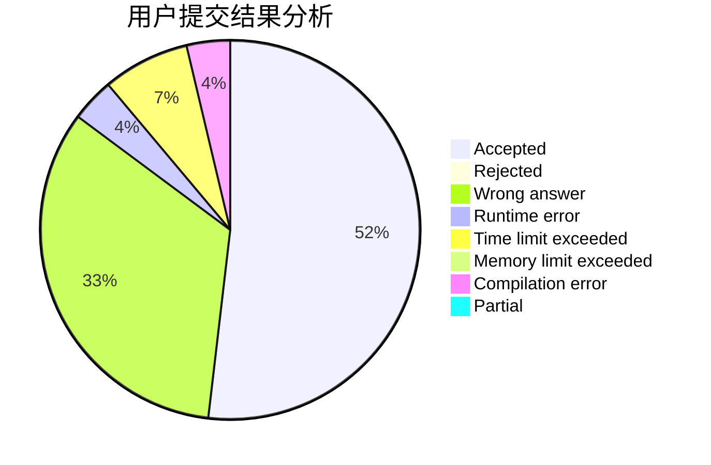
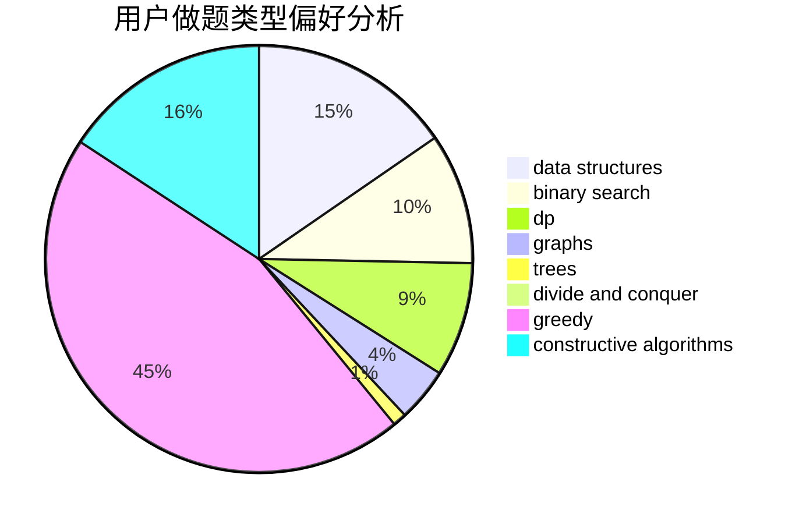
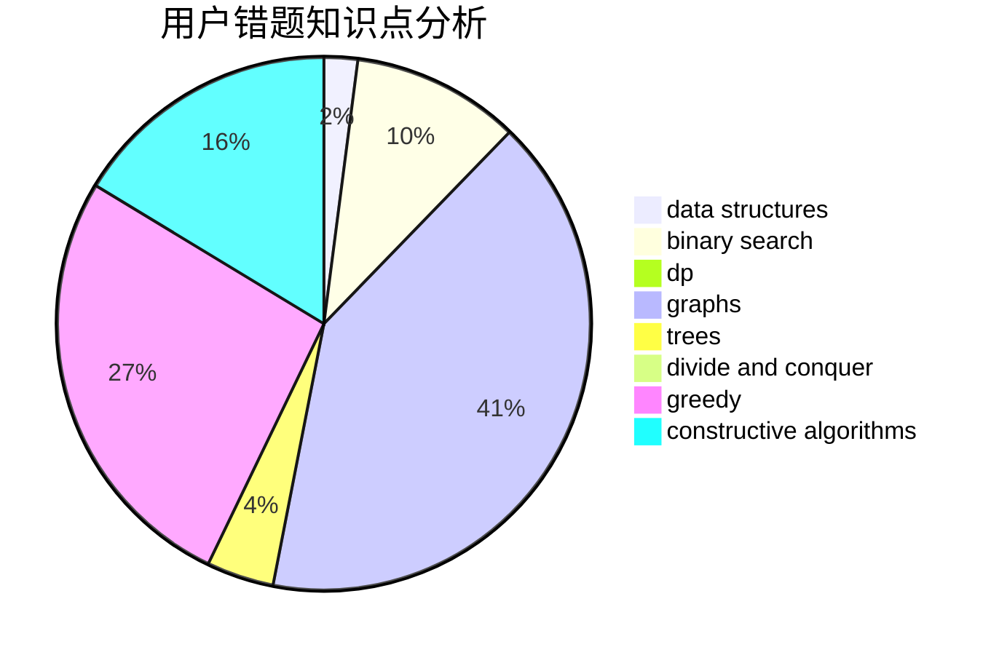

# SKN2
<!-- tabs:start -->
#### **用户提交结果分析**

#### **用户做题类型偏好分析**

#### **用户错题知识点分析**

<!-- tabs:end -->
# 推荐题目
[The Modcrab](http://codeforces.com/problemset/problem/903/B)		greedy,
                        implementation		  
[Marbles](http://codeforces.com/problemset/problem/1215/E)		bitmasks,
                        dp		  
[NP-Hard Problem](http://codeforces.com/problemset/problem/687/A)		dfs and similar,
                        graphs		  
[Spongebob and Squares](http://codeforces.com/problemset/problem/599/D)		brute force,
                        math		  
[String Mark](http://codeforces.com/problemset/problem/895/D)		combinatorics,
                        math,
                        strings		  
[Concatenation with intersection](http://codeforces.com/problemset/problem/1313/E)		data structures,
                        hashing,
                        strings,
                        two pointers		  
[Currency System in Geraldion](http://codeforces.com/problemset/problem/560/A)		implementation,
                        sortings		  
[Sharti](http://codeforces.com/problemset/problem/494/E)		data structures,
                        games		  
[INTERCALC](http://codeforces.com/problemset/problem/784/C)		*special problem,
                        implementation		  
[QR code](http://codeforces.com/problemset/problem/290/B)		*special problem,
                        implementation		  
<!-- tabs:start -->
#### **data structures**
[The Modcrab](http://codeforces.com/problemset/problem/1313/E)		data structures,
                        hashing,
                        strings,
                        two pointers		  
[Marbles](http://codeforces.com/problemset/problem/494/E)		data structures,
                        games		  
[NP-Hard Problem](http://codeforces.com/problemset/problem/625/E)		data structures,
                        greedy		  
[Spongebob and Squares](http://codeforces.com/problemset/problem/1367/F2)		binary search,
                        data structures,
                        dp,
                        greedy,
                        sortings,
                        two pointers		  
[String Mark](http://codeforces.com/problemset/problem/240/F)		data structures		  
[Concatenation with intersection](http://codeforces.com/problemset/problem/653/F)		data structures,
                        string suffix structures,
                        strings		  
[Currency System in Geraldion](http://codeforces.com/problemset/problem/1408/H)		binary search,
                        data structures,
                        flows,
                        greedy		  
[Sharti](http://codeforces.com/problemset/problem/474/E)		binary search,
                        data structures,
                        dp,
                        sortings,
                        trees		  
[INTERCALC](http://codeforces.com/problemset/problem/526/F)		data structures,
                        divide and conquer		  
[QR code](http://codeforces.com/problemset/problem/1404/C)		binary search,
                        constructive algorithms,
                        data structures,
                        greedy,
                        two pointers		  
#### **binary search**
[The Modcrab](http://codeforces.com/problemset/problem/1367/F2)		binary search,
                        data structures,
                        dp,
                        greedy,
                        sortings,
                        two pointers		  
[Marbles](http://codeforces.com/problemset/problem/1408/H)		binary search,
                        data structures,
                        flows,
                        greedy		  
[NP-Hard Problem](http://codeforces.com/problemset/problem/474/E)		binary search,
                        data structures,
                        dp,
                        sortings,
                        trees		  
[Spongebob and Squares](http://codeforces.com/problemset/problem/1404/C)		binary search,
                        constructive algorithms,
                        data structures,
                        greedy,
                        two pointers		  
[String Mark](http://codeforces.com/problemset/problem/1492/C)		binary search,
                        data structures,
                        dp,
                        greedy,
                        two pointers		  
[Concatenation with intersection](http://codeforces.com/problemset/problem/1463/D)		binary search,
                        constructive algorithms,
                        greedy,
                        two pointers		  
[Currency System in Geraldion](http://codeforces.com/problemset/problem/1490/G)		binary search,
                        data structures,
                        math		  
[Sharti](http://codeforces.com/problemset/problem/1479/D)		binary search,
                        bitmasks,
                        brute force,
                        data structures,
                        probabilities,
                        trees		  
[INTERCALC](http://codeforces.com/problemset/problem/1436/E)		binary search,
                        data structures,
                        two pointers		  
[QR code](http://codeforces.com/problemset/problem/1461/D)		binary search,
                        brute force,
                        data structures,
                        divide and conquer,
                        implementation,
                        sortings		  
#### **dp**
[The Modcrab](http://codeforces.com/problemset/problem/1215/E)		bitmasks,
                        dp		  
[Marbles](http://codeforces.com/problemset/problem/138/D)		dp,
                        games		  
[NP-Hard Problem](http://codeforces.com/problemset/problem/321/B)		dp,
                        flows,
                        greedy		  
[Spongebob and Squares](http://codeforces.com/problemset/problem/1367/F2)		binary search,
                        data structures,
                        dp,
                        greedy,
                        sortings,
                        two pointers		  
[String Mark](http://codeforces.com/problemset/problem/219/C)		brute force,
                        dp,
                        greedy		  
[Concatenation with intersection](http://codeforces.com/problemset/problem/51/F)		dfs and similar,
                        dp,
                        graphs,
                        trees		  
[Currency System in Geraldion](http://codeforces.com/problemset/problem/1239/E)		dp,
                        implementation		  
[Sharti](http://codeforces.com/problemset/problem/894/E)		dp,
                        graphs		  
[INTERCALC](http://codeforces.com/problemset/problem/235/B)		dp,
                        math,
                        probabilities		  
[QR code](http://codeforces.com/problemset/problem/474/E)		binary search,
                        data structures,
                        dp,
                        sortings,
                        trees		  
#### **graph**
[The Modcrab](http://codeforces.com/problemset/problem/687/A)		dfs and similar,
                        graphs		  
[Marbles](http://codeforces.com/problemset/problem/97/E)		dfs and similar,
                        dsu,
                        graphs,
                        trees		  
[NP-Hard Problem](http://codeforces.com/problemset/problem/51/F)		dfs and similar,
                        dp,
                        graphs,
                        trees		  
[Spongebob and Squares](http://codeforces.com/problemset/problem/639/B)		constructive algorithms,
                        graphs,
                        trees		  
[String Mark](http://codeforces.com/problemset/problem/894/E)		dp,
                        graphs		  
[Concatenation with intersection](https://codeforces.com/contest/512/problem/A)		dfs and similar,
                        graphs,
                        sortings		  
[Currency System in Geraldion](http://codeforces.com/problemset/problem/223/E)		flows,
                        geometry,
                        graphs		  
[Sharti](http://codeforces.com/problemset/problem/1407/E)		constructive algorithms,
                        dfs and similar,
                        dp,
                        graphs,
                        greedy,
                        shortest paths		  
[INTERCALC](http://codeforces.com/problemset/problem/915/F)		data structures,
                        dsu,
                        graphs,
                        trees		  
[QR code](http://codeforces.com/problemset/problem/164/C)		flows,
                        graphs		  
#### **trees**
[The Modcrab](http://codeforces.com/problemset/problem/97/E)		dfs and similar,
                        dsu,
                        graphs,
                        trees		  
[Marbles](http://codeforces.com/problemset/problem/51/F)		dfs and similar,
                        dp,
                        graphs,
                        trees		  
[NP-Hard Problem](http://codeforces.com/problemset/problem/639/B)		constructive algorithms,
                        graphs,
                        trees		  
[Spongebob and Squares](http://codeforces.com/problemset/problem/474/E)		binary search,
                        data structures,
                        dp,
                        sortings,
                        trees		  
[String Mark](http://codeforces.com/problemset/problem/915/F)		data structures,
                        dsu,
                        graphs,
                        trees		  
[Concatenation with intersection](http://codeforces.com/problemset/problem/1479/D)		binary search,
                        bitmasks,
                        brute force,
                        data structures,
                        probabilities,
                        trees		  
[Currency System in Geraldion](http://codeforces.com/problemset/problem/1511/C)		brute force,
                        data structures,
                        implementation,
                        trees		  
[Sharti](http://codeforces.com/problemset/problem/1499/F)		combinatorics,
                        dfs and similar,
                        dp,
                        trees		  
[INTERCALC](http://codeforces.com/problemset/problem/1491/E)		brute force,
                        dfs and similar,
                        divide and conquer,
                        number theory,
                        trees		  
[QR code](http://codeforces.com/problemset/problem/1466/D)		data structures,
                        greedy,
                        sortings,
                        trees		  
#### **divide and conquer**
[The Modcrab](http://codeforces.com/problemset/problem/526/F)		data structures,
                        divide and conquer		  
[Marbles](http://codeforces.com/problemset/problem/1461/D)		binary search,
                        brute force,
                        data structures,
                        divide and conquer,
                        implementation,
                        sortings		  
[NP-Hard Problem](http://codeforces.com/problemset/problem/1466/G)		combinatorics,
                        divide and conquer,
                        hashing,
                        math,
                        string suffix structures,
                        strings		  
[Spongebob and Squares](http://codeforces.com/problemset/problem/1490/D)		dfs and similar,
                        divide and conquer,
                        implementation		  
[String Mark](https://codeforces.com/contest/1483/problem/C)		data structures,
                        divide and conquer,
                        dp		  
[Concatenation with intersection](http://codeforces.com/problemset/problem/1491/E)		brute force,
                        dfs and similar,
                        divide and conquer,
                        number theory,
                        trees		  
[Currency System in Geraldion](http://codeforces.com/problemset/problem/1303/G)		data structures,
                        divide and conquer,
                        geometry,
                        trees		  
[Sharti](http://codeforces.com/problemset/problem/1494/D)		constructive algorithms,
                        data structures,
                        dfs and similar,
                        divide and conquer,
                        dsu,
                        greedy,
                        sortings,
                        trees		  
[INTERCALC](http://codeforces.com/problemset/problem/1482/E)		data structures,
                        divide and conquer,
                        dp		  
[QR code](http://codeforces.com/problemset/problem/566/C)		dfs and similar,
                        divide and conquer,
                        trees		  
#### **greedy**
[The Modcrab](http://codeforces.com/problemset/problem/903/B)		greedy,
                        implementation		  
[Marbles](http://codeforces.com/problemset/problem/625/E)		data structures,
                        greedy		  
[NP-Hard Problem](http://codeforces.com/problemset/problem/321/B)		dp,
                        flows,
                        greedy		  
[Spongebob and Squares](http://codeforces.com/problemset/problem/1367/F2)		binary search,
                        data structures,
                        dp,
                        greedy,
                        sortings,
                        two pointers		  
[String Mark](http://codeforces.com/problemset/problem/219/C)		brute force,
                        dp,
                        greedy		  
[Concatenation with intersection](http://codeforces.com/problemset/problem/584/C)		constructive algorithms,
                        greedy,
                        strings		  
[Currency System in Geraldion](http://codeforces.com/problemset/problem/1220/C)		games,
                        greedy,
                        strings		  
[Sharti](http://codeforces.com/problemset/problem/1408/H)		binary search,
                        data structures,
                        flows,
                        greedy		  
[INTERCALC](http://codeforces.com/problemset/problem/1409/D)		greedy,
                        math		  
[QR code](http://codeforces.com/problemset/problem/1186/D)		constructive algorithms,
                        greedy,
                        math		  
#### **constructive algorithms**
[The Modcrab](http://codeforces.com/problemset/problem/584/C)		constructive algorithms,
                        greedy,
                        strings		  
[Marbles](http://codeforces.com/problemset/problem/639/B)		constructive algorithms,
                        graphs,
                        trees		  
[NP-Hard Problem](http://codeforces.com/problemset/problem/1186/D)		constructive algorithms,
                        greedy,
                        math		  
[Spongebob and Squares](http://codeforces.com/problemset/problem/1404/C)		binary search,
                        constructive algorithms,
                        data structures,
                        greedy,
                        two pointers		  
[String Mark](http://codeforces.com/problemset/problem/156/B)		constructive algorithms,
                        data structures,
                        implementation		  
[Concatenation with intersection](http://codeforces.com/problemset/problem/286/E)		constructive algorithms,
                        fft,
                        math		  
[Currency System in Geraldion](http://codeforces.com/problemset/problem/1407/E)		constructive algorithms,
                        dfs and similar,
                        dp,
                        graphs,
                        greedy,
                        shortest paths		  
[Sharti](http://codeforces.com/problemset/problem/1174/D)		bitmasks,
                        constructive algorithms		  
[INTERCALC](http://codeforces.com/problemset/problem/1405/B)		constructive algorithms,
                        implementation		  
[QR code](http://codeforces.com/problemset/problem/1493/A)		constructive algorithms,
                        greedy		  
#### **sortings**
[The Modcrab](http://codeforces.com/problemset/problem/560/A)		implementation,
                        sortings		  
[Marbles](http://codeforces.com/problemset/problem/1367/F2)		binary search,
                        data structures,
                        dp,
                        greedy,
                        sortings,
                        two pointers		  
[NP-Hard Problem](http://codeforces.com/problemset/problem/474/E)		binary search,
                        data structures,
                        dp,
                        sortings,
                        trees		  
[Spongebob and Squares](https://codeforces.com/contest/512/problem/A)		dfs and similar,
                        graphs,
                        sortings		  
[String Mark](https://codeforces.com/contest/1496/problem/C)		geometry,
                        greedy,
                        math,
                        sortings		  
[Concatenation with intersection](http://codeforces.com/problemset/problem/1495/A)		geometry,
                        greedy,
                        math,
                        sortings		  
[Currency System in Geraldion](http://codeforces.com/problemset/problem/1497/A)		brute force,
                        data structures,
                        greedy,
                        sortings		  
[Sharti](http://codeforces.com/problemset/problem/1427/A)		math,
                        sortings		  
[INTERCALC](http://codeforces.com/problemset/problem/1461/D)		binary search,
                        brute force,
                        data structures,
                        divide and conquer,
                        implementation,
                        sortings		  
[QR code](http://codeforces.com/problemset/problem/1437/C)		dp,
                        flows,
                        graph matchings,
                        greedy,
                        math,
                        sortings		  
<!-- tabs:end -->
