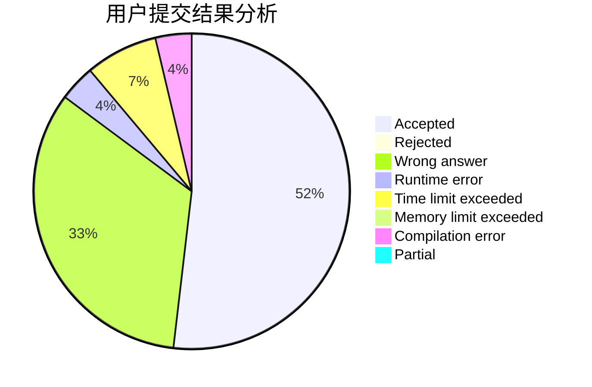
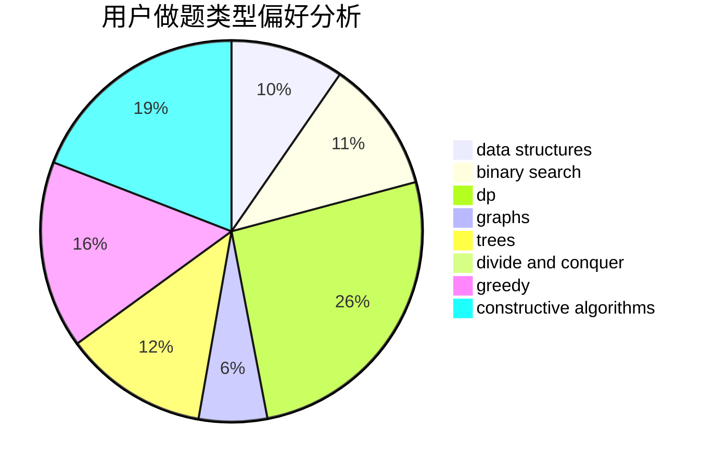
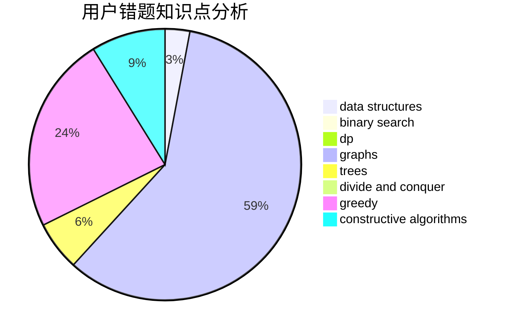

# SKN2

<!-- tabs:start -->

#### **用户提交结果分析**

#### **用户做题类型偏好分析**

#### **用户错题知识点分析**

<!-- tabs:end -->
# 推荐题目
[1221C](https://codeforces.com/contest/1221/problem/C)		binary search,
                        math		  
[617E](https://codeforces.com/contest/617/problem/E)		data structures		  
[919C](https://codeforces.com/contest/919/problem/C)		brute force,
                        implementation		  
[515A](https://codeforces.com/contest/515/problem/A)		math		  
[584C](https://codeforces.com/contest/584/problem/C)		constructive algorithms,
                        greedy,
                        strings		  
[261D](https://codeforces.com/contest/261/problem/D)		dp		  
[708E](https://codeforces.com/contest/708/problem/E)		dp,
                        math		  
[736B](https://codeforces.com/contest/736/problem/B)		dsu,graphs,sortings,trees		  
[429A](https://codeforces.com/contest/429/problem/A)		dfs and similar,
                        trees		  
[238D](https://codeforces.com/contest/238/problem/D)		data structures,
                        implementation		  
