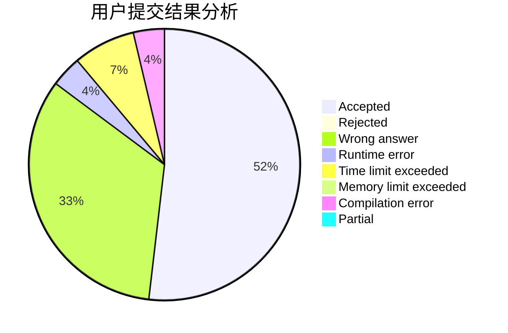
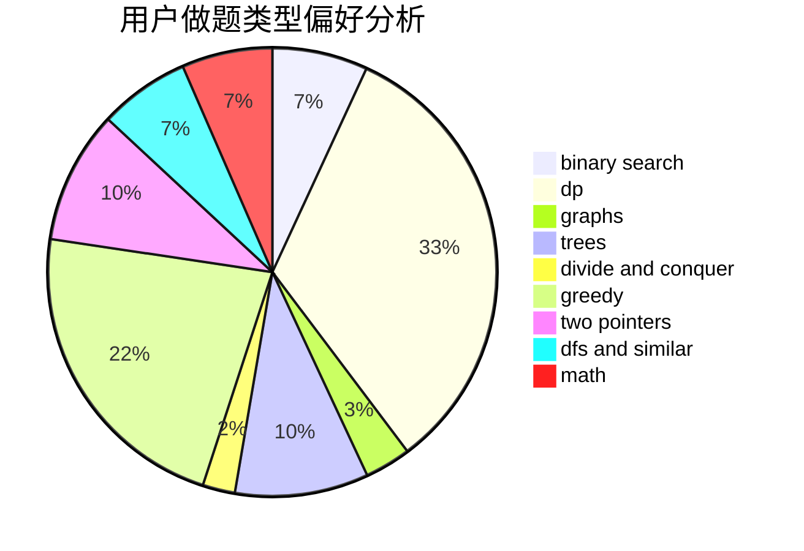

# SKN2

<!-- tabs:start -->

#### **用户提交结果分析**

#### **用户做题类型偏好分析**

<!-- tabs:end -->
# 推荐题目
[1221C](https://codeforces.com/contest/1221/problem/C)
[617E](https://codeforces.com/contest/617/problem/E)
[919C](https://codeforces.com/contest/919/problem/C)
[515A](https://codeforces.com/contest/515/problem/A)
[584C](https://codeforces.com/contest/584/problem/C)
[261D](https://codeforces.com/contest/261/problem/D)
[708E](https://codeforces.com/contest/708/problem/E)
[736B](https://codeforces.com/contest/736/problem/B)
[429A](https://codeforces.com/contest/429/problem/A)
[238D](https://codeforces.com/contest/238/problem/D)
