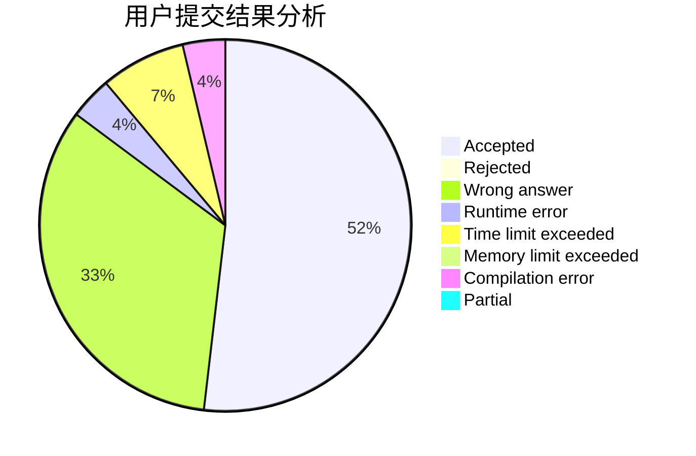
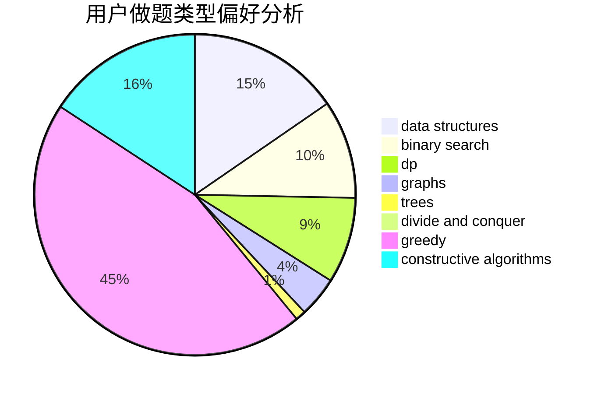
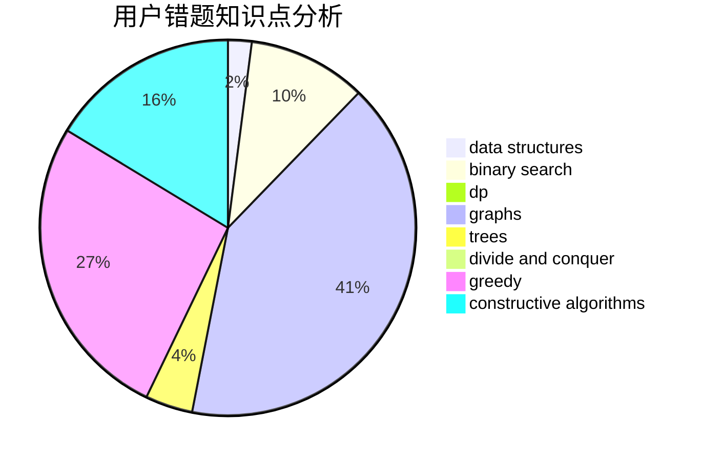

# SKN2

<!-- tabs:start -->

#### **用户提交结果分析**

#### **用户做题类型偏好分析**

#### **用户错题知识点分析**

<!-- tabs:end -->
# 推荐题目
[1215E](https://codeforces.com/contest/1215/problem/E)		bitmasks,
                        dp		  
[599D](https://codeforces.com/contest/599/problem/D)		brute force,
                        math		  
[903B](https://codeforces.com/contest/903/problem/B)		greedy,
                        implementation		  
[494E](https://codeforces.com/contest/494/problem/E)		data structures,
                        games		  
[560A](https://codeforces.com/contest/560/problem/A)		implementation,
                        sortings		  
[240F](https://codeforces.com/contest/240/problem/F)		data structures		  
[687A](https://codeforces.com/contest/687/problem/A)		dfs and similar,
                        graphs		  
[719A](https://codeforces.com/contest/719/problem/A)		implementation		  
[39J](https://codeforces.com/contest/39/problem/J)		hashing,
                        implementation,
                        strings		  
[219C](https://codeforces.com/contest/219/problem/C)		brute force,
                        dp,
                        greedy		  
