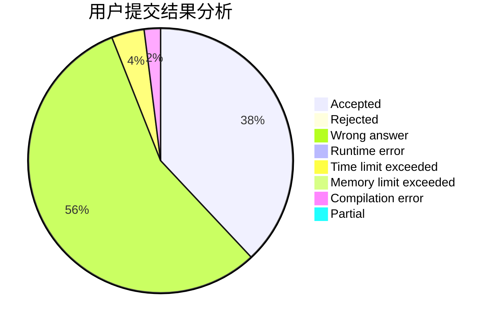
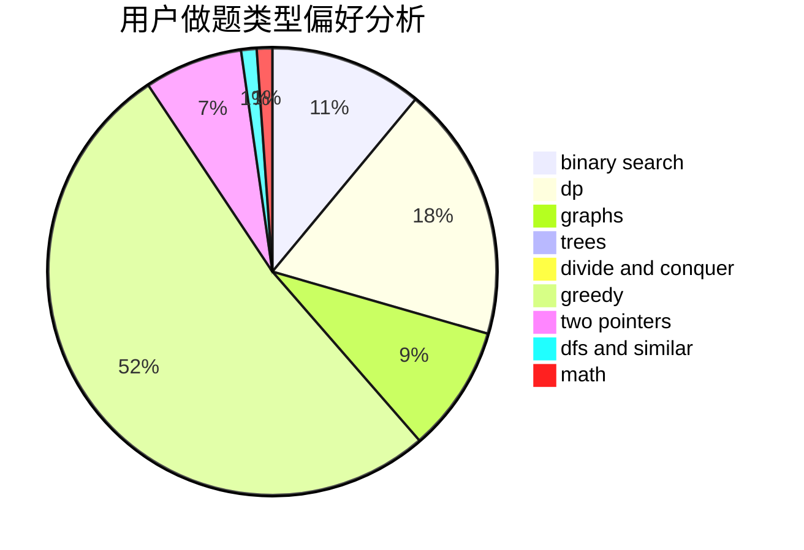

# SSSGreedy

<!-- tabs:start -->

#### **用户提交结果分析**

#### **用户做题类型偏好分析**

<!-- tabs:end -->
# 推荐题目
[1510I](https://codeforces.com/contest/1510/problem/I)
[1158F](https://codeforces.com/contest/1158/problem/F)
[813F](https://codeforces.com/contest/813/problem/F)
[598E](https://codeforces.com/contest/598/problem/E)
[710C](https://codeforces.com/contest/710/problem/C)
[1424J](https://codeforces.com/contest/1424/problem/J)
[11302](https://codeforces.com/contest/1130/problem/2)
[85A](https://codeforces.com/contest/85/problem/A)
[841C](https://codeforces.com/contest/841/problem/C)
[12492](https://codeforces.com/contest/1249/problem/2)
