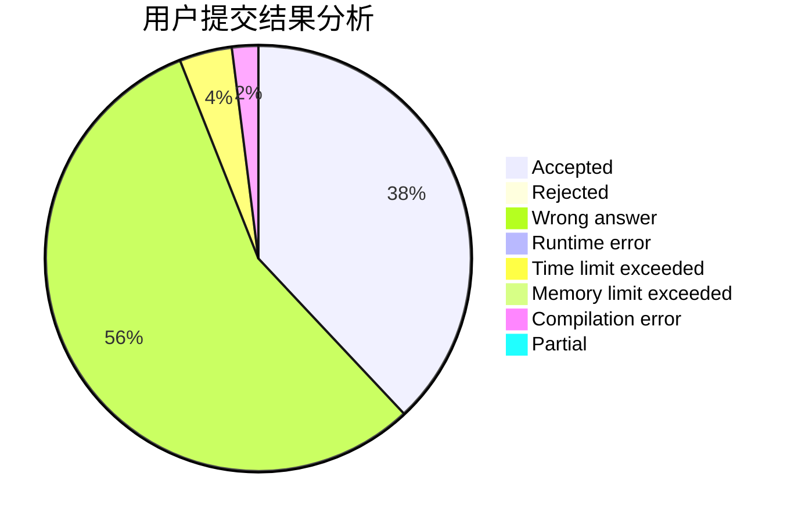
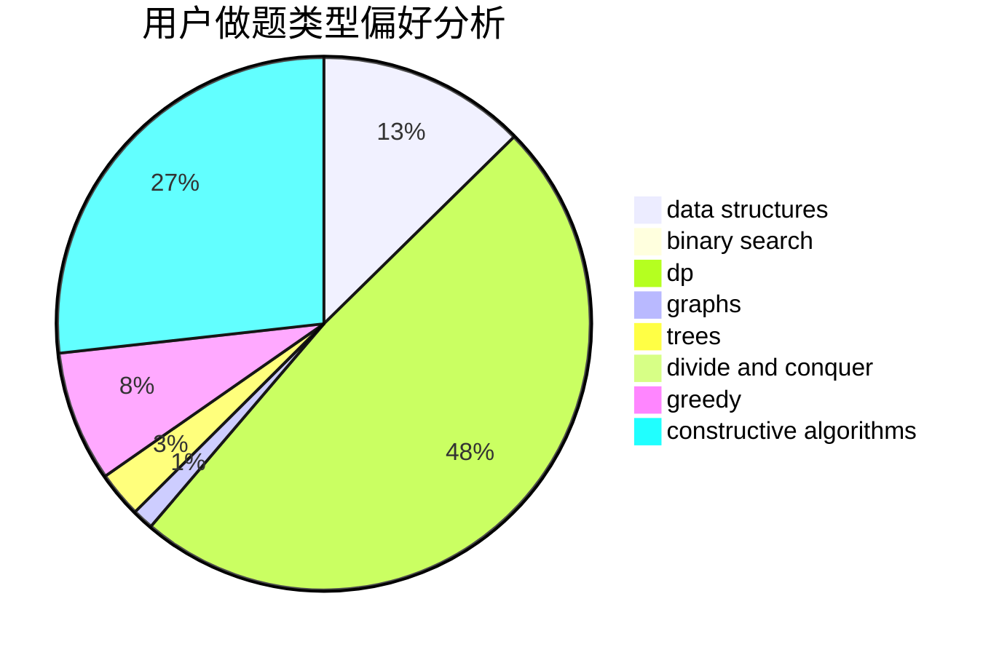

# SSSGreedy

<!-- tabs:start -->

#### **用户提交结果分析**

#### **用户做题类型偏好分析**

#### **用户错题知识点分析**

<!-- tabs:end -->
# 推荐题目
[1500C](https://codeforces.com/contest/1500/problem/C)		bitmasks,
                        brute force,
                        constructive algorithms,
                        greedy,
                        two pointers		  
[1156G](https://codeforces.com/contest/1156/problem/G)		graphs,
                        greedy,
                        hashing,
                        implementation		  
[799F](https://codeforces.com/contest/799/problem/F)		data structures		  
[576E](https://codeforces.com/contest/576/problem/E)		binary search,
                        data structures		  
[690A2](https://codeforces.com/contest/690A/problem/2)		nan		  
[1417B](https://codeforces.com/contest/1417/problem/B)		greedy,
                        math,
                        sortings		  
[1120F](https://codeforces.com/contest/1120/problem/F)		data structures,
                        dp,
                        greedy		  
[840C](https://codeforces.com/contest/840/problem/C)		combinatorics,
                        dp		  
[821D](https://codeforces.com/contest/821/problem/D)		dfs and similar,
                        graphs,
                        shortest paths		  
[1244A](https://codeforces.com/contest/1244/problem/A)		math		  
