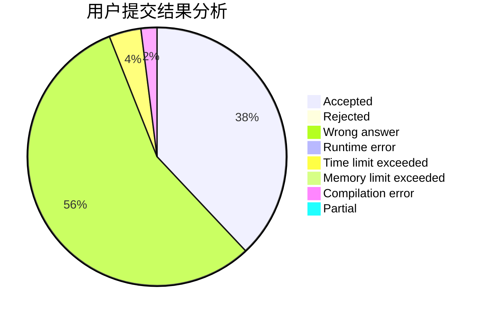
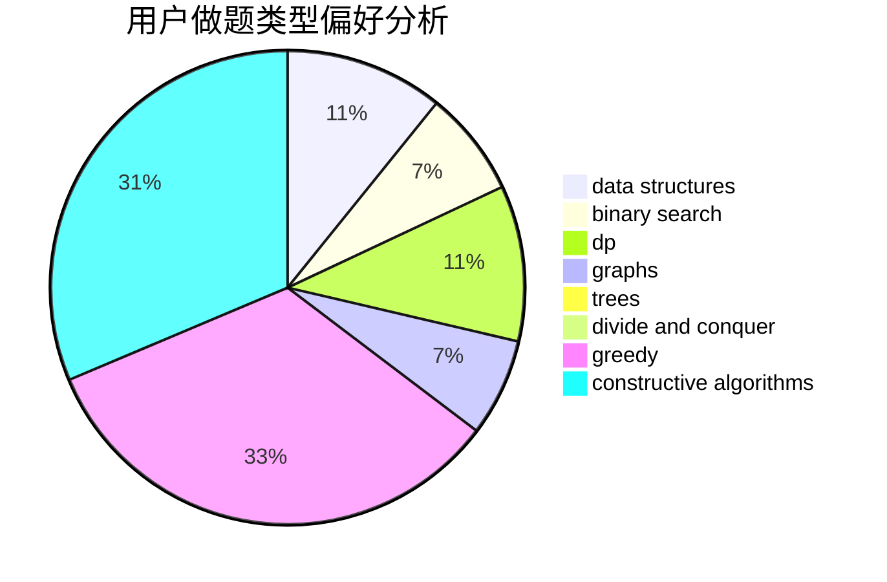

# SSSGreedy

<!-- tabs:start -->

#### **用户提交结果分析**

#### **用户做题类型偏好分析**

#### **用户错题知识点分析**

<!-- tabs:end -->
# 推荐题目
[1510I](https://codeforces.com/contest/1510/problem/I)		greedy,
                        interactive,
                        math,
                        probabilities		  
[1158F](https://codeforces.com/contest/1158/problem/F)		dp,
                        math		  
[813F](https://codeforces.com/contest/813/problem/F)		data structures,
                        dsu,
                        graphs		  
[598E](https://codeforces.com/contest/598/problem/E)		brute force,
                        dp		  
[710C](https://codeforces.com/contest/710/problem/C)		constructive algorithms,
                        math		  
[1424J](https://codeforces.com/contest/1424/problem/J)		dsu,graphs,sortings,trees		  
[11302](https://codeforces.com/contest/1130/problem/2)		dsu,graphs,sortings,trees		  
[85A](https://codeforces.com/contest/85/problem/A)		constructive algorithms,
                        implementation		  
[841C](https://codeforces.com/contest/841/problem/C)		dsu,graphs,sortings,trees		  
[12492](https://codeforces.com/contest/1249/problem/2)		dsu,graphs,sortings,trees		  
