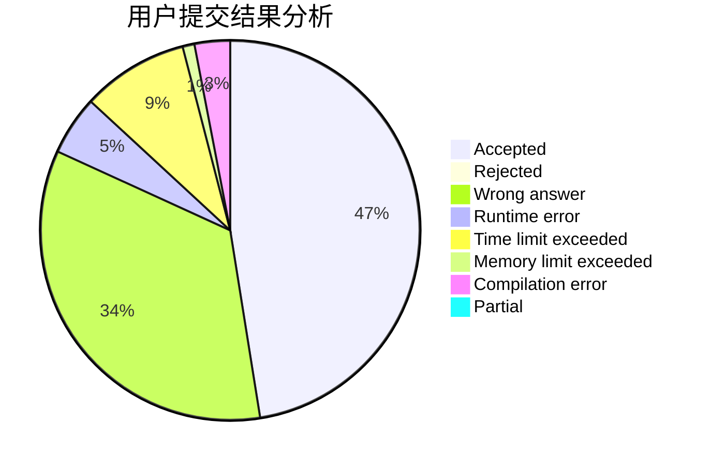
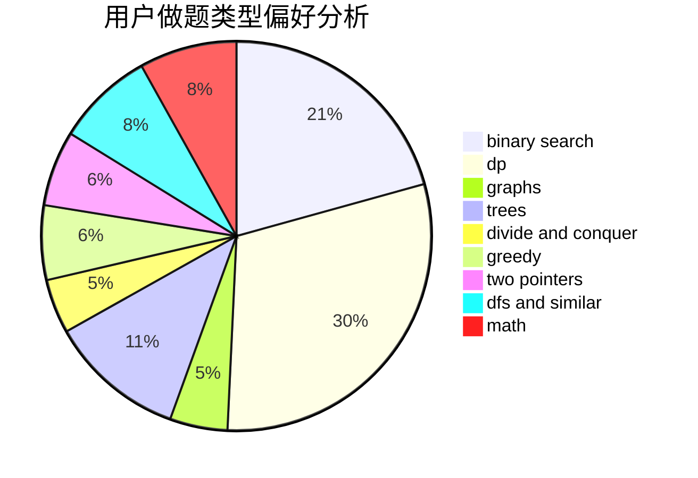

# SSerxhs

<!-- tabs:start -->

#### **用户提交结果分析**

#### **用户做题类型偏好分析**

<!-- tabs:end -->
# 推荐题目
[1025G](https://codeforces.com/contest/1025/problem/G)
[1228C](https://codeforces.com/contest/1228/problem/C)
[1344A](https://codeforces.com/contest/1344/problem/A)
[1145B](https://codeforces.com/contest/1145/problem/B)
[1059C](https://codeforces.com/contest/1059/problem/C)
[1059B](https://codeforces.com/contest/1059/problem/B)
[883I](https://codeforces.com/contest/883/problem/I)
[816D](https://codeforces.com/contest/816/problem/D)
[676D](https://codeforces.com/contest/676/problem/D)
[1093B](https://codeforces.com/contest/1093/problem/B)
