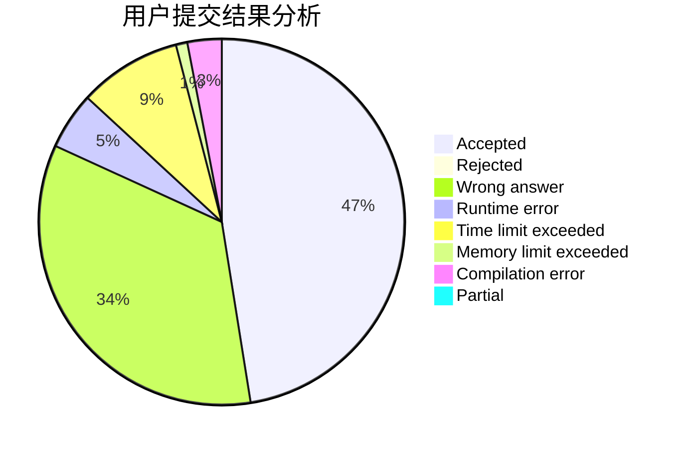
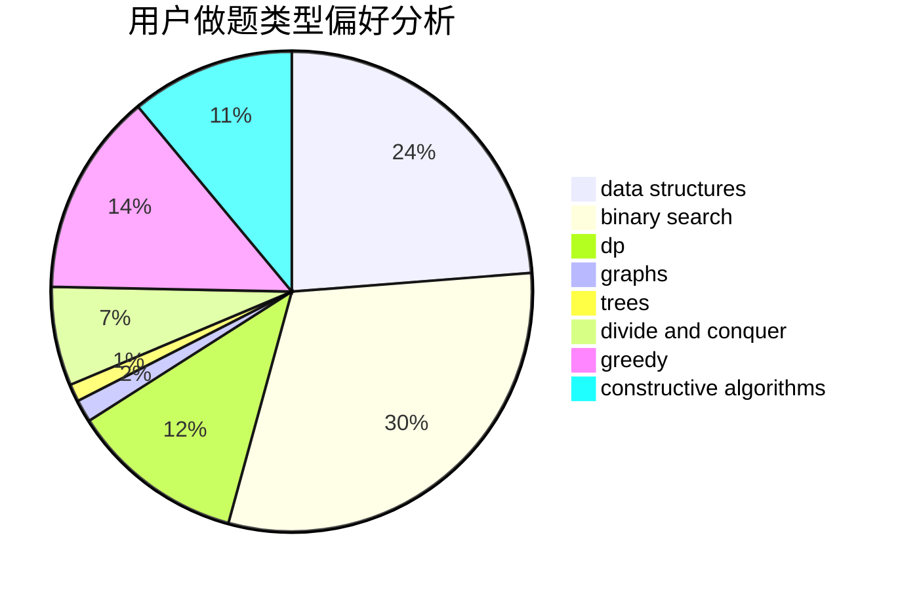
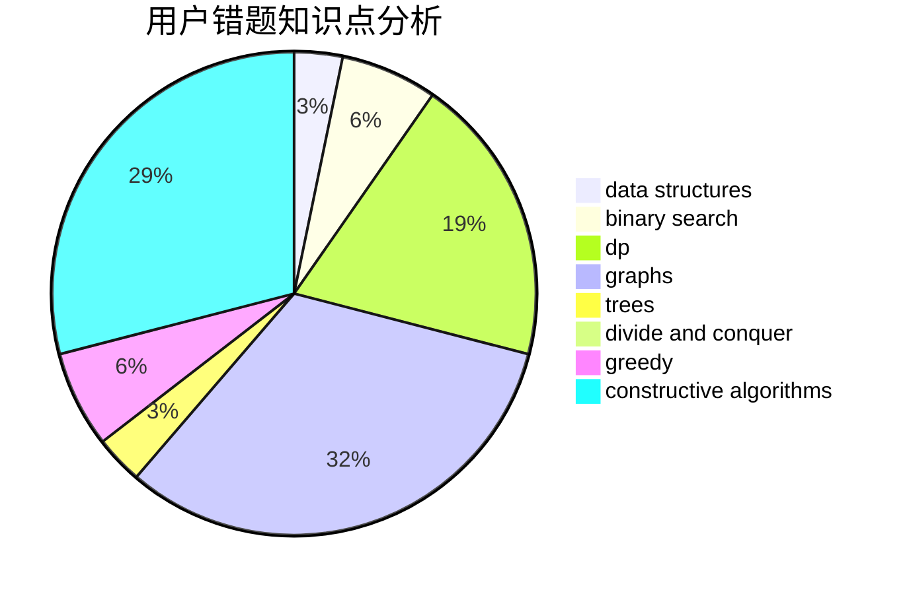

# SSerxhs

<!-- tabs:start -->

#### **用户提交结果分析**

#### **用户做题类型偏好分析**

#### **用户错题知识点分析**

<!-- tabs:end -->
# 推荐题目
[1025D](https://codeforces.com/contest/1025/problem/D)		brute force,
                        dp,
                        math,
                        number theory,
                        trees		  
[1220C](https://codeforces.com/contest/1220/problem/C)		games,
                        greedy,
                        strings		  
[1336E2](https://codeforces.com/contest/1336E/problem/2)		bitmasks,
                        brute force,
                        combinatorics,
                        math		  
[1143B](https://codeforces.com/contest/1143/problem/B)		brute force,
                        math,
                        number theory		  
[1058E](https://codeforces.com/contest/1058/problem/E)		dsu,graphs,sortings,trees		  
[1058D](https://codeforces.com/contest/1058/problem/D)		dsu,graphs,sortings,trees		  
[864A](https://codeforces.com/contest/864/problem/A)		implementation,
                        sortings		  
[801D](https://codeforces.com/contest/801/problem/D)		dsu,graphs,sortings,trees		  
[652E](https://codeforces.com/contest/652/problem/E)		dfs and similar,
                        dsu,
                        graphs,
                        trees		  
[1092E](https://codeforces.com/contest/1092/problem/E)		constructive algorithms,
                        dfs and similar,
                        greedy,
                        trees		  
